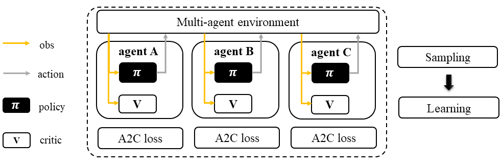
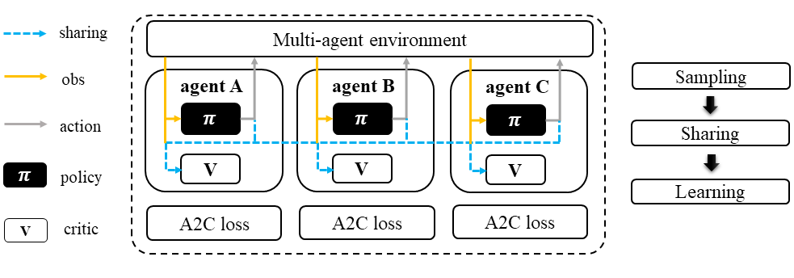
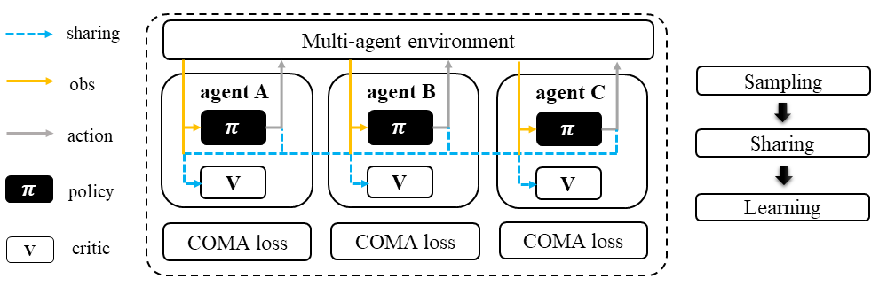
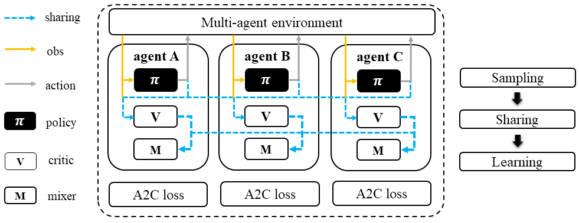

Advanced Actor Critic Family
======================================================================

.. contents::
    :local:
    :depth: 3

---------------------

.. _A2C:

Advanced Actor-Critic: A Recap
-----------------------------------------------

**Preliminary**:

- Vanilla Policy Gradient (PG)
- Monte Carlo Policy Gradients (REINFORCE)

You might be wondering why we need an advanced actor-critic (A2C) algorithm when we already have policy gradient method variants like REINFORCE. Well, the thing is, these methods are not always stable during training due to the large variance in the reward signal used to update the policy. To reduce this variance, we can introduce a baseline. A2C tackles this issue by using a critic value function, which is conditioned on the state, as the baseline. The difference between the Q value and the state value is then calculated as the advantage.

.. math::

    A(s_t,a_t) = Q(s_t,a_t) - V(s_t)

Now we need two functions :math:`Q` and :math:`V` to estimate :math:`A`. Luckily we can do some transformations for the above equation.
Recall the bellman optimality equation:

.. math::

    Q(s_t,a_t)  = r_{t+1} + \lambda V(s_{t+1})

:math:`A` can be written as:

.. math::

    A_t = r_{t+1} + \lambda V(s_{t+1}) - V(s_t)

In this way, only :math:`V` is needed to estimate :math:`A`
Finally we use policy gradient to update the :math:`V` function by:

.. math::

    \nabla_\theta J(\theta) \sim \sum_{t=0}^{T-1}\nabla_\theta \log\pi_{\theta}(a_t|s_t)A_t

The only thing left is how to update the parameters of the critic function:

.. math::

    \phi_{k+1} = \arg \min_{\phi} \frac{1}{|{\mathcal D}_k| T} \sum_{\tau \in {\mathcal D}_k} \sum_{t=0}^T\left( V_{\phi} (s_t) - \hat{R}_t \right)^2

Here
:math:`V` is the critic function.
:math:`\phi` is the parameters of the critic function.
:math:`{\mathcal D}` is the collected trajectories.
:math:`R` is the rewards-to-go.
:math:`\tau` is the trajectory.

---------------------

.. _IA2C:

IA2C: multi-agent version of A2C
-----------------------------------------------------

.. admonition:: Quick Facts

    - Independent advanced actor-critic (IA2C) is a natural extension of standard advanced actor-critic (A2C) in multi-agent settings.
    - Agent architecture of IA2C consists of two modules: ``policy`` and ``critic``.
    - IA2C is applicable for cooperative, collaborative, competitive, and mixed task modes.

**Preliminary**:

- :ref:`A2C`

Workflow
^^^^^^^^^^^^^^^^^^^^^^^^^^^^^

The IA2C algorithm employs a standard A2C sampling and training pipeline for each of its agents, making it a reliable baseline for all multi-agent reinforcement learning (MARL) tasks with consistent performance. It's worth noting that the buffer and agent models can be either shared or separately trained among agents, which is a feature that applies to all algorithms within the A2C family.

    Independent Advanced Actor-Critic (IA2C)

Characteristic
^^^^^^^^^^^^^^^

action space

.. list-table::
   :widths: 25 25
   :header-rows: 0

   * - ``discrete``
     - ``continuous``

task mode

.. list-table::
   :widths: 25 25 25 25
   :header-rows: 0

   * - ``cooperative``
     - ``collaborative``
     - ``competitive``
     - ``mixed``

taxonomy label

.. list-table::
   :widths: 25 25 25
   :header-rows: 0

   * - ``on-policy``
     - ``stochastic``
     - ``independent learning``

Insights
^^^^^^^^^^^^^^^^^^^^^^^

IA2C is a straightforward adaptation of the standard A2C algorithm to multi-agent scenarios, where each agent acts as an A2C-based sampler and learner. Unlike some other multi-agent algorithms, IA2C does not require information sharing among agents to function effectively. However, the option to share knowledge among agents is available in IA2C.

.. admonition:: Information Sharing

    In the field of multi-agent learning, the term "information sharing" can be vague and unclear, so it's important to provide clarification. We can categorize information sharing into three types:

    - real/sampled data: observation, action, etc.
    - predicted data: Q/critic value, message for communication, etc.
    - knowledge: experience replay buffer, model parameters, etc.

    Traditionally, knowledge-level information sharing has been viewed as a "trick" and not considered a true form of information sharing in multi-agent learning. However, recent research has shown that knowledge sharing is actually crucial for achieving optimal performance. Therefore, we now consider knowledge sharing to be a valid form of information sharing in multi-agent learning.

Mathematical Form
^^^^^^^^^^^^^^^^^^

When considering a single agent's perspective, the mathematical formulation of IA2C is similar to that of A2C, with the exception that in multi-agent reinforcement learning (MARL), agents often do not have access to the global state, especially under partial observable settings. In this case, we use :math:o to represent the local observation of the agent and :math:s to represent the global state. The mathematical formulation of IA2C can be rewritten as follows to account for this:

Critic learning: every iteration gives a better value function.

.. math::

    \phi_{k+1} = \arg \min_{\phi} \frac{1}{|{\mathcal D}_k| T} \sum_{\tau \in {\mathcal D}_k} \sum_{t=0}^T\left( V_{\phi} (o_t) - \hat{R}_t \right)^2

Advantage Estimation: how good are current action regarding to the baseline critic value.

.. math::

    A_t = r_{t+1} + \lambda V_{\phi} (o_{t+1}) - V_{\phi} (o_t)

Policy learning: computing the policy gradient using estimated advantage to update the policy function.

.. math::

    \nabla_\theta J(\theta) \sim \sum_{t=0}^{T-1}\nabla_\theta \log\pi_{\theta}(u_t|o_t)A_t

Note that in multi-agent settings, all the agent models can be shared, including:

- value function :math:`V_{\phi}`.
- policy function :math:`\pi_{\theta}`.

Implementation
^^^^^^^^^^^^^^^^^^^^^^^^^

We use vanilla A2C implementation of RLlib in IA2C.

Key hyperparameter location:

- ``marl/algos/hyperparams/common/a2c``
- ``marl/algos/hyperparams/fintuned/env/a2c``

---------------------

.. _MAA2C:

MAA2C: A2C agent with a centralized critic
-----------------------------------------------------

.. admonition:: Quick Facts

    - Multi-agent advanced actor-critic (MAA2C) is one of the extended versions of :ref:`IA2C`.
    - Agent architecture of MAA2C consists of two models: ``policy`` and ``critic``.
    - MAA2C is applicable for cooperative, collaborative, competitive, and mixed task modes.

**Preliminary**:

- :ref:`IA2C`

Workflow
^^^^^^^^^^^^^^^^^^^^^^^^^^^^^

In the sampling stage, agents share information with others. The information includes others' observations and predicted actions. After collecting the necessary information from other agents,
all agents follow the standard A2C training pipeline, except using the centralized critic value function to calculate the GAE and conduct the A2C critic learning procedure.

    Multi-agent Advanced Actor-Critic (MAA2C)

Characteristic
^^^^^^^^^^^^^^^

action space

.. list-table::
   :widths: 25 25
   :header-rows: 0

   * - ``discrete``
     - ``continuous``

task mode

.. list-table::
   :widths: 25 25 25 25
   :header-rows: 0

   * - ``cooperative``
     - ``collaborative``
     - ``competitive``
     - ``mixed``

taxonomy label

.. list-table::
   :widths: 25 25 25
   :header-rows: 0

   * - ``on-policy``
     - ``stochastic``
     - ``centralized critic``

Insights
^^^^^^^^^^^^^^^^^^^^^^^

The use of a centralized critic has been shown to significantly improve the performance of multi-agent proximal policy optimization (MAPPO) in multi-agent reinforcement learning (MARL). This same architecture can also be applied to IA2C with similar success. Additionally, MAA2C can perform well in most scenarios, even without the use of a centralized critic. While there is no official MAA2C paper, we have implemented MAA2C in the same pipeline as MAPPO, using an advanced actor-critic loss function. Our implementation has shown promising results in various MARL tasks.

Mathematical Form
^^^^^^^^^^^^^^^^^^

MAA2C needs information sharing across agents. Critic learning utilizes self-observation and global information,
including state and actions. Here we bold the symbol (e.g., :math:`u` to :math:`\mathbf{u}`) to indicate that more than one agent information is contained.

Critic learning: every iteration gives a better value function.

.. math::

    \phi_{k+1} = \arg \min_{\phi} \frac{1}{|{\mathcal D}_k| T} \sum_{\tau \in {\mathcal D}_k} \sum_{t=0}^T\left( V_{\phi} (o_t,s_t,\mathbf{u_t^-}) - \hat{R}_t \right)^2

Advantage Estimation: how good are current action regarding to the baseline critic value.

.. math::

    A_t = r_{t+1} + \lambda V_{\phi} (o_{t+1},s_{t+1},\mathbf{u_{t+1}^-}) - V_{\phi} (o_t,s_t,\mathbf{u_t^-})

Policy learning: computing the policy gradient using estimated advantage to update the policy function.

.. math::

    \nabla_\theta J(\theta) \sim \sum_{t=0}^{T-1}\nabla_\theta \log\pi_{\theta}(u_t|o_t)A_t

Here
:math:`\mathcal D` is the collected trajectories that can be shared across agents.
:math:`R` is the rewards-to-go.
:math:`\tau` is the trajectory.
:math:`A` is the advantage.
:math:`\gamma` is discount value.
:math:`\lambda` is the weight value of GAE.
:math:`o` is the current agent local observation.
:math:`u` is the current agent action.
:math:`\mathbf{u}^-` is the action set of all agents, except the current agent.
:math:`s` is the current agent global state.
:math:`V_{\phi}` is the critic value function, which can be shared across agents.
:math:`\pi_{\theta}` is the policy function, which can be shared across agents.

Implementation
^^^^^^^^^^^^^^^^^^^^^^^^^

Based on IA2C, we add centralized modules to implement MAA2C.
The details can be found in:

- ``centralized_critic_postprocessing``
- ``central_critic_a2c_loss``
- ``CC_RNN``

Key hyperparameter location:

- ``marl/algos/hyperparams/common/maa2c``
- ``marl/algos/hyperparams/fintuned/env/maa2c``

---------------------

.. _COMA:

COMA: MAA2C with Counterfactual Multi-Agent Policy Gradients
-----------------------------------------------------

.. admonition:: Quick Facts

    - Counterfactual multi-agent policy gradients (COMA) is based on MAA2C.
    - Agent architecture of COMA consists of two models: ``policy`` and ``Q``.
    - COMA adopts a counterfactual baseline to marginalize a single agent’s action's contribution.
    - COMA is applicable for cooperative, collaborative, competitive, and mixed task modes.

**Preliminary**:

- :ref:`IA2C`
- :ref:`MAA2C`

Workflow
^^^^^^^^^^^^^^^^^^^^^^^^^^^^^

In the sampling stage, agents share information with each other, including their observations and predicted actions. Once the necessary information has been collected, all agents follow the standard A2C training pipeline. However, in order to update the policy, agents use the counterfactual multi-agent (COMA) loss function. Similar to MAA2C, the value function (critic) is centralized. This centralized critic enables agents to effectively learn from the collective experience of all agents, leading to improved performance in MARL tasks.

    Counterfactual Multi-Agent Policy Gradients (COMA)

Characteristic
^^^^^^^^^^^^^^^

action space

.. list-table::
   :widths: 25
   :header-rows: 0

   * - ``discrete``

task mode

.. list-table::
   :widths: 25 25 25 25
   :header-rows: 0

   * - ``cooperative``
     - ``collaborative``
     - ``competitive``
     - ``mixed``

taxonomy label

.. list-table::
   :widths: 25 25 25
   :header-rows: 0

   * - ``on-policy``
     - ``stochastic``
     - ``centralized critic``

Insights
^^^^^^^^^^^^^^^^^^^^^^^

Efficiently learning decentralized policies is an essential demand for modern AI systems. However, assigning credit to an agent becomes a significant challenge when only one global reward exists.
COMA provides one solution for this problem:

#. COMA uses a counterfactual baseline that considers the actions of all agents except for the one whose credit is being assigned, making the computation of the credit assignment more effective.
#. COMA also utilizes a centralized Q value function, allowing for the efficient computation of the counterfactual baseline in a single forward pass.
#. By incorporating these techniques, COMA significantly improves average performance compared to other multi-agent actor-critic methods under decentralized execution and partial observability settings.

.. admonition:: You Should Know

    - While COMA is based on stochastic policy gradient methods, it has only been evaluated in the context of discrete action spaces. Extending this method to continuous action spaces can be challenging and may require additional techniques to compute the critic value. This is because continuous action spaces involve a potentially infinite number of actions, making it difficult to compute the critic value in a tractable manner.
    - While COMA has shown promising results in improving average performance over other multi-agent actor-critic methods under decentralized execution and partial observability settings, it is worth noting that it may not always outperform other MARL methods in all tasks. It is important to carefully consider the specific task and setting when selecting an appropriate MARL method for a particular application.

Mathematical Form
^^^^^^^^^^^^^^^^^^

COMA requires information sharing across agents. In particular, it uses Q learning which utilizes both self-observation and global information, including state and actions of other agents.

One unique feature of COMA is its use of a counterfactual baseline for advantage estimation, which is different from other algorithms in the A2C family. This allows for more accurate credit assignment to individual agents, even when there is only one global reward.

Q learning: every iteration gives a better Q function.

.. math::

    \phi_{k+1} = \arg \min_{\phi} \frac{1}{|{\mathcal D}_k| T} \sum_{\tau \in {\mathcal D}_k} \sum_{t=0}^T\left( Q_{\phi} (o_t, s_t, u_t, (\mathbf{u_t}^-)) - \hat{R}_t \right)^2

Marginalized Advantage Estimation: how good are current action's Q value compared to the average Q value of the whole action space.

.. math::

    A_t = Q_{\phi}(o_t, s_t, u_t, \mathbf{a}^-) - \sum_{u_t} \pi(u_t \vert \tau) Q_{\phi}(o_t, s_t, u_t, (\mathbf{u_t}^-))

Policy learning:

.. math::

    L(o, s, a, \mathbf{a}^-, \theta)=\log\pi_\theta(a|s)A((o, s, a, \mathbf{a}^-)

Here
:math:`{\mathcal D}` is the collected trajectories.
:math:`R` is the rewards-to-go.
:math:`\tau` is the trajectory.
:math:`A` is the advantage.
:math:`o` is the current agent local observation.
:math:`u` is the current agent action.
:math:`\mathbf{u}^-` is the action set of all agents, except the current agent.
:math:`s` is the global state.
:math:`Q_{\phi}` is the Q function.
:math:`\pi_{\theta}` is the policy function.

Implementation
^^^^^^^^^^^^^^^^^^^^^^^^^

Based on IA2C, we add the COMA loss function.
The details can be found in:

- ``centralized_critic_postprocessing``
- ``central_critic_coma_loss``
- ``CC_RNN``

Key hyperparameter location:

- ``marl/algos/hyperparams/common/coma``
- ``marl/algos/hyperparams/fintuned/env/coma``

---------------------

.. _VDA2C:

VDA2C: mixing a bunch of A2C agents' critics
-----------------------------------------------------

.. admonition:: Quick Facts

    - Value decomposition advanced actor-critic (VDA2C) is one of the extensions of :ref:`IA2C`.
    - Agent architecture of VDA2C consists of three modules: ``policy``, ``critic``, and ``mixer``.
    - VDA2C is proposed to solve cooperative and collaborative tasks only.

**Preliminary**:

- :ref:`IA2C`
- :ref:`QMIX`

Workflow
^^^^^^^^^^^^^^^^^^^^^^^^^^^^^

During the sampling stage, agents exchange information with other agents, including their observations and predicted critic values. After gathering the required information, all agents follow the usual A2C training pipeline, with the exception of using a mixed critic value to calculate the Generalized Advantage Estimation (GAE) and perform the critic learning procedure for A2C.

    Value Decomposition Advanced Actor-Critic (VDA2C)

Characteristic
^^^^^^^^^^^^^^^

action space

.. list-table::
   :widths: 25 25
   :header-rows: 0

   * - ``discrete``
     - ``continuous``

task mode

.. list-table::
   :widths: 25 25
   :header-rows: 0

   * - ``cooperative``
     - ``collaborative``

taxonomy label

.. list-table::
   :widths: 25 25 25
   :header-rows: 0

   * - ``on-policy``
     - ``stochastic``
     - ``value decomposition``

Insights
^^^^^^^^^^^^^^^^^^^^^^^

To put it simply, VDA2C is an algorithm that focuses on assigning credit to different actions in multi-agent settings. It does this by using a value function, called the V function, which is different from the Q function used in other similar algorithms. VDA2C uses on-policy learning and is applicable to both discrete and continuous control problems. However, it may not be as efficient as other joint Q learning algorithms in terms of sampling.

Mathematical Form
^^^^^^^^^^^^^^^^^^

VDA2C needs information sharing across agents. Therefore, the critic mixing utilizes both self-observation and other agents' observation.
Here we bold the symbol (e.g., :math:`u` to :math:`\mathbf{u}`) to indicate that more than one agent information is contained.

Critic mixing:

.. math::

    V_{tot}(\mathbf{u}, s;\boldsymbol{\phi},\psi) = g_{\psi}\bigl(s, V_{\phi_1},V_{\phi_2},..,V_{\phi_n} \bigr)

Mixed Critic learning: every iteration gives a better value function and a better mixing function.

.. math::

    \phi_{k+1} = \arg \min_{\phi} \frac{1}{|{\mathcal D}_k| T} \sum_{\tau \in {\mathcal D}_k} \sum_{t=0}^T\left( V_{tot} - \hat{R}_t \right)^2

Advantage Estimation: how good are current joint action set regarding to the baseline critic value.

.. math::

    A_t = r_{t+1} + \lambda V_{tot}^{t+1} - V_{tot}^{t}

Policy learning: computing the policy gradient using estimated advantage to update the policy function.

.. math::

    \nabla_\theta J(\theta) \sim \sum_{t=0}^{T-1}\nabla_\theta \log\pi_{\theta}(u_t|s_t)A_t

Here
:math:`\mathcal D` is the collected trajectories that can be shared across agents.
:math:`R` is the rewards-to-go.
:math:`\tau` is the trajectory.
:math:`A` is the advantage.
:math:`\gamma` is discount value.
:math:`\lambda` is the weight value of GAE.
:math:`o` is the current agent local observation.
:math:`u` is the current agent action.
:math:`\mathbf{u}^-` is the action set of all agents, except the current agent.
:math:`s` is the current agent global state.
:math:`V_{\phi}` is the critic value function, which can be shared across agents.
:math:`\pi_{\theta}` is the policy function, which can be shared across agents.
:math:`g_{\psi}` is a mixing network, which must be shared across agents.

Implementation
^^^^^^^^^^^^^^^^^^^^^^^^^

Based on IA2C, we add mixing Q modules to implement VDA2C.
The details can be found in:

- ``value_mixing_postprocessing``
- ``value_mix_actor_critic_loss``
- ``VD_RNN``

Key hyperparameter location:

- ``marl/algos/hyperparams/common/vda2c``
- ``marl/algos/hyperparams/fintuned/env/vda2c``

---------------------

Read List
-------------

- `Advanced Actor-Critic Algorithms <https://arxiv.org/abs/1707.06347>`_
- `The Surprising Effectiveness of PPO in Cooperative, Multi-Agent Games <https://arxiv.org/abs/2103.01955>`_
- `Counterfactual Multi-Agent Policy Gradients <https://ojs.aaai.org/index.php/AAAI/article/download/11794/11653>`_
- `Value-Decomposition Multi-Agent Actor-Critics <https://arxiv.org/abs/2007.12306>`_
