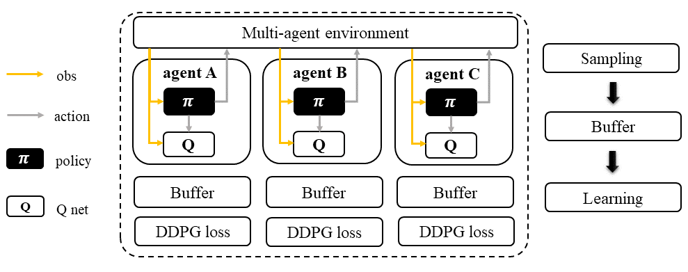
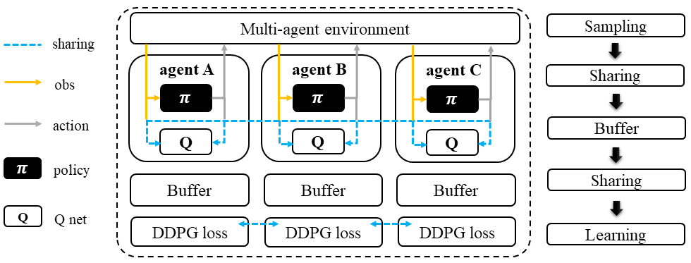
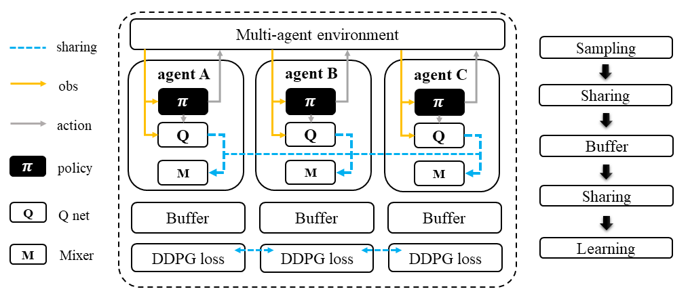

Deep Deterministic Policy Gradient Family
======================================================================

.. contents::
    :local:
    :depth: 3

---------------------

.. _DDPG:

Deep Deterministic Policy Gradient: A Recap
-----------------------------------------------

**Preliminary**

- Q-Learning & Deep Q Network(DQN)

Deep Deterministic Policy Gradient (DDPG) is a popular reinforcement learning algorithm that can handle continuous action spaces. DDPG concurrently learns a Q-function and a policy network using off-policy data and the Bellman equation. The Q-function estimates the expected cumulative reward for taking a specific action in a given state, and the policy network produces actions to maximize the Q-value.

To extend Q-learning to continuous action spaces, DDPG introduces an additional policy network, represented by the function :math:`\mu(s;\theta)`, which takes the state as input and outputs a continuous action. The Q-value is estimated as :math:`Q(s, a;\phi)` using the state-action pair as input, where the Q-function is represented by :math:`\phi`, and :math:`a` is obtained by applying the policy network on the state. By learning both the Q-function and the policy network concurrently, DDPG can handle continuous action spaces effectively.

**Mathematical Form**

Q learning:

.. math::

    L(\phi, {\mathcal D}) = \underset{(s,a,r,s',d) \sim {\mathcal D}}{{\mathrm E}}\left[
        \Bigg( Q_{\phi}(s,a) - \left(r + \gamma (1 - d) Q_{\phi_{\text{targ}}}(s', \mu_{\theta_{\text{targ}}}(s')) \right) \Bigg)^2
        \right]

Policy learning:

.. math::

    \max_{\theta} \underset{s \sim {\mathcal D}}{{\mathrm E}}\left[ Q_{\phi}(s, \mu_{\theta}(s)) \right]

Here :math:`{\mathcal D}` is the replay buffer
:math:`a` is the action taken.
:math:`r` is the reward.
:math:`s` is the observation/state.
:math:`s'` is the next observation/state.
:math:`d` is set to 1 (True) when episode ends else 0 (False).
:math:`{\gamma}` is discount value.
:math:`\mu_{\theta}` is policy function.
:math:`Q_{\phi}` is Q function.
:math:`\mu_{\theta_{\text{targ}}}` is target policy function
:math:`Q_{\phi_{\text{targ}}}` is target Q function.

.. admonition:: You Should Know

    Tricks like `gumble softmax` enables DDPG policy function to output categorical-like action distribution.

---------------------

.. _IDDPG:

IDDPG: multi-agent version of DDPG
-------------------------------------

.. admonition:: Quick Facts

    - Independent deep deterministic policy gradient (IDDPG) is a natural extension of DDPG under multi-agent settings.
    - An IDDPG agent architecture consists of two models: ``policy`` and ``Q``.
    - IDDPG is applicable for cooperative, collaborative, competitive, and mixed task modes.

**Preliminary**

- :ref:`DDPG`

Workflow
^^^^^^^^^^^^^^^^^^^^^^^^^^^^^

Each agent follows the standard DDPG learning pipeline, which concurrently learns a Q-function and a policy. The models and buffers used in the pipeline can be shared or separated according to the agents' group. This flexibility also applies to all algorithms in the DDPG family. For example, the models and buffers can be shared across all agents to allow for better coordination and faster learning, or they can be trained separately to allow for agents to learn individual strategies.

    Independent Deep Deterministic Policy Gradient (IDDPG)

Characteristic
^^^^^^^^^^^^^^^

action space

.. list-table::
   :widths: 25
   :header-rows: 0

   * - ``continuous``

task mode

.. list-table::
   :widths: 25 25 25 25
   :header-rows: 0

   * - ``cooperative``
     - ``collaborative``
     - ``competitive``
     - ``mixed``

taxonomy label

.. list-table::
   :widths: 25 25 25
   :header-rows: 0

   * - ``off-policy``
     - ``deterministic``
     - ``independent learning``

Insights
^^^^^^^^^^^^^^^^^^^^^^^

Independent Deep Deterministic Policy Gradient (IDDPG) is a version of the Deep Deterministic Policy Gradient (DDPG) algorithm designed for multi-agent scenarios. In IDDPG, each agent has its own DDPG algorithm that samples data and learns independently from other agents. Unlike other multi-agent algorithms, IDDPG does not require agents to share any information, including real or sampled data and predicted actions.

However, IDDPG does allow for optional knowledge sharing between agents. This means that agents can choose to share their models or other information with each other to improve their learning performance. Overall, IDDPG is a flexible and scalable algorithm that can be applied to a wide range of multi-agent scenarios.

.. admonition:: Information Sharing

    In the field of multi-agent learning, the term "information sharing" can be vague and unclear, so it's important to provide clarification. We can categorize information sharing into three types:

    - real/sampled data: observation, action, etc.
    - predicted data: Q/critic value, message for communication, etc.
    - knowledge: experience replay buffer, model parameters, etc.

    Traditionally, knowledge-level information sharing has been viewed as a "trick" and not considered a true form of information sharing in multi-agent learning. However, recent research has shown that knowledge sharing is actually crucial for achieving optimal performance. Therefore, we now consider knowledge sharing to be a valid form of information sharing in multi-agent learning.

Mathematical Form
^^^^^^^^^^^^^^^^^^

Standing at the view of a single agent, the mathematical formulation of IDDPG is the same as DDPG: :ref:`DDPG`.
, except that in MARL,
agent usually has no access to the global state typically under partial observable setting.
Therefore, we use :math:`o` for
local observation and :math:`s` for the global state. We then rewrite the mathematical formulation of DDPG as:

Q learning: get a better Q function

.. math::

    L(\phi, {\mathcal D}) = \underset{(o,u,r,o',d) \sim {\mathcal D}}{{\mathrm E}}\left[
        \Bigg( Q_{\phi}(o,u) - \left(r + \gamma (1 - d) Q_{\phi_{\text{targ}}}(o', \mu_{\theta_{\text{targ}}}(o')) \right) \Bigg)^2
        \right]

Policy learning: maximize the Q function output by updating the policy function.

.. math::

    \max_{\theta} \underset{o \sim {\mathcal D}}{{\mathrm E}}\left[ Q_{\phi}(o, \mu_{\theta}(o)) \right]

Here :math:`{\mathcal D}` is the replay buffer
:math:`a` is the action taken.
:math:`r` is the reward.
:math:`o` is the local observation.
:math:`o'` is the next local observation.
:math:`d` is set to 1 (True) when episode ends else 0 (False).
:math:`{\gamma}` is discount value.
:math:`\mu_{\theta}` is policy function.
:math:`Q_{\phi}` is Q function.
:math:`\mu_{\theta_{\text{targ}}}` is target policy function
:math:`Q_{\phi_{\text{targ}}}` is target Q function.

Note in multi-agent settings, all the agent models and buffer can be shared, including:

- replay buffer :math:`{\mathcal D}`.
- policy function :math:`\mu_{\theta}`.
- Q function :math:`Q_{\phi}`.
- target policy function :math:`\mu_{\theta_{\text{targ}}}`.
- target Q function :math:`Q_{\phi_{\text{targ}}}`.

Implementation
^^^^^^^^^^^^^^^^^^^^^^^^^

We extend the vanilla IDDPG of RLlib to be recurrent neural network(RNN) compatible.
The main differences are:

- model side: the agent model-related modules and functions are rewritten, including:
    - ``build_rnnddpg_models_and_action_dist``
    - ``DDPG_RNN_TorchModel``
- algorithm side: the sampling and training pipelines are rewritten, including:
    - ``episode_execution_plan``
    - ``ddpg_actor_critic_loss``

Key hyperparameter location:

- ``marl/algos/hyperparams/common/ddpg``
- ``marl/algos/hyperparams/fintuned/env/ddpg``

.. admonition:: Continuous Control Tasks

    - There is only a few MARL dataset focusing on continuous control. The popular three are:
        - :ref:`MPE` (discrete+continuous)
        - :ref:`MAMuJoCo` (continuous only)
        - :ref:`MetaDrive` (continuous only)

---------------------

.. _MADDPG:

MADDPG: DDPG agent with a centralized Q
--------------------------------------------

.. admonition:: Quick Facts

    - Multi-agent deep deterministic policy gradient(MADDPG) is one of the extended version of :ref:`IDDPG`.
    - Agent architecture of MADDPG consists of two models: ``policy`` and ``Q``.
    - MADDPG is applicable for cooperative, collaborative, competitive, and mixed task modes.

**Preliminary**

- :ref:`IDDPG`

Workflow
^^^^^^^^^^^^^^^^^^^^^^^^^^^^^

During the sampling stage, each agent in MADDPG follows the same DDPG learning pipeline to infer an action. However, instead of computing the Q-value based on its own action, each agent uses a centralized Q-function that takes all agents' actions as input to compute the Q-value. This requires sharing data among agents before storing it in the buffer.

During the learning stage, each agent predicts its next action using the target policy and shares it with other agents before entering the training loop. This is done to ensure that all agents use the same action for computing the Q-value in the centralized Q-function during the next sampling stage.

    Multi-agent Deep Deterministic Policy Gradient (MADDPG)

Characteristic
^^^^^^^^^^^^^^^

action space

.. list-table::
   :widths: 25
   :header-rows: 0

   * - ``continuous``

task mode

.. list-table::
   :widths: 25 25 25 25
   :header-rows: 0

   * - ``cooperative``
     - ``collaborative``
     - ``competitive``
     - ``mixed``

taxonomy label

.. list-table::
   :widths: 25 25
   :header-rows: 0

   * - ``off-policy``
     - ``deterministic``

Insights
^^^^^^^^^^^^^^^^^^^^^^^

In multi-agent environments, traditional reinforcement learning algorithms like Q-Learning or policy gradient may not be effective due to various reasons such as changing policies during training, non-stationary environments, and high variance in coordination between agents.
To address these challenges, Multi-agent Deep Deterministic Policy Gradient (MADDPG) was introduced.
MADDPG extends the DDPG algorithm with a centralized Q function that takes observation and action from all agents,
including other agents. The policy network :math:`\mu(s)` is parameterized by :math:`\theta` to produce action values,
while the centralized Q value is calculated as :math:`Q(\mathbf{s},\mu(\mathbf{s}))` and the Q network is parameterized by :math:`\phi`.
It's important to note that the local observation is denoted by :math:`o` in the policy network, while the joint observation/state is
denoted by :math:`\mathbf{s}` in the centralized Q function, which includes information about opponents.

.. admonition:: You Should Know

    - MADDPG is a widely known research work that initiated the exploration of Multi-Agent Reinforcement Learning (MARL) under the paradigm of centralized training and decentralized execution (CTDE).
    - Recent studies have shown that stochastic policy gradient methods can be directly employed in MARL with good performance, as exemplified by :ref:`IPPO`
    - However, MADDPG has been subject to criticism due to its unstable performance in practical scenarios.

Mathematical Form
^^^^^^^^^^^^^^^^^^

In MADDPG, information sharing between agents is required. This includes the observation and actions of other agents, in addition to the agent's own observations. The shared information can be denoted using bold symbols, such as :math:`\mathbf{u}` to represent the actions of all agents.

Q learning: get a better centralized Q function

.. math::

    L(\phi, {\mathcal D}) = \underset{(o,s,\mathbf{u},r,o',s',d) \sim {\mathcal D}}{{\mathrm E}}\left[
        \Bigg( Q_{\phi}(o,s,\mathbf{u},r,o',s',d) - \left(r + \gamma (1 - d) Q_{\phi_{\text{targ}}}(o', s', \mu_{\theta_{\text{targ}}}(\mathbf{o'})) \right) \Bigg)^2
        \right]

Policy learning: maximize the Q function output by updating the policy function.

.. math::

    \max_{\theta} \underset{\mathbf{o},s \sim {\mathcal D}}{{\mathrm E}}\left[ Q_{\phi}(o,s, \mu_{\theta}(\mathbf{o})) \right]

Here :math:`{\mathcal D}` is the replay buffer and can be shared across agents.
:math:`\mathbf{u}` is an action set, including opponents.
:math:`r` is the reward.
:math:`s` is the observation/state set, including opponents.
:math:`s'` is the next observation/state set, including opponents.
:math:`d` is set to 1(True) when an episode ends else 0(False).
:math:`{\gamma}` is discount value.
:math:`\mu_{\theta}` is a policy function that can be shared across agents.
:math:`Q_{\phi}` is Q function, which can be shared across agents.
:math:`\mu_{\theta_{\text{targ}}}` is target policy function, which can be shared across agents.
:math:`Q_{\phi_{\text{targ}}}` is target Q function, which can be shared across agents.

Implementation
^^^^^^^^^^^^^^^^^^^^^^^^^

To make DDPG compatible with recurrent neural networks (RNNs), we extend vanilla DDPG in RLlib. Then, we add a centralized sampling and training module to the original pipeline.

The main differences between Independent Deep Deterministic Policy Gradient (IDDPG) and MADDPG are:

- model side: the agent model-related modules and functions are built in a centralized style:
    - ``build_maddpg_models_and_action_dist``
    - ``MADDPG_RNN_TorchModel``
- algorithm side: the sampling and training pipelines are built in a centralized style:
    - ``centralized_critic_q``
    - ``central_critic_ddpg_loss``

Key hyperparameter location:

- ``marl/algos/hyperparams/common/maddpg``
- ``marl/algos/hyperparams/fintuned/env/maddpg``

.. admonition:: You Should Know

    - The policy inference procedure of MADDPG is kept the same as IDDPG.
    - Some tricks like `gumble softmax` enables MADDPG to output categorical-like action distribution.

---------------------

.. _FACMAC:

FACMAC: mixing a bunch of DDPG agents
-------------------------------------------------------------

.. admonition:: Quick Facts

    - Factored Multi-Agent Centralised Policy Gradients (FACMAC) is one of the extended version of :ref:`IDDPG`.
    - Agent architecture of FACMAC consists of three models: ``policy``, ``Q``, and ``mixer``.
    - FACMAC is applicable for cooperative and collaborative task modes.

**Preliminary**:

- :ref:`IDDPG`
- :ref:`QMIX`

Workflow
^^^^^^^^^^^^^^^^^^^^^^^^^^^^^

Each agent in the FACMAC algorithm follows the standard DDPG learning pipeline to infer the action and calculate the Q value using the centralized Q function. However, in this stage, agents share data such as observations or states with each other before sending the sampled data to the buffer.

In the learning stage, each agent predicts its own Q value using the Q function, its next action using the target policy, and the next Q value using the target Q function. Then, each agent shares the predicted data with other agents before entering the training loop.

    Factored Multi-Agent Centralised Policy Gradients (FACMAC)

Characteristic
^^^^^^^^^^^^^^^

action space

.. list-table::
   :widths: 25
   :header-rows: 0

   * - ``continuous``

task mode

.. list-table::
   :widths: 25 25
   :header-rows: 0

   * - ``cooperative``
     - ``collaborative``

taxonomy label

.. list-table::
   :widths: 25 25 25
   :header-rows: 0

   * - ``off-policy``
     - ``deterministic``
     - ``value decomposition``

Insights
^^^^^^^^^^^^^^^^^^^^^^^

FACMAC is a variant of :ref:`IDDPG` in the value decomposition method and a counterpart of :ref:`MADDPG`.
The main contribution of FACMAC is:

#. MARL's first value decomposition method can deal with a continuous control problem.
#. Proposed with a multi-agent benchmark :ref:`MAMuJoCo` that focuses on continuous control with heterogeneous agents.
#. It can also be applied to discrete action space with tricks like `gumble softmax` and keep robust performance

Compared to existing methods, FACMAC:

- outperforms MADDPG and other baselines in both discrete and continuous action tasks.
- scales better as the number of agents (and/or actions) and the complexity of the task increases.
- proves that factoring the critic can better take advantage of our centralized gradient estimator to optimize the agent policies when the number of agents and/or actions is large.

.. admonition:: You Should Know

    - Recent studies have shown that stochastic policy gradient methods are more stable and effective in handling MARL problems, such as the MAA2C algorithm mentioned in :ref:MAA2C. If you aim for improved performance, it is recommended to consider using stochastic policy gradient methods.
    - The scope of applicable scenarios for FACMAC is relatively limited. This includes only cooperative tasks and continuous tasks without the use of any additional techniques or methods.

Mathematical Form
^^^^^^^^^^^^^^^^^^

FAMAC needs information sharing across agents. Here we bold the symbol (e.g., :math:`u` to :math:`\mathbf{u}`) to indicate more than one agent information is contained.

Q mixing: using a learnable mixer to compute the global Q value.

.. math::

    Q_{tot}(\mathbf{u}, s;\boldsymbol{\phi},\psi) = g_{\psi}\bigl(s, Q_{\phi_1},Q_{\phi_2},..,Q_{\phi_n} \bigr)

Q learning: get a better Q function and mixer function

.. math::

    L(\phi,\psi, {\mathcal D}) = \underset{(o, s,\mathbf{u},r,o' s',d) \sim {\mathcal D}}{{\mathrm E}}\left[
        \Bigg(Q_{tot}(\mathbf{u},o,s;\boldsymbol{\phi},\psi) - \left(r + \gamma (1 - d) Q_{tot}(\mathbf{u'},o', s';\boldsymbol{\phi_{\text{targ}}},\psi_{\text{targ}}) \right) \Bigg)^2
        \right]

Policy learning: maximize the Q function output by updating the policy function.

.. math::

    \max_{\theta} \underset{o \sim {\mathcal D}}{{\mathrm E}}\left[ Q_{\phi}(o,\mu_{\theta}(o)) \right]

Here :math:`{\mathcal D}` is the replay buffer, which can be shared across agents.
:math:`\mathbf{u}` is an action set, including opponents.
:math:`r` is the reward.
:math:`s` is the observation/state set, including opponents.
:math:`s'` is the next observation/state set, including opponents.
:math:`d` is set to 1(True) when an episode ends else 0(False).
:math:`{\gamma}` is discount value.
:math:`\mu_{\theta}` is policy function, which can be shared across agents.
:math:`Q_{\phi}` is Q function, which can be shared across agents.
:math:`g_{\psi}` is mixing network.
:math:`\mu_{\theta_{\text{targ}}}` is target policy function, which can be shared across agents.
:math:`Q_{\phi_{\text{targ}}}` is target Q function, which can be shared across agents.
:math:`g_{\psi_{\text{targ}}}` is target mixing network.

Implementation
^^^^^^^^^^^^^^^^^^^^^^^^^

We have extended the vanilla DDPG algorithm of RLlib to be compatible with recurrent neural networks (RNNs). This RNN-compatible DDPG algorithm is further enhanced with a centralized sampling and training module. The main distinguishing features between IDDPG and MADDPG are as follows:

- model side: the agent model-related modules and functions are built in a value decomposition style:
    - ``build_facmac_models_and_action_dist``
    - ``FACMAC_RNN_TorchModel``
- algorithm side: the sampling and training pipelines are built in a value decomposition style:
    - ``q_value_mixing``
    - ``value_mixing_ddpg_loss``

Key hyperparameter location:

- ``marl/algos/hyperparams/common/maddpg``
- ``marl/algos/hyperparams/fintuned/env/maddpg``

.. admonition:: You Should Know

    - The policy inference procedure of FACMAC is kept the same as IDDPG.
    - Tricks such as using `gumbel softmax` are employed to allow the FACMAC network to produce action distributions that resemble categorical distributions.

---------------------

Read List
-------------

- `Continuous Control with Deep Reinforcement Learning <https://arxiv.org/abs/1509.02971>`_
- `Multi-Agent Actor-Critic for Mixed Cooperative-Competitive Environments <https://arxiv.org/abs/1706.02275>`_
- `FACMAC: Factored Multi-Agent Centralised Policy Gradients <https://arxiv.org/pdf/2003.06709.pdf>`_
