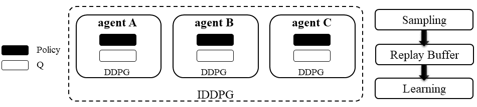

.. _IDDPG:

Independent Deep Deterministic Policy Gradient (IDDPG)
-------------------------------------------------------------

.. admonition:: Quick Facts

    Independent deep deterministic policy gradient is a natural extension of standard single agent deep deterministic policy gradient in multi-agent settings.
    The sampling/training pipeline is exactly the same when we standing at the view of single agent when comparing DDPG and IDDPG.

Characteristic
^^^^^^^^^^^^^^^

action space

.. list-table::
   :widths: 25
   :header-rows: 0

   * - ``continues``

task mode

.. list-table::
   :widths: 25 25 25
   :header-rows: 0

   * - ``cooperative``
     - ``collaborative``
     - ``competitive``

taxonomy label

.. list-table::
   :widths: 25 25 25
   :header-rows: 0

   * - ``off-policy``
     - ``deterministic``
     - ``independent learning``

derived algorithm

.. list-table::
   :widths: 25 25
   :header-rows: 0

   * - :ref:`MADDPG`
     - :ref:`FACMAC`

Preliminary
^^^^^^^^^^^^^^^^^^^^^^^^^^^^^

Q-Learning & Deep Q Network(DQN)

Algorithm Description
^^^^^^^^^^^^^^^^^^^^^^^

Deep Deterministic Policy Gradient (DDPG) is an algorithm which concurrently learns a Q-function and a policy.
It uses off-policy data and the Bellman equation to learn the Q-function, and uses the Q-function to learn the policy.
The motivation of DDPG is to tackling the problem that standard Q-learning can only be used in discrete action space (a finite number of actions).
To extend Q function to continues control problem, DDPG adopts an extra policy network :math:`\mu(s)` parameterized by :math:`\theta` to produce action value.
Then Q value is calculated as :math:`Q(s,\mu(s))` and the Q network is parameterized by :math:`\phi`.

Math Formulation
^^^^^^^^^^^^^^^^^^

Q learning:

.. math::

    L(\phi, {\mathcal D}) = \underset{(s,a,r,s',d) \sim {\mathcal D}}{{\mathrm E}}\left[
        \Bigg( Q_{\phi}(s,a) - \left(r + \gamma (1 - d) Q_{\phi_{\text{targ}}}(s', \mu_{\theta_{\text{targ}}}(s')) \right) \Bigg)^2
        \right],

Policy learning:

.. math::

    \max_{\theta} \underset{s \sim {\mathcal D}}{{\mathrm E}}\left[ Q_{\phi}(s, \mu_{\theta}(s)) \right].

Here :math:`{\mathcal D}` is the replay buffer, which can be shared across agents.
:math:`a` is the action taken.
:math:`r` is the reward.
:math:`s` is the observation/state.
:math:`s'` is the next observation/state.
:math:`d` is set to ``1`` (True) when episode ends else ``0`` (False).
:math:`{\gamma}` is discount value.
:math:`\mu_{\theta}` is policy net, which can be shared across agents.
:math:`\mu_{\theta_{\text{targ}}}` is policy target net, which can be shared across agents.
:math:`\phi` is Q net, which can be shared across agents.
:math:`\phi_{\text{targ}}` is Q target net, which can be shared across agents.

Workflow
^^^^^^^^^^^^^^^^^^^^^^^^^^^^^

Each agent follows the standard DDPG learning pipeline as described in Preliminary. No information is shared across agents.

    Independent Deep Deterministic Policy Gradient (IDDPG)

.. admonition:: You Should Know

    Some tricks like `gumble_softmax` enables DDPG policy net to output categorical-like action distribution.

Implementation
^^^^^^^^^^^^^^^^^^^^^^^^^

We extend vanilla DDPG of RLlib to be recurrent neural network(RNN) compatiable.
The main differences are:

- model side: the agent model related modules and functions are rewritten including:
    - ``build_rnnddpg_models_and_action_dist``
    - ``DDPG_RNN_TorchModel``
- algorithm side: the sampling and training pipelines are rewritten including:
    - ``episode_execution_plan``
    - ``ddpg_actor_critic_loss``

Key hyperparameter location:

- ``marl/algos/hyperparams/common/ddpg``
- ``marl/algos/hyperparams/fintuned/env/ddpg``

Usage & Limitation
^^^^^^^^^^^^^^^^^^^^^^

IDDPG is suitable for

- continues control tasks
- any task mode

.. code-block:: shell

    python marl/main.py --algo_config=ddpg --finetuned --env-config=mamujoco with env_args.map_name=2AgentAnt

Read list
^^^^^^^^^^^^^^^^^^^^^^^^^^^^^

- `Continuous control with deep reinforcement learning <https://arxiv.org/abs/1509.02971>`_
