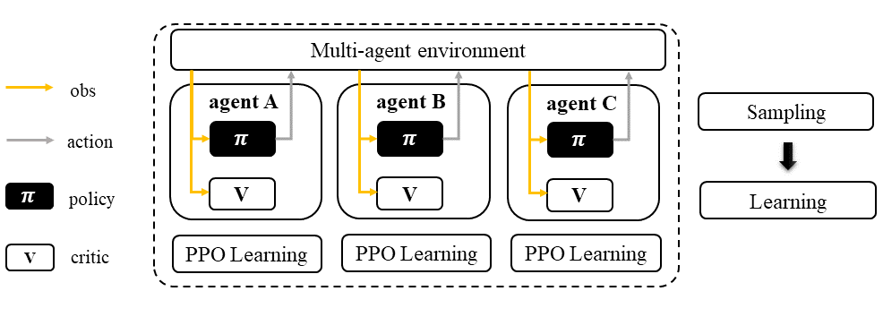

.. _IPPO:

Independent Proximal Policy Optimization (IPPO)
-----------------------------------------------------

.. admonition:: Quick Facts

    Independent proximal policy optimization is a natural extension of standard single agent proximal policy optimization in multi-agent settings.
    The sampling/training pipeline is exactly the same when we standing at the view of single agent when comparing PPO and IPPO.

Characteristic
^^^^^^^^^^^^^^^

action space

.. list-table::
   :widths: 25 25
   :header-rows: 0

   * - ``discrete``
     - ``continues``

task mode

.. list-table::
   :widths: 25 25 25
   :header-rows: 0

   * - ``cooperative``
     - ``collaborative``
     - ``competitive``

taxonomy label

.. list-table::
   :widths: 25 25 25
   :header-rows: 0

   * - ``on-policy``
     - ``stochastic``
     - ``independent learning``

derived algorithm

.. list-table::
   :widths: 25 25 25
   :header-rows: 0

   * - :ref:`MAPPO`
     - :ref:`HAPPO`
     - :ref:`VDPPO`

Preliminary
^^^^^^^^^^^^^^^^^^^^^^^^^^^^^

Vanilla Policy Gradient (PG) & Trust Region Policy Optimization (TRPO) & General Advantage Estimation (GAE)

Algorithm Description
^^^^^^^^^^^^^^^^^^^^^^^

PPO is a first-order optimisation that simplifies its implementation. Similar to TRPO objective function, It defines the probability ratio between the new policy and old policy as :math:`\frac{\pi_{\theta}(a|s)}{\pi_{\theta_k}(a|s)}`.
Instead of adding complicated KL constraint, PPO imposes this policy ratio to stay within a small interval between :math:`1-\epsilon` and :math:`1+\epsilon`.
The objective function of PPO takes the minimum value between the original value and the clipped value.

There are two primary variants of PPO: PPO-Penalty and PPO-Clip. Here we only give the formulation of PPO-Clip, which is more commonly used in practical.

Math Formulation
^^^^^^^^^^^^^^^^^^

Critic learning:

.. math::

    \phi_{k+1} = \arg \min_{\phi} \frac{1}{|{\mathcal D}_k| T} \sum_{\tau \in {\mathcal D}_k} \sum_{t=0}^T\left( V_{\phi} (s_t) - \hat{R}_t \right)^2

General Advantage Estimation:

.. math::

    A_t=\sum_{t=0}^{\infty}(\gamma\lambda)^l\delta_{t+l}^V

Policy learning:

.. math::

    L(s,a,\theta_k,\theta) = \min\left(
    \frac{\pi_{\theta}(a|s)}{\pi_{\theta_k}(a|s)}  A^{\pi_{\theta_k}}(s,a), \;\;
    \text{clip}\left(\frac{\pi_{\theta}(a|s)}{\pi_{\theta_k}(a|s)}, 1 - \epsilon, 1+\epsilon \right) A^{\pi_{\theta_k}}(s,a)
    \right),

Here
:math:`{\mathcal D}` is the collected trajectories.
:math:`R` is the rewards-to-go.
:math:`\tau` is the trajectory.
:math:`V_{\phi}` is the critic function.
:math:`A` is the advantage.
:math:`\gamma` is discount value.
:math:`\lambda` is the weight value of GAE.
:math:`a` is the action.
:math:`s` is the observation/state.
:math:`\epsilon` is a hyperparameter controlling how far away the new policy is allowed to go from the old.
:math:`\pi_{\theta}` is the policy net.

Workflow
^^^^^^^^^^^^^^^^^^^^^^^^^^^^^

In IPPO, each agent follows standard PPO sampling/training pipeline. Therefore, IPPO is a general baseline for all kinds of MARL tasks with robust performance.

    Independent Proximal Policy Optimization (IPPO)

Implementation
^^^^^^^^^^^^^^^^^^^^^^^^^

We use vanilla PPO implementation of RLlib in IPPO. The only exception is we rewrite the sgd iteration logic.
The differences can be found in

    - ``MultiGPUTrainOneStep``
    - ``learn_on_loaded_batch``

Key hyperparameter location:

- ``marl/algos/hyperparams/common/ppo``
- ``marl/algos/hyperparams/fintuned/env/ppo``

Usage & Limitation
^^^^^^^^^^^^^^^^^^^^^^

IPPO is suitable for

- continues control tasks
- discrete control tasks
- any task mode

.. code-block:: shell

    python marl/main.py --algo_config=ppo --finetuned --env-config=smac with env_args.map_name=3m

Read list
^^^^^^^^^^^^^^^^^^^^^^^^^^^^^

- `High-Dimensional Continuous Control Using Generalized Advantage Estimation <https://arxiv.org/abs/1506.02438>`_
- `Proximal Policy Optimization Algorithms <https://arxiv.org/abs/1707.06347>`_
- `Is Independent Learning All You Need in the StarCraft Multi-Agent Challenge? <https://arxiv.org/abs/2011.09533>`_
