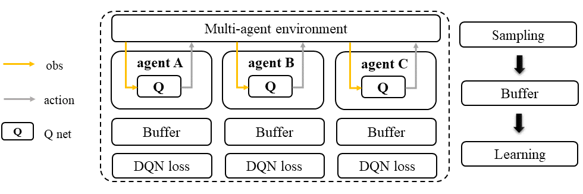
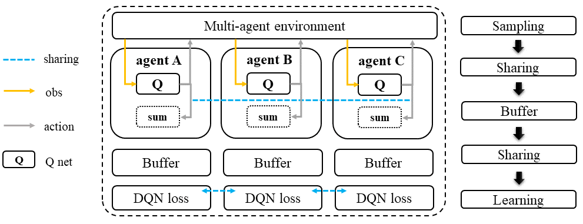
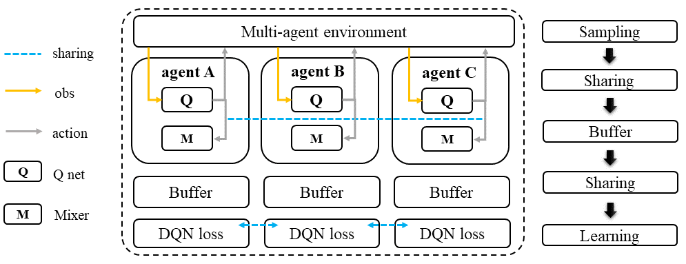

Joint Q Learning Family
======================================================================

.. contents::
    :local:
    :depth: 3

---------------------

.. _DQN:

Deep (Recurrent) Q Learning: A Recap
-----------------------------------------------

**Vanilla Q Learning**

In Q-learning, the goal is to learn the value of each state-action pair by iteratively updating a table of Q-values. Without the use of deep learning to approximate the Q-values, Q-learning is limited to a Q-table that stores all possible state-action pairs and their corresponding Q-values.

To update the Q-values in the table, the algorithm follows a two-step process. First, the agent selects an action using the epsilon-greedy exploration strategy, which involves choosing the best-known action or exploring a random action. The agent then transitions to the next state and receives a reward from the environment.

In the second step, the Q-value for the state-action pair is updated using the Bellman equation, which takes into account the immediate reward received and the expected future rewards. The updated Q-value is then stored in the Q-table. The process repeats until the Q-values converge or the desired performance is achieved.

.. math::

    Q(s,a)=(1-\alpha)Q(s,a)+\alpha*(r+\lambda*max_a(s^{'},a^{'}))

Here
:math:`s` is the state.
:math:`a` is the action.
:math:`s^{'}` is the next state.
:math:`a^{'}` is the next action that yields the highest Q value
:math:`\alpha` is the learning rate.
:math:`\lambda` is the discount factor.

Keeping iterating these two steps and updating the Q-table can converge the Q value. And the final Q value is the reward expectation of the action you choose based on the current state.

**Deep Q Learning**

Deep Q learning is a significant advancement in Q learning that allows us to approximate the Q value using a neural network. Instead of using a Q-table to store all possible state-action pairs and their corresponding Q values, a Q network is used to approximate the Q value. This is possible because we can encode the state to a feature vector and learn the mapping between the feature vector and the Q value. The Q function is designed to take the state as input and has a number of output dimensions corresponding to the number of possible actions. The max value of output nodes is selected as the Q value for the next state-action pair.

The Q network is updated using the Bellman equation. The optimization target is to minimize the minimum square error (MSE) between the current Q value estimation and the target Q estimation.

.. math::

    \phi_{k+1} = \arg \min_{\phi}(Q_\phi(s,a)-(r+\lambda*max_{a^{'}}Q_{\phi_{tar}}(s^{'},a^{'})))^2

The :math:`Q_{tag}` network is updated every :math:`t` timesteps copying the :math:`Q` network.

**DQN + Recurrent Neural Network(DRQN)**

When dealing with a Partially Observable Markov Decision Process (POMDP), we may not have full access to the state information, and therefore, we need to record the history or trajectory information to assist in choosing the action. Recurrent Neural Networks (RNNs) are introduced to Deep Q Learning to handle POMDPs by encoding the history into the hidden state of the RNN.

In this case, the optimization target is changed to predicting the next Q-value given the current state and the history. We can use the RNN to encode the history of past states and actions, and then pass this encoded information along with the current state to the Q network to predict the Q-value. The goal is to minimize the difference between the predicted Q-value and the target Q-value obtained from the Bellman equation.

.. math::

    \phi_{k+1} = \arg \min_{\phi}(Q_\phi(o,h,a)-(r+\lambda*max_{a^{'}}Q_{\phi_{tar}}(o^{'},h^{'},a^{'})))^2

Here
:math:`o` is the observation as we cannot access the state :math:`s`.
:math:`o^{'}` is the next observation.
:math:`h` is the hidden state(s) of the RNN.
:math:`h^{'}` is the next hidden state(s) of the RNN.

.. admonition:: You Should Know

    Navigating from DQN to DRQN, you need to:

    - replace the deep Q net's multi-layer perceptron(MLP) module with a recurrent module, e.g., GRU, LSTM.
    - store the data in episode format. (while DQN has no such restriction)

---------------------

.. _IQL:

IQL: multi-agent version of D(R)QN.
-----------------------------------------------------

.. admonition:: Quick Facts

    - Independent Q Learning (IQL) is the natural extension of q learning under multi-agent settings.
    - Agent architecture of IQL consists of one module: ``Q``.
    - IQL is applicable for cooperative, collaborative, competitive, and mixed task modes.

Workflow
^^^^^^^^^^^^^^^^^^^^^^^^^^^^^

In IQL, each agent follows a standard D(R)QN sampling/training pipeline.

    Independent Q Learning (IQL)

Characteristic
^^^^^^^^^^^^^^^

action space

.. list-table::
   :widths: 25
   :header-rows: 0

   * - ``discrete``

task mode

.. list-table::
   :widths: 25 25 25 25
   :header-rows: 0

   * - ``cooperative``
     - ``collaborative``
     - ``competitive``
     - ``mixed``

taxonomy label

.. list-table::
   :widths: 25 25 25
   :header-rows: 0

   * - ``off-policy``
     - ``stochastic``
     - ``independent learning``

Insights
^^^^^^^^^^^^^^^^^^^^^^^

**Preliminary**

- :ref:`DQN`

In Independent Q-Learning (IQL), each agent in a multi-agent system is treated as a single agent and uses its own collected data as input to conduct the standard DQN or DRQN learning procedure. This means that each agent learns its own Q-function independently without any information sharing among the other agents. However, knowledge sharing across agents is possible but optional in IQL.

.. admonition:: Information Sharing

    In the field of multi-agent learning, the term "information sharing" can be vague and unclear, so it's important to provide clarification. We can categorize information sharing into three types:

    - real/sampled data: observation, action, etc.
    - predicted data: Q/critic value, message for communication, etc.
    - knowledge: experience replay buffer, model parameters, etc.

    Traditionally, knowledge-level information sharing has been viewed as a "trick" and not considered a true form of information sharing in multi-agent learning. However, recent research has shown that knowledge sharing is actually crucial for achieving optimal performance. Therefore, we now consider knowledge sharing to be a valid form of information sharing in multi-agent learning.

Math Formulation
^^^^^^^^^^^^^^^^^^

Standing at the view of a single agent, the mathematical formulation of IQL is the same as :ref:`DQN`.

Note in multi-agent settings, all the agent models and buffer can be shared, including:

- replay buffer :math:`{\mathcal D}`.
- Q function :math:`Q_{\phi}`.
- target Q function :math:`Q_{\phi_{\text{targ}}}`.

Implementation
^^^^^^^^^^^^^^^^^^^^^^^^^

Our implementation of IQL is based on the vanilla implementation in RLlib, but we have made some additional improvements to ensure that its performance matches the official implementation. The differences between our implementation and the vanilla implementation can be found in the following:

- ``episode_execution_plan``
- ``EpisodeBasedReplayBuffer``
- ``JointQLoss``
- ``JointQPolicy``

Key hyperparameters location:

- ``marl/algos/hyperparams/common/iql``
- ``marl/algos/hyperparams/finetuned/env/iql``

---------------------

.. _VDN:

VDN: mixing Q with value decomposition network
-----------------------------------------------------

.. admonition:: Quick Facts

    - Value Decomposition Network(VDN) is one of the value decomposition versions of IQL.
    - Agent architecture of VDN consists of one module: `Q` network.
    - VDN is applicable for cooperative and collaborative task modes.

Workflow
^^^^^^^^^^^^^^^^^^^^^^^^^^^^^

In the VDN approach, each agent follows the same D(R)QN sampling pipeline as in other deep Q-learning methods. However, before entering the training loop, each agent shares its Q value and target Q value with other agents.
During the training loop, the Q value and target Q value of the current agent and other agents are summed to obtain the :math:`Q_{tot}` value. This summation allows each agent to incorporate the impact of other agents' actions on the environment and make more informed decisions.

    Value Decomposition Network (VDN)

Characteristic
^^^^^^^^^^^^^^^

action space

.. list-table::
   :widths: 25
   :header-rows: 0

   * - ``discrete``

task mode

.. list-table::
   :widths: 25 25
   :header-rows: 0

   * - ``cooperative``
     - ``collaborative``

taxonomy label

.. list-table::
   :widths: 25 25 25
   :header-rows: 0

   * - ``off-policy``
     - ``stochastic``
     - ``value decomposition``

Algorithm Insights
^^^^^^^^^^^^^^^^^^^^^^^

Preliminary

- :ref:`IQL`

Optimizing the joint policy of multiple agents with a single team reward can be a challenging task due to the large combined action and observation space. Value Decomposition Network (VDN) was introduced as a solution to this problem. The algorithm decomposes the joint Q value into the sum of individual Q values for each agent. This allows each agent to learn and optimize its own policy independently while still contributing to the team reward. In VDN, each agent follows a standard D(R)QN sampling pipeline and shares its Q value and target Q value with other agents before entering the training loop. The Q value and target Q value of the current agent and other agents are then summed in the training loop to get the total Q value.

- Each agent is still a standard `Q`, use self-observation as input and output the action logits(Q value).
- The Q values of all agents are added together for mixed Q value annotated as :math:`Q_{tot}`
- Using standard DQN to optimize the Q net using :math:`Q_{tot}` with the team reward :math:`r`.
- The gradient each Q net received depends on the **contribution** of its Q value to the :math:`Q_{tot}`:
The Q net that outputs a larger Q will be updated more; the smaller will be updated less.

The value decomposition version of IQL is also referred as **joint Q learning**(JointQ).
These two names emphasize different aspects. Value decomposition focuses on how the team reward is divided to update the Q net, known as credit assignment.
Joint Q learning shows how the optimization target :math:`Q_{tot}` is got.
As VDN is developed to address the cooperative multi-agent task, sharing the parameter is the primary option, which brings higher data efficiency and a smaller model size.

.. admonition:: You Should Know:

    VDN is the first algorithm that decomposes the joint value function for cooperative multi-agent tasks. However, simply summing the Q value across agents can lead to a reduced diversity of policy and can quickly get stuck in a local optimum, particularly when the Q network is shared across agents.

Math Formulation
^^^^^^^^^^^^^^^^^^

VDN needs information sharing across agents. Here we bold the symbol (e.g., :math:`o` to :math:`\mathbf{o}`) to indicate that more than one agent information is contained.

Q sum: add all the Q values to get the total Q value

.. math::

    Q_{\phi}^{tot} = \sum_{i=1}^{n} Q_{\phi}^i

Q learning: every iteration get a better total Q value estimation, passing gradient to each Q function to update it.

.. math::

    L(\phi, {\mathcal D}) = \underset{\tau \sim {\mathcal D}}{{\mathrm E}}\Bigg(Q_{\phi}^{tot} - \left(r + \gamma (1 - d) Q_{\phi_{targ}}^{tot^{'}} \right) \Bigg)^2

Here :math:`{\mathcal D}` is the replay buffer, which can be shared across agents.
:math:`r` is the reward.
:math:`d` is set to 1(True) when an episode ends else 0(False).
:math:`{\gamma}` is discount value.
:math:`Q_{\phi}` is Q net, which can be shared across agents.
:math:`Q_{\phi_{\text{targ}}}` is target Q net, which can be shared across agents.

Implementation
^^^^^^^^^^^^^^^^^^^^^^^^^

We use vanilla VDN implementation of RLlib, but with further improvement to ensure the performance is aligned with the official implementation.
The differences between ours and vanilla VDN can be found in

- ``episode_execution_plan``
- ``EpisodeBasedReplayBuffer``
- ``JointQLoss``
- ``JointQPolicy``

Key hyperparameters location:

- ``marl/algos/hyperparams/common/vdn``
- ``marl/algos/hyperparams/finetuned/env/vdn``

----------------

.. _QMIX:

QMIX: mixing Q with monotonic factorization
-----------------------------------------------------------------

.. admonition:: Quick Facts

    - Monotonic Value Function Factorisation(QMIX) is one of the value decomposition versions of IQL.
    - Agent architecture of QMIX consists of two modules: ``Q`` and ``Mixer``.
    - QMIX is applicable for cooperative and collaborative task modes.

Workflow
^^^^^^^^^^^^^^^^^^^^^^^^^^^^^

In QMIX, each agent follows a standard D(R)QN sampling pipeline and shares its Q-value and target Q-value with other agents before entering the training loop. During the training loop, the Q-value and target Q-value of the current agent and other agents are fed into the Mixer to obtain the overall Q-value of the team, denoted as :math:`Q_{tot}`.

    Monotonic Value Function Factorisation (QMIX)

Characteristic
^^^^^^^^^^^^^^^

action space

.. list-table::
   :widths: 25
   :header-rows: 0

   * - ``discrete``

task mode

.. list-table::
   :widths: 25 25
   :header-rows: 0

   * - ``cooperative``
     - ``collaborative``

taxonomy label

.. list-table::
   :widths: 25 25 25
   :header-rows: 0

   * - ``off-policy``
     - ``stochastic``
     - ``value decomposition``

Algorithm Insights
^^^^^^^^^^^^^^^^^^^^^^^

Preliminary

- :ref:`IQL`
- :ref:`VDN`

VDN optimizes multiple agents' joint policy by a straightforward operation: sum all the rewards. However, this operation reduces the
representation of the strategy because the full factorization is not necessary for extracted decentralized
policies to be entirely consistent with the centralized counterpart.

Simply speaking, VDN force each agent to find the best action to satisfy the following equation:

.. math::

    \underset{\mathbf{u}}{\operatorname{argmax}}\:Q_{tot}(\boldsymbol{\tau}, \mathbf{u}) =
    \begin{pmatrix}
    \underset{u^1}{\operatorname{argmax}}\:Q_1(\tau^1, u^1)   \\
    \vdots \\
    \underset{u^n}{\operatorname{argmax}}\:Q_n(\tau^n, u^n) \\
    \end{pmatrix}

QMIX claims that a larger family of monotonic functions is sufficient for factorization (value decomposition) but not necessary to satisfy the above equation
The monotonic constraint can be written as:

.. math::
    \frac{\partial Q_{tot}}{\partial Q_a}  \geq 0,~ \forall a \in A

With monotonic constraints, we need to introduce a feed-forward neural network that
takes the agent network outputs as input and mixes them monotonically.
To satisfy the monotonic constraint, the weights (but not the biases) of the mixing network are restricted
to be non-negative.

This neural network is named **Mixer**.

The similarity of QMIX and VDN:

- Each agent is still a standard Q function, use self-observation as input and output the action logits(Q value).
- Using standard DQN to optimize the Q function using :math:`Q_{tot}` with the team reward :math:`r`.

Difference:

- Additional model **Mixer** is added into QMIX.
- The Q values of all agents are fed to the **Mixer** for getting :math:`Q_{tot}`.
- The gradient each Q function received is backpropagated from the **Mixer**.

Similar to VDN, QMIX is only applicable to the cooperative multi-agent task.
Sharing the parameter is the primary option, which brings higher data efficiency and smaller model size.

.. admonition:: You Should Know:

    Variants of QMIX are proposed, like WQMIX and Q-attention. However, in practice, a finetuned QMIX (RIIT) is all you need.

Math Formulation
^^^^^^^^^^^^^^^^^^

QMIX needs information sharing across agents. Here we bold the symbol (e.g., :math:`s` to :math:`\mathbf{s}`) to indicate that more than one agent information is contained.

Q mixing: a learnable mixer computing the global Q value by mixing all the Q values.

.. math::

    Q_{tot}(\mathbf{a}, s;\boldsymbol{\phi},\psi) = g_{\psi}\bigl(`\mathbf{s}, Q_{\phi_1},Q_{\phi_2},..,Q_{\phi_n} \bigr)

Q learning: every iteration get a better total global Q value estimation, passing gradient to both mixer and each Q function to update them.

.. math::

    L(\phi, {\mathcal D}) = \underset{\tau \sim {\mathcal D}}{{\mathrm E}}\Bigg(Q_{\phi}^{tot} - \left(r + \gamma (1 - d) Q_{\phi_{targ}}^{tot^{'}} \right) \Bigg)^2

Here :math:`{\mathcal D}` is the replay buffer, which can be shared across agents.
:math:`r` is the reward.
:math:`d` is set to 1(True) when an episode ends else 0(False).
:math:`{\gamma}` is discount value.
:math:`Q_{\phi}` is Q function, which can be shared across agents.
:math:`Q_{\phi_{\text{targ}}}` is target Q function, which can be shared across agents.
:math:`g_{\psi}` is mixing network.
:math:`g_{\psi_{\text{targ}}}` is target mixing network.

Implementation
^^^^^^^^^^^^^^^^^^^^^^^^^

In our implementation of QMIX in RLlib, we have made some changes to improve its performance and make it consistent with the official implementation. These differences can be found in the code and configuration files used in our implementation, such as changes in the network architecture or the hyperparameters used during training. We have made these changes to ensure that our version of QMIX is capable of achieving similar or better results compared to the official implementation.

- ``episode_execution_plan``
- ``EpisodeBasedReplayBuffer``
- ``JointQLoss``
- ``JointQPolicy``

Key hyperparameters location:

- ``marl/algos/hyperparams/common/qmix``
- ``marl/algos/hyperparams/finetuned/env/qmix``

Read List
-------------

- `Human-level control through deep reinforcement learning <https://daiwk.github.io/assets/dqn.pdf>`_
- `Deep Recurrent Q-learning for Partially Observable MDPs <https://www.aaai.org/ocs/index.php/FSS/FSS15/paper/download/11673/11503>`_
- `Value-Decomposition Networks For Cooperative Multi-Agent Learning <https://arxiv.org/abs/1706.05296>`_
- `QMIX: Monotonic Value Function Factorisation for Deep Multi-Agent Reinforcement Learning <https://arxiv.org/abs/1803.11485>`_
