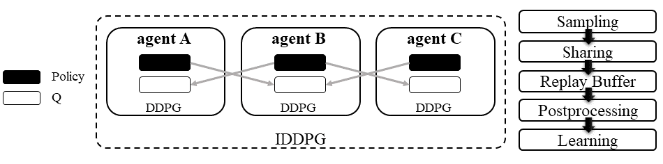

.. _MADDPG:

Multi-agent Deep Deterministic Policy Gradient (MADDPG)
-------------------------------------------------------------

.. admonition:: Quick Facts

    - Multi-agent deep deterministic policy gradient(MADDPG) is one of the centralized extensions of :ref:`IDDPG`.
    - Agent architecture of MADDPG consists of two modules: ``policy`` and ``Q``.
    - Policies only use local information at execution time.
    - MADDPG applies to cooperative, competitive, and mixed task modes.

Characteristic
^^^^^^^^^^^^^^^

action space

.. list-table::
   :widths: 25
   :header-rows: 0

   * - ``continues``

task mode

.. list-table::
   :widths: 25 25 25
   :header-rows: 0

   * - ``cooperative``
     - ``collaborative``
     - ``competitive``

taxonomy label

.. list-table::
   :widths: 25 25
   :header-rows: 0

   * - ``off-policy``
     - ``deterministic``

inherited algorithms

.. list-table::
   :widths: 25
   :header-rows: 0

   * - :ref:`IDDPG`

Preliminary
^^^^^^^^^^^^^^^^^^^^^^^^^^^^^

:ref:`IDDPG`

Algorithm
^^^^^^^^^^^^^^^^^^^^^^^

Traditional reinforcement learning approaches such as Q-Learning or policy gradient are poorly suited to multi-agent environments because:

#. Each agent's policy changes as training progresses.
#. The environment becomes non-stationary from the perspective of any individual agent.
#. Deep Q-learning becomes unstable due to points 1 & 2.
#. Policy gradient methods suffer from high variance in the coordination of agents due to points 1 & 2.

Multi-agent Deep Deterministic Policy Gradient (MADDPG) is an algorithm that extends DDPG with a centralized Q function that takes observation and action from current agents and other agents. Similar to DDPG, MADDPG also has a policy network :math:`\mu(s)` parameterized by :math:`\theta` to produce action value.
While the centralized Q value is calculated as :math:`Q(\mathbf{s},\mu(\mathbf{s}))` and the Q network is parameterized by :math:`\phi`.
Note :math:`s` in policy network is the self-observation/state while :math:`\mathbf{s}` in centralized Q is the joint observation/state, which also includes the opponents.

.. admonition:: Some Interesting Facts

    - MADDPG is the most famous work that started MARL research under centralized training and decentralized execution(CTDE) these years.
    - Other works find that Q-learning-based algorithms can perform well under similar settings. E.g., :ref:`QMIX`.
    - Recent works prove that policy gradient methods can be directly applied to MARL and maintain good performance. E.g., :ref:`IPPO`
    - MADDPG is criticized for its unstable performance in recent MARL research.

Math Formulation
^^^^^^^^^^^^^^^^^^

Q learning:

.. math::

    L(\phi, {\mathcal D}) = \underset{(\mathbf{s},\mathbf{a},r,\mathbf{s'},d) \sim {\mathcal D}}{{\mathrm E}}\left[
        \Bigg( Q_{\phi}(\mathbf{s},\mathbf{a}) - \left(r + \gamma (1 - d) Q_{\phi_{\text{targ}}}(\mathbf{s'}, \mu_{\theta_{\text{targ}}}(\mathbf{s'})) \right) \Bigg)^2
        \right]

Policy learning:

.. math::

    \max_{\theta} \underset{s \sim {\mathcal D}}{{\mathrm E}}\left[ Q_{\phi}(s,\mathbf{a}, \mu_{\theta}(s)) \right]

Here :math:`{\mathcal D}` is the replay buffer, which can be shared across agents.
:math:`\mathbf{a}` is an action set, including opponents.
:math:`r` is the reward.
:math:`\mathbf{s}` is the observation/state set, including opponents.
:math:`\mathbf{s'}` is the next observation/state set, including opponents.
:math:`d` is set to ``1``(True) when an episode ends else ``0``(False).
:math:`{\gamma}` is discount value.
:math:`\mu_{\theta_{\text{targ}}}` is policy target net, which can be shared across agents.
:math:`\phi_{\text{targ}}` is Q target net, which can be shared across agents.

.. admonition:: You Should Know

    The policy inference procedure of MADDPG is kept the same as IDDPG. In contrast, the learning target of the policy net is different.

Workflow
^^^^^^^^^^^^^^^^^^^^^^^^^^^^^

In the sampling stage, each agent follows the standard DDPG learning pipeline to infer the action but uses a centralized Q function to compute the Q value, which needs data sharing
before sending all the collected data to the buffer.
In the learning stage, each agent predicts its next action using the target policy and shares it with other agents before entering the training loop.

    Multi-agent Deep Deterministic Policy Gradient (MADDPG)

Implementation
^^^^^^^^^^^^^^^^^^^^^^^^^

We extend the vanilla DDPG of RLlib to be recurrent neural network(RNN) compatible.
Based on RNN compatible DDPG, we add the centralized sampling and training module to the original pipeline.
The main differences between IDDPG and MADDPG are:

- model side: the agent model-related modules and functions are built in a centralized style:
    - ``build_maddpg_models_and_action_dist``
    - ``MADDPG_RNN_TorchModel``
- algorithm side: the sampling and training pipelines are built in a centralized style:
    - ``centralized_critic_q``
    - ``central_critic_ddpg_loss``

Key hyperparameter location:

- ``marl/algos/hyperparams/common/maddpg``
- ``marl/algos/hyperparams/fintuned/env/maddpg``

Usage & Limitation
^^^^^^^^^^^^^^^^^^^^^^

MADDPG in *MARLlib* is suitable for

- continues control tasks
- any task mode

.. code-block:: shell

    python marl/main.py --algo_config=maddpg --finetuned --env-config=mamujoco with env_args.map_name=2AgentAnt

Read list
^^^^^^^^^^^^^^^^^^^^^^^^^^^^^

- `Multi-Agent Actor-Critic for Mixed Cooperative-Competitive Environments <https://arxiv.org/abs/1706.02275>`_
