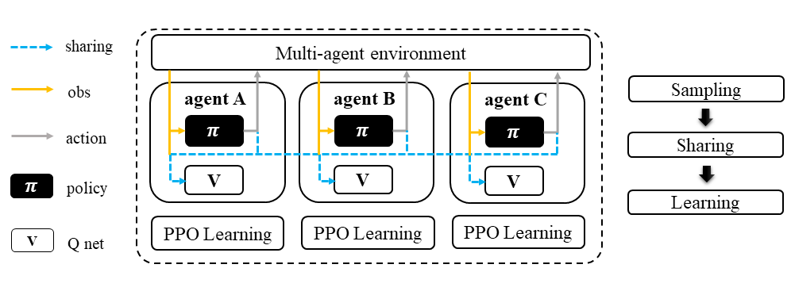

.. _MAPPO:

Multi-agent Proximal Policy Optimization (MAPPO)
-----------------------------------------------------

.. admonition:: Quick Facts

    - Multi-agent proximal policy optimization is one of the centralized extensions of independent proximal policy optimization.
    - Additional data sharing module is needed.
    - The agent model is equipped with a centralized critic function.
    - The mappo surrogate loss is built based on new critic loss.

Characteristic
^^^^^^^^^^^^^^^

action space

.. list-table::
   :widths: 25 25
   :header-rows: 0

   * - ``discrete``
     - ``continues``

task mode

.. list-table::
   :widths: 25 25 25
   :header-rows: 0

   * - ``cooperative``
     - ``collaborative``
     - ``competitive``

taxonomy label

.. list-table::
   :widths: 25 25 25
   :header-rows: 0

   * - ``on-policy``
     - ``stochastic``
     - ``centralized critic``

inherited algorithm

.. list-table::
   :widths: 25
   :header-rows: 0

   * - :ref:`IPPO`

Preliminary
^^^^^^^^^^^^^^^^^^^^^^^^^^^^^

Independent Proximal Policy Optimization (IPPO)

Algorithm Description
^^^^^^^^^^^^^^^^^^^^^^^

MAPPO is the centralized version of PPO where the critic function :math:`V` take not only the self observation as input but also other agents' information.

Math Formulation
^^^^^^^^^^^^^^^^^^

Critic learning:

.. math::

    \phi_{k+1} = \arg \min_{\phi} \frac{1}{|{\mathcal D}_k| T} \sum_{\tau \in {\mathcal D}_k} \sum_{t=0}^T\left( V_{\phi} (s_t) - \hat{R}_t \right)^2

General Advantage Estimation:

.. math::

    A_t=\sum_{t=0}^{\infty}(\gamma\lambda)^l\delta_{t+l}^V

Policy learning:

.. math::

    L(s,\mathbf{s}, a,\mathbf{a}^-,\theta_k,\theta) = \min\left(
    \frac{\pi_{\theta}(a|s)}{\pi_{\theta_k}(a|s)}  A^{\pi_{\theta_k}}(\mathbf{s},\mathbf{a}^-), \;\;
    \text{clip}\left(\frac{\pi_{\theta}(a|s)}{\pi_{\theta_k}(a|s)}, 1 - \epsilon, 1+\epsilon \right) A^{\pi_{\theta_k}}(\mathbf{s},\mathbf{a}^-)
    \right),

Here
:math:`{\mathcal D}` is the collected trajectories.
:math:`R` is the rewards-to-go.
:math:`\tau` is the trajectory.
:math:`A` is the advantage.
:math:`\gamma` is discount value.
:math:`\lambda` is the weight value of GAE.
:math:`a` is the current agent action.
:math:`\mathbf{a}^-` is the action set of all agents, except the current agent.
:math:`s` is the current agent observation/state.
:math:`\mathbf{s}` is the observation/state set of all agents.
:math:`\epsilon` is a hyperparameter controlling how far away the new policy is allowed to go from the old.
:math:`V_{\phi}` is the critic value function.
:math:`\pi_{\theta}` is the policy net.

Workflow
^^^^^^^^^^^^^^^^^^^^^^^^^^^^^

In sampling stage, agents share information with others. The information includes others' observation and predicted action. After collecting the necessary information from other agents,
all agents follow standard PPO training pipeline, except using the centralized critic value function to calculate the GAE and conduct the PPO critic learning procedure.

    Multi-agent Proximal Policy Optimization (MAPPO)

Implementation
^^^^^^^^^^^^^^^^^^^^^^^^^

We use vanilla PPO implementation of RLlib in IPPO. The only exception is we rewrite the sgd iteration logic.
The differences can be found in

    - ``MultiGPUTrainOneStep``
    - ``learn_on_loaded_batch``

Based on IPPO, we add centralized modules to implement MAPPO.
The main differences are:

    - ``centralized_critic_postprocessing``
    - ``central_critic_ppo_loss``
    - ``CC_RNN``

Key hyperparameter location:

- ``marl/algos/hyperparams/common/ppo``
- ``marl/algos/hyperparams/fintuned/env/ppo``

Usage & Limitation
^^^^^^^^^^^^^^^^^^^^^^

IPPO is suitable for

- continues control tasks
- discrete control tasks
- any task mode

.. code-block:: shell

    python marl/main.py --algo_config=ppo --finetuned --env-config=smac with env_args.map_name=3m

Read list
^^^^^^^^^^^^^^^^^^^^^^^^^^^^^

- `The Surprising Effectiveness of PPO in Cooperative, Multi-Agent Games <https://arxiv.org/abs/2103.01955>`_
