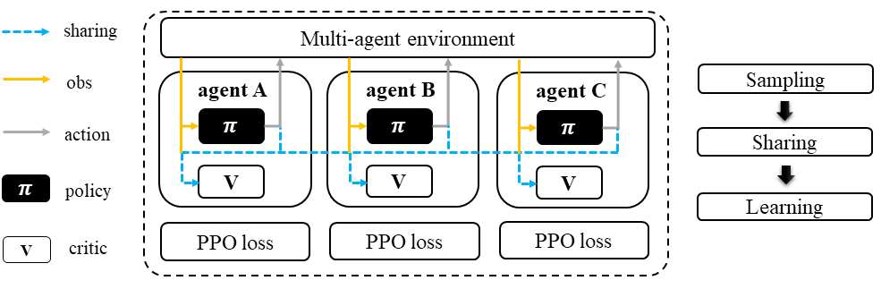
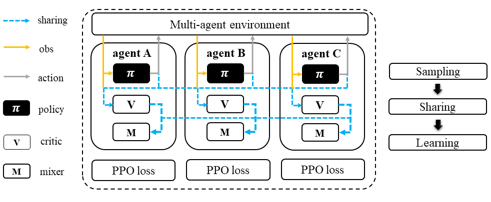
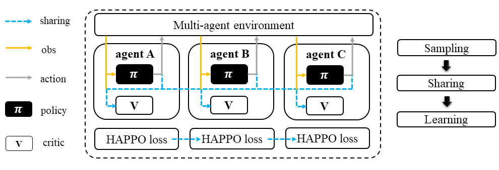

Proximal Policy Optimization Family
======================================================================

.. contents::
    :local:
    :depth: 3

---------------------

.. _PPO:

Proximal Policy Optimization: A Recap
-----------------------------------------------

**Preliminary**:

- Vanilla Policy Gradient (PG)
- Trust Region Policy Optimization (TRPO)
- General Advantage Estimation (GAE)

Proximal Policy Optimization (PPO) is a first-order optimization that simplifies its implementation. Similar to TRPO objective function, It defines the probability ratio between the new policy and old policy as :math:`\frac{\pi_{\theta}(a|s)}{\pi_{\theta_k}(a|s)}`.
Instead of adding complicated KL constraints, PPO imposes this policy ratio to stay within a small interval between :math:`1-\epsilon` and :math:`1+\epsilon`.
The objective function of PPO takes the minimum value between the original value and the clipped value.

There are two primary variants of PPO: PPO-Penalty and PPO-Clip. Here we only give the formulation of PPO-Clip, which is more common in practice.
For PPO-penalty, please refer to `Proximal Policy Optimization <https://spinningup.openai.com/en/latest/algorithms/ppo.html>`_.

**Mathematical Form**

Critic learning: every iteration gives a better value function.

.. math::

    \phi_{k+1} = \arg \min_{\phi} \frac{1}{|{\mathcal D}_k| T} \sum_{\tau \in {\mathcal D}_k} \sum_{t=0}^T\left( V_{\phi} (s_t) - \hat{R}_t \right)^2

General Advantage Estimation: how good are current action regarding to the baseline critic value.

.. math::

    A_t=\sum_{t=0}^{\infty}(\gamma\lambda)^l\delta_{t+l}^V

Policy learning: computing the policy gradient using estimated advantage to update the policy function.

.. math::

    L(s,a,\theta_k,\theta) = \min\left(
    \frac{\pi_{\theta}(a|s)}{\pi_{\theta_k}(a|s)}  A^{\pi_{\theta_k}}(s,a), \;\;
    \text{clip}\left(\frac{\pi_{\theta}(a|s)}{\pi_{\theta_k}(a|s)}, 1 - \epsilon, 1+\epsilon \right) A^{\pi_{\theta_k}}(s,a)
    \right)

Here
:math:`{\mathcal D}` is the collected trajectories.
:math:`R` is the rewards-to-go.
:math:`\tau` is the trajectory.
:math:`V_{\phi}` is the critic function.
:math:`A` is the advantage.
:math:`\gamma` is discount value.
:math:`\lambda` is the weight value of GAE.
:math:`a` is the action.
:math:`s` is the observation/state.
:math:`\epsilon` is a hyperparameter controlling how far away the new policy is allowed to go from the old.
:math:`\pi_{\theta}` is the policy function.

---------------------

.. _IPPO:

IPPO: multi-agent version of PPO
-----------------------------------------------------

.. admonition:: Quick Facts

    - Independent proximal policy optimization (IPPO) is a natural extension of standard proximal policy optimization (PPO) in multi-agent settings.
    - Agent architecture of IPPO consists of two modules: ``policy`` and ``critic``.
    - IPPO is applicable for cooperative, collaborative, competitive, and mixed task modes.

**Preliminary**:

- :ref:`PPO`

Workflow
^^^^^^^^^^^^^^^^^^^^^^^^^^^^^

In IPPO, each agent follows a standard PPO sampling/training pipeline. Therefore, IPPO is a general baseline for all MARL tasks with robust performance.
Note that buffer and agent models can be shared or separately training across agents. And this applies to all algorithms in PPO family.

.. figure:: ../images/ippo.png
    :width: 600
    :align: center

    Independent Proximal Policy Optimization (IPPO)

Characteristic
^^^^^^^^^^^^^^^

action space

.. list-table::
   :widths: 25 25
   :header-rows: 0

   * - ``discrete``
     - ``continuous``

task mode

.. list-table::
   :widths: 25 25 25 25
   :header-rows: 0

   * - ``cooperative``
     - ``collaborative``
     - ``competitive``
     - ``mixed``

taxonomy label

.. list-table::
   :widths: 25 25 25
   :header-rows: 0

   * - ``on-policy``
     - ``stochastic``
     - ``independent learning``

Insights
^^^^^^^^^^^^^^^^^^^^^^^

IPPO is the simplest multi-agent version of standard PPO. Each agent is now a PPO-based sampler and learner.
IPPO does not need information sharing
While knowledge sharing across agents is optional in IPPO.

.. admonition:: Information Sharing

    In multi-agent learning, the concept of information sharing is not well defined and may confuse.
    Here we try to clarify this by categorizing the type of information sharing into three.

    - real/sampled data: observation, action, etc.
    - predicted data: Q/critic value, message for communication, etc.
    - knowledge: experience replay buffer, model parameters, etc.

    Knowledge-level information sharing is usually excluded from information sharing and is only seen as a trick.
    But recent works find it is essential for good performance. So here, we include knowledge sharing as part of the information sharing.

Mathematical Form 
^^^^^^^^^^^^^^^^^^

Standing at the view of a single agent, the mathematical formulation of IPPO is similiar as :ref:`PPO`, except that in MARL,
agent usually has no access to the global state typically under partial observable setting. Therefore, we use :math:`o` for
local observation and :math:`s`for the global state. We then rewrite the mathematical formulation of PPO as:

Critic learning: every iteration gives a better value function.

.. math::

    \phi_{k+1} = \arg \min_{\phi} \frac{1}{|{\mathcal D}_k| T} \sum_{\tau \in {\mathcal D}_k} \sum_{t=0}^T\left( V_{\phi} (o_t) - \hat{R}_t \right)^2

General Advantage Estimation: how good are current action regarding to the baseline critic value.

.. math::

    A_t=\sum_{t=0}^{\infty}(\gamma\lambda)^l\delta_{t+l}^V

Policy learning: computing the policy gradient using estimated advantage to update the policy function.

.. math::

    L(o,u,\theta_k,\theta) = \min\left(
    \frac{\pi_{\theta}(u|o)}{\pi_{\theta_k}(u|o)}  A^{\pi_{\theta_k}}(o,u), \;\;
    \text{clip}\left(\frac{\pi_{\theta}(u|o)}{\pi_{\theta_k}(u|o)}, 1 - \epsilon, 1+\epsilon \right) A^{\pi_{\theta_k}}(o,u)
    \right)

:math:`{\mathcal D}` is the collected trajectories.
:math:`R` is the rewards-to-go.
:math:`\tau` is the trajectory.
:math:`V_{\phi}` is the critic function.
:math:`A` is the advantage.
:math:`\gamma` is discount value.
:math:`\lambda` is the weight value of GAE.
:math:`u` is the action.
:math:`o` is the local observation.
:math:`\epsilon` is a hyperparameter controlling how far away the new policy is allowed to go from the old.
:math:`\pi_{\theta}` is the policy function.

Note that in multi-agent settings, all the agent models can be shared, including:

- critic function :math:`V_{\phi}`.
- policy function :math:`\pi_{\theta}`.

Implementation
^^^^^^^^^^^^^^^^^^^^^^^^^

We use vanilla PPO implementation of RLlib in IPPO. The only exception is we rewrite the SGD iteration logic.
The details can be found in

- ``MultiGPUTrainOneStep``
- ``learn_on_loaded_batch``

Key hyperparameter location:

- ``marl/algos/hyperparams/common/ppo``
- ``marl/algos/hyperparams/fintuned/env/ppo``

---------------------

.. _MAPPO:

MAPPO: PPO agent with a centralized critic
-----------------------------------------------------

.. admonition:: Quick Facts

    - Multi-agent proximal policy optimization (MAPPO) is one of the extended version of :ref:`IPPO`.
    - Agent architecture of MAPPO consists of two models: ``policy`` and ``critic``.
    - MAPPO is proposed to solve cooperative tasks but is still applicable to collaborative, competitive, and mixed tasks.

**Preliminary**:

- :ref:`IPPO`

Workflow
^^^^^^^^^^^^^^^^^^^^^^^^^^^^^

In the sampling stage, agents share information with others. The information includes others' observations and predicted actions. After collecting the necessary information from other agents,
all agents follow the standard PPO training pipeline, except using the centralized value function to calculate the GAE and conduct the PPO critic learning procedure.

    Multi-agent Proximal Policy Optimization (MAPPO)

Characteristic
^^^^^^^^^^^^^^^

action space

.. list-table::
   :widths: 25 25
   :header-rows: 0

   * - ``discrete``
     - ``continuous``

task mode

.. list-table::
   :widths: 25 25 25 25
   :header-rows: 0

   * - ``cooperative``
     - ``collaborative``
     - ``competitive``
     - ``mixed``

taxonomy label

.. list-table::
   :widths: 25 25 25
   :header-rows: 0

   * - ``on-policy``
     - ``stochastic``
     - ``centralized critic``

Insights
^^^^^^^^^^^^^^^^^^^^^^^

On-policy reinforcement learning algorithms are less sample efficient than their off-policy counterparts in MARL.
The MAPPO algorithm overturn this consensus by experimentally proving that:

#. On-policy algorithms can achieve comparable performance to various off-policy methods.
#. MAPPO is a robust MARL algorithm for diverse cooperative tasks and can outperform SOTA off-policy methods in more challenging scenarios.
#. Formulating the input to the centralized value function is crucial for the final performance.

.. admonition:: You Should Know

    - MAPPO paper is done in cooperative settings. Nevertheless, it can be directly applied to competitive and mixed task modes. Moreover, the performance is still good.
    - Sampling procedure of on-policy algorithms can be parallel conducted. Therefore, the actual time consuming for a comparable performance between MAPPO and off-policy algorithms is almost the same when we have enough sampling *workers*.
    - Parameters are shared across agents. Not sharing these parameters will not incur any problems. Conversely, partly sharing these parameters(e.g., only sharing the critic) can help achieve better performance in some scenarios.

Mathematical Form 
^^^^^^^^^^^^^^^^^^

MAPPO needs information sharing across agents. Critic learning utilizes self-observation and information other agents provide,
including observation and actions. Here we bold the symbol (e.g., :math:`u` to :math:`\mathbf{u}`) to indicate more than one agent information is contained.

Critic learning: every iteration gives a better centralized value function.

.. math::

    \phi_{k+1} = \arg \min_{\phi} \frac{1}{|{\mathcal D}_k| T} \sum_{\tau \in {\mathcal D}_k} \sum_{t=0}^T\left( V_{\phi} (o_t,s_t,\mathbf{u_t}^-) - \hat{R}_t \right)^2

General Advantage Estimation: how good are current action regarding to the baseline critic value.

.. math::

    A_t=\sum_{t=0}^{\infty}(\gamma\lambda)^l\delta_{t+l}^V

Policy learning: computing the policy gradient using estimated advantage to update the policy function.

.. math::

    L(o,s, u,\mathbf{u}^-,\theta_k,\theta) = \min\left(
    \frac{\pi_{\theta}(u|o)}{\pi_{\theta_k}(u|o)}  A^{\pi_{\theta_k}}(o,s,\mathbf{u}^-), \;\;
    \text{clip}\left(\frac{\pi_{\theta}(u|o)}{\pi_{\theta_k}(u|o)}, 1 - \epsilon, 1+\epsilon \right) A^{\pi_{\theta_k}}(o,s,\mathbf{u}^-)
    \right)

Here
:math:`\mathcal D` is the collected trajectories that can be shared across agents.
:math:`R` is the rewards-to-go.
:math:`\tau` is the trajectory.
:math:`A` is the advantage.
:math:`\gamma` is discount value.
:math:`\lambda` is the weight value of GAE.
:math:`u` is the current agent action.
:math:`\mathbf{u}^-` is the action set of all agents, except the current agent.
:math:`s` is the global state.
:math:`o` is the local observation
:math:`\epsilon` is a hyperparameter controlling how far away the new policy is allowed to go from the old.
:math:`V_{\phi}` is the value function, which can be shared across agents.
:math:`\pi_{\theta}` is the policy function, which can be shared across agents.

Implementation
^^^^^^^^^^^^^^^^^^^^^^^^^

Based on IPPO, we add centralized modules to implement MAPPO.
The details can be found in:

- ``centralized_critic_postprocessing``
- ``central_critic_ppo_loss``
- ``CC_RNN``

Key hyperparameter location:

- ``marl/algos/hyperparams/common/mappo``
- ``marl/algos/hyperparams/fintuned/env/mappo``

---------------------

.. _VDPPO:

VDPPO: mixing a bunch of PPO agents' critics
-----------------------------------------------------

.. admonition:: Quick Facts

    - Value decomposition proximal policy optimization (VDPPO) is one of the extended version of :ref:`IPPO`.
    - Agent architecture of VDPPO consists of three modules: ``policy``, ``critic``, and ``mixer``.
    - VDPPO is proposed to solve cooperative and collaborative task modes.

**Preliminary**:

- :ref:`IPPO`
- :ref:`QMIX`

Workflow
^^^^^^^^^^^^^^^^^^^^^^^^^^^^^

In the sampling stage, agents share information with others. The information includes others' observations and predicted critic value. After collecting the necessary information from other agents,
all agents follow the standard PPO training pipeline, except for using the mixed critic value to calculate the GAE and conduct the PPO critic learning procedure.

    Value Decomposition Proximal Policy Optimization (VDPPO)

Characteristic
^^^^^^^^^^^^^^^

action space

.. list-table::
   :widths: 25 25
   :header-rows: 0

   * - ``discrete``
     - ``continuous``

task mode

.. list-table::
   :widths: 25 25
   :header-rows: 0

   * - ``cooperative``
     - ``collaborative``

taxonomy label

.. list-table::
   :widths: 25 25 25
   :header-rows: 0

   * - ``on-policy``
     - ``stochastic``
     - ``value decomposition``

Insights
^^^^^^^^^^^^^^^^^^^^^^^

VDPPO focuses on the credit assignment learning, which is similar to the joint Q learning family.
VDPPO is easy to understand when you have basic idea of :ref:`QMIX` and :ref:`VDA2C`.

.. admonition:: You Should Know
    - Like the joint Q learning family, VDPPO is applicable for cooperative and collaborative multi-agent tasks.
    - The sampling efficiency of VDPPO is worse than joint Q learning family algorithms.
    - VDPPO can be applied to both discrete and continuous control problems, which is a good news compared to discrete-only joint Q learning algorithms

Mathematical Form 
^^^^^^^^^^^^^^^^^^

VDPPO needs information sharing across agents. Therefore, the critic mixing utilizes both self-observation and other agents' observation.
Here we bold the symbol (e.g., :math:`u` to :math:`\mathbf{u}`) to indicate more than one agent information is contained.

Critic mixing: a learnable mixer for computing the global value function.

.. math::

    V_{tot}(\mathbf{a}, s;\boldsymbol{\phi},\psi) = g_{\psi}\bigl(s, V_{\phi_1},V_{\phi_2},..,V_{\phi_n} \bigr)

Critic learning: every iteration gives a better  global value function.

.. math::

    \phi_{k+1} = \arg \min_{\phi} \frac{1}{|{\mathcal D}_k| T} \sum_{\tau \in {\mathcal D}_k} \sum_{t=0}^T\left( V_{tot}(\mathbf{u}, s;\boldsymbol{\phi},\psi) - \hat{R}_t \right)^2

General Advantage Estimation: how good are current joint action set regarding to the baseline critic value.

.. math::

    A_t=\sum_{t=0}^{\infty}(\gamma\lambda)^l\delta_{t+l}^{V_{tot}}

Policy learning: computing the policy gradient using estimated advantage to update the policy function.

.. math::

    L(s,o, u,\mathbf{u}^-,\theta_k,\theta) = \min\left(
    \frac{\pi_{\theta}(u|o)}{\pi_{\theta_k}(u|o)}  A^{\pi_{\theta_k}}(s, o,\mathbf{u}^-), \;\;
    \text{clip}\left(\frac{\pi_{\theta}(u|o)}{\pi_{\theta_k}(u|o)}, 1 - \epsilon, 1+\epsilon \right) A^{\pi_{\theta_k}}(s, o,\mathbf{u}^-)
    \right)

Here
:math:`{\mathcal D}` is the collected trajectories.
:math:`R` is the rewards-to-go.
:math:`\tau` is the trajectory.
:math:`A` is the advantage.
:math:`\gamma` is discount value.
:math:`\lambda` is the weight value of GAE.
:math:`u` is the current agent action.
:math:`\mathbf{u}^-` is the action set of all agents, except the current agent.
:math:`s` is the global state.
:math:`o` is the local observation.
:math:`\epsilon` is a hyperparameter controlling how far away the new policy is allowed to go from the old.
:math:`V_{\phi}` is the value function.
:math:`\pi_{\theta}` is the policy function.
:math:`g_{\psi}` is the mixer.

Implementation
^^^^^^^^^^^^^^^^^^^^^^^^^

Based on IPPO, we add the mixer to implement VDPPO.
The details can be found in:

- ``value_mixing_postprocessing``
- ``value_mix_ppo_surrogate_loss``
- ``VD_RNN``

Key hyperparameter location:

- ``marl/algos/hyperparams/common/vdppo``
- ``marl/algos/hyperparams/fintuned/env/vdppo``

---------------------

.. _HAPPO:

HAPPO: Sequentially updating critic of MAPPO agents
-----------------------------------------------------

.. admonition:: Quick Facts

    - Heterogeneous-Agent Proximal Policy Optimisation (HAPPO) algorithm is based on :ref:`MAPPO`.
    - Agent architecture of HAPPO consists of three modules: ``policy``, ``critic``, and ``sequential updating``.
    - In HAPPO, agents have non-shared ``policy`` and shared ``critic``.
    - HAPPO is proposed to solve cooperative and collaborative tasks.

Workflow
^^^^^^^^^^^^^^^^^^^^^^^^^^^^^

In the sampling stage, agents share information with others. The information includes others' observations and predicted actions. After collecting the necessary information from other agents,
all agents follow the standard PPO training pipeline, except HAPPO would update each policy sequentially. In this updating sequence, the next agent's advantage is iterated by the current sampling importance and hte former advantage, except the first agent's advantage is the original advantae value.

    Heterogeneous-Agent Proximal Policy Optimization (HAPPO)

Characteristic
^^^^^^^^^^^^^^^

action space

.. list-table::
   :widths: 25 25
   :header-rows: 0

   * - ``discrete``
     - ``continuous``

task mode

.. list-table::
   :widths: 25 25
   :header-rows: 0

   * - ``cooperative``
     - ``collaborative``

taxonomy label

.. list-table::
   :widths: 25 25 25
   :header-rows: 0

   * - ``on-policy``
     - ``stochastic``
     - ``centralized critic``

Insights
^^^^^^^^^^^^^^^^^^^^^^^

**Preliminary**

- :ref:`IPPO`

The previous methods either hold the sharing parameters for different agents or lack the essential theoretical property of trust region learning, which is the monotonic improvement guarantee.
This could lead to several issues when dealing with MARL problems. Such as:

#. If the parameters have to be shared, the methods could not apply to the occasions that different agents observe different dimensions.
#. Sharing parameters could suffer from an exponentially-worse suboptimal outcome.
#. although IPPO/MAPPO can be practically applied in a non-parameter sharing way, it still lacks the essential theoretical property of trust region learning, which is the monotonic improvement guarantee.

The HAPPO paper proves that for Heterogeneous-Agent:

#. Theoretically-justified trust region learning framework in MARL.
#. HAPPO adopts the sequential update scheme, which saves the cost of maintaining a centralized critic for each agent in CTDE(centralized training with decentralized execution).

.. admonition:: Some Interesting Facts

    - A similar idea of the multi-agent sequential update was also discussed in dynamic programming, where artificial “in-between” states must be considered. On the contrary, HAPPO sequential update scheme is developed based on the paper proposed Lemma 1, which does not require any artificial assumptions and holds for any cooperative games
    - Bertsekas (2019) requires maintaining a fixed order of updates that is pre-defined for the task, whereas the order in MAPPO is randomised at each iteration, which also offers desirable convergence property

Mathematical Form
^^^^^^^^^^^^^^^^^^

Critic learning: every iteration gives a better value function.

.. math::

    \phi_{k+1} = \arg \min_{\phi} \frac{1}{|{\mathcal D}_k| T} \sum_{\tau \in {\mathcal D}_k} \sum_{t=0}^T\left( V_{\phi} (s_t) - \hat{R}_t \right)^2

Initial Advantage Estimation: how good are current action regarding to the baseline critic value.

.. math::

    A_t=\sum_{t=0}^{\infty}(\gamma\lambda)^l\delta_{t+l}^V

Advantage Estimation for m  = 1: how good are current action regarding to the baseline critic value of the first chosen agent.

.. math::

    \mathbf{M}^{i_{1}}(s, \mathbf{u}) = \hat{A}_{s, \mathbf{u}}(s, \mathbf{u})

Advantage Estimation if m > 1: how good are current action regarding to the baseline critic value of the chosen agent except the first one.

.. math::

    \mathbf{M}^{i_{1:m}}(s, \mathbf{u}) = \frac{\bar{\pi}^{i_{1:m-1}}(u^{1:m-1} | o)} {\pi^{i_{1:m-1}}(u^{1:m-1} | o)} \mathbf{M}^{i_{1:m-1}}(s, \mathbf{u})

Policy learning: computing the policy gradient using estimated advantage to update the policy function.

.. math::

    \frac{1}{BT}\sum_{b=1}^{B} \sum_{t=0}^{T}\left[ min\left(  \frac{\pi_{\theta^{i_m}}^{i_m}(u^{i_m} |o)} {\pi_{\theta^{i_m}_{k}}^{i_m}(u^{i_m} | o)} M^{i_{1:m}}(s|u), clip\left( \frac{\pi_{\theta^{i_m}}^{i_m}(u^{i_m} | o)} {\pi_{\theta^{i_m}_{k}}^{i_m}(u^{i_m} | o)}, 1 \pm \epsilon \right)\right)M^{i_{1:m}}(s|u)\right]

Here
:math:`{\mathcal D}` is the collected trajectories.
:math:`R` is the rewards-to-go.
:math:`\tau` is the trajectory.
:math:`A` is the advantage.
:math:`\gamma` is discount value.
:math:`\lambda` is the weight value of GAE.
:math:`u` is the current agent action.
:math:`\mathbf{u}^-` is the action set of all agents, except the current agent.
:math:`s` is the global state.
:math:`o` is the local information.
:math:`\epsilon` is a hyperparameter controlling how far away the new policy is allowed to go from the old.
:math:`V_{\phi}` is the value function.
:math:`\pi_{\theta}` is the policy function.
:math:`B` is batch size
:math:`T` is steps per episode

Implementation
^^^^^^^^^^^^^^^^^^^^^^^^^

Based on MAPPO, we add three components to implement HAPPO.
The details can be found in:

- ``add_opponent_information_and_critical_vf``
- ``happo_surrogate_loss``
- ``add_all_agents_gae``

Key hyperparameter location:

- ``marl/algos/hyperparams/common/happo``
- ``marl/algos/hyperparams/fintuned/env/happo``

---------------------

Read List
-------------

- `High-Dimensional Continuous Control Using Generalized Advantage Estimation <https://arxiv.org/abs/1506.02438>`_
- `Proximal Policy Optimization Algorithms <https://arxiv.org/abs/1707.06347>`_
- `Is Independent Learning All You Need in the StarCraft Multi-Agent Challenge? <https://arxiv.org/abs/2011.09533>`_
- `The Surprising Effectiveness of PPO in Cooperative, Multi-Agent Games <https://arxiv.org/abs/2103.01955>`_
- `Trust Region Policy Optimisation in Multi-Agent Reinforcement Learning <https://arxiv.org/abs/2109.11251>`_
