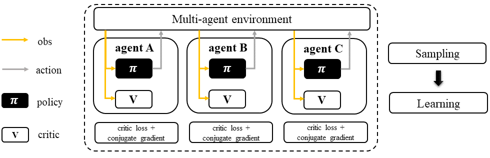
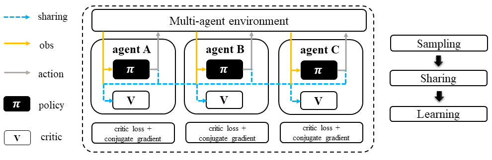
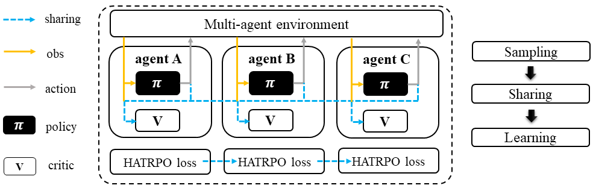

Trust Region Policy Optimization Family
======================================================================

.. contents::
    :local:
    :depth: 3

---------------------

.. _TRPO:

Trust Region Policy Optimization: A Recap
-----------------------------------------------

**Preliminary**:

- Vanilla Policy Gradient (PG)

In reinforcement learning, finding the appropriate learning rate is essential for policy-gradient based methods. To address this issue, Trust Region Policy Optimization (TRPO) proposes that the updated policy should remain within a trust region. TRPO has four steps to optimize its policy function:

#. sample a set of trajectories.
#. estimate the advantages using any advantage estimation method (here we adopt General Advantage Estimation (GAE)).
#. solve the constrained optimization problem using conjugate gradient and update the policy by it.
#. fit the value function (critic).

And we repeat these steps to get the global maximum point of the policy function.

**Mathematical Form**

Critic learning: every iteration gives a better value function.

.. math::

    \phi_{k+1} = \arg \min_{\phi} \frac{1}{|{\mathcal D}_k| T} \sum_{\tau \in {\mathcal D}_k} \sum_{t=0}^T\left( V_{\phi} (s_t) - \hat{R}_t \right)^2

General Advantage Estimation: how good are current action regarding to the baseline critic value.

.. math::

    A_t=\sum_{t=0}^{\infty}(\gamma\lambda)^l\delta_{t+l}^V

: computing the policy gradient using estimated advantage to update the policy function.

Policy learning step 1: estimate policy gradient

.. math::

    g_k = \frac{1}{|{\mathcal D}_k|} \sum_{\tau \in {\mathcal D}_k} \sum_{t=0}^T \left. \nabla_{\theta} \log\pi_{\theta}(a_t|s_t)\right|_{\theta_k} A_t

Policy learning step 2: Use the conjugate gradient algorithm to compute

.. math::

    x_k \approx H_k^{-1} g_k

Policy learning step 3

.. math::

    \theta_{k+1} = \theta_k + \alpha^j \sqrt{ \frac{2\delta}{x_k^T H_k x_k}} x_k

Here
:math:`{\mathcal D}` is the collected trajectories.
:math:`R` is the rewards-to-go.
:math:`\tau` is the trajectory.
:math:`V_{\phi}` is the critic function.
:math:`A` is the advantage.
:math:`\gamma` is discount value.
:math:`\lambda` is the weight value of GAE.
:math:`a` is the action.
:math:`s` is the observation/state.
:math:`\epsilon` is a hyperparameter controlling how far away the new policy is allowed to go from the old.
:math:`\pi_{\theta}` is the policy function.
:math:`H_k` is the Hessian of the sample average KL-divergence.
:math:`j \in \{0, 1, 2, ... K\}` is the smallest value which improves the sample loss and satisfies the sample KL-divergence constraint.

A more detailed explanation can be found in - `Spinning Up: Trust Region Policy Optimisation <https://spinningup.openai.com/en/latest/algorithms/trpo.html>`_

---------------------

.. _ITRPO:

ITRPO: multi-agent version of TRPO
-----------------------------------------------------

.. admonition:: Quick Facts

    - Independent trust region policy optimization (ITRPO) is a natural extension of standard trust region policy optimization (TRPO) in multi-agent settings.
    - Agent architecture of ITRPO consists of two modules: ``policy`` and ``critic``.
    - ITRPO is applicable for cooperative, collaborative, competitive, and mixed task modes.

**Preliminary**:

- :ref:`TRPO`

Workflow
^^^^^^^^^^^^^^^^^^^^^^^^^^^^^

In ITRPO, each agent follows a standard TRPO sampling/training pipeline. 
Note that buffer and agent models can be shared or separately training across agents.
And this applies to all algorithms in TRPO family.

    Independent Trust Region Policy Optimization (ITRPO)

Characteristic
^^^^^^^^^^^^^^^

action space

.. list-table::
   :widths: 25 25
   :header-rows: 0

   * - ``discrete``
     - ``continuous``

task mode

.. list-table::
   :widths: 25 25 25 25
   :header-rows: 0

   * - ``cooperative``
     - ``collaborative``
     - ``competitive``
     - ``mixed``

taxonomy label

.. list-table::
   :widths: 25 25 25
   :header-rows: 0

   * - ``on-policy``
     - ``stochastic``
     - ``independent learning``

Insights
^^^^^^^^^^^^^^^^^^^^^^^

ITRPO is a multi-agent version of TRPO, where each agent is a TRPO-based sampler and learner.
ITRPO does not require information sharing between agents during training.
However, knowledge sharing between agents is optional and can be implemented if desired.

.. admonition:: Information Sharing

    In the field of multi-agent learning, the term "information sharing" can be vague and unclear, so it's important to provide clarification. We can categorize information sharing into three types:

    - real/sampled data: observation, action, etc.
    - predicted data: Q/critic value, message for communication, etc.
    - knowledge: experience replay buffer, model parameters, etc.

    Traditionally, knowledge-level information sharing has been viewed as a "trick" and not considered a true form of information sharing in multi-agent learning. However, recent research has shown that knowledge sharing is actually crucial for achieving optimal performance. Therefore, we now consider knowledge sharing to be a valid form of information sharing in multi-agent learning.

Mathematical Form
^^^^^^^^^^^^^^^^^^

Standing at the view of a single agent, the mathematical formulation of ITRPO is similiar as :ref:`TRPO`, except that in MARL,
agent usually has no access to the global state typically under partial observable setting. Therefore, we use :math:`o` for
local observation and :math:`s`for the global state. We then rewrite the mathematical formulation of TRPO as:

Critic learning: every iteration gives a better value function.

.. math::

    \phi_{k+1} = \arg \min_{\phi} \frac{1}{|{\mathcal D}_k| T} \sum_{\tau \in {\mathcal D}_k} \sum_{t=0}^T\left( V_{\phi} (o_t) - \hat{R}_t \right)^2

General Advantage Estimation: how good are current action regarding to the baseline critic value.

.. math::

    A_t=\sum_{t=0}^{\infty}(\gamma\lambda)^l\delta_{t+l}^V

Policy learning step 1: estimate policy gradient

.. math::

    g_k = \frac{1}{|{\mathcal D}_k|} \sum_{\tau \in {\mathcal D}_k} \sum_{t=0}^T \left. \nabla_{\theta} \log\pi_{\theta}(u_t|o_t)\right|_{\theta_k} A_t

Policy learning step 2 & 3 are the same as :ref:`TRPO`.

:math:`{\mathcal D}` is the collected trajectories.
:math:`R` is the rewards-to-go.
:math:`\tau` is the trajectory.
:math:`V_{\phi}` is the critic function.
:math:`A` is the advantage.
:math:`\gamma` is discount value.
:math:`\lambda` is the weight value of GAE.
:math:`u` is the action.
:math:`o` is the local observation.
:math:`\epsilon` is a hyperparameter controlling how far away the new policy is allowed to go from the old.
:math:`\pi_{\theta}` is the policy function.

Note that in multi-agent settings, all the agent models can be shared, including:

- critic function :math:`V_{\phi}`.
- policy function :math:`\pi_{\theta}`.

Implementation
^^^^^^^^^^^^^^^^^^^^^^^^^

We implement TRPO based on PPO training pipeline of RLlib.
The detail can be found in:

- ``TRPOTorchPolicy``
- ``TRPOTrainer``

Key hyperparameter location:

- ``marl/algos/hyperparams/common/trpo``
- ``marl/algos/hyperparams/fintuned/env/trpo``

---------------------

.. _MATRPO:

MATRPO: TRPO agent with a centralized critic
-----------------------------------------------------

.. admonition:: Quick Facts

    - Multi-agent trust region policy optimization (MATRPO) is one of the extended version of :ref:`ITRPO`.
    - Agent architecture of MATRPO consists of two models: ``policy`` and ``critic``.
    - MATRPO is applicable for cooperative, collaborative, competitive, and mixed task modes.

**Preliminary**:

- :ref:`ITRPO`

Workflow
^^^^^^^^^^^^^^^^^^^^^^^^^^^^^

During the sampling stage of MATRPO, agents share information such as observations and predicted actions with each other. Once each agent collects the necessary information from the others, they can begin the standard TRPO training pipeline. The only difference is that a centralized value function is used to calculate the Generalized Advantage Estimation (GAE) and conduct the TRPO policy learning and critic learning procedure. This allows the agents to take into account the actions and observations of their teammates when updating their policies.

    Multi-agent Trust Region Policy Optimization (MATRPO)

Characteristic
^^^^^^^^^^^^^^^

action space

.. list-table::
   :widths: 25 25
   :header-rows: 0

   * - ``discrete``
     - ``continuous``

task mode

.. list-table::
   :widths: 25 25 25 25
   :header-rows: 0

   * - ``cooperative``
     - ``collaborative``
     - ``competitive``
     - ``mixed``

taxonomy label

.. list-table::
   :widths: 25 25 25
   :header-rows: 0

   * - ``on-policy``
     - ``stochastic``
     - ``centralized critic``

Insights
^^^^^^^^^^^^^^^^^^^^^^^

MATRPO and :ref:`MAPPO` are very alike of their features, only the decentralized policy is optimized in the TRPO manner in MATRPO instead of PPO manner.

Mathematical Form
^^^^^^^^^^^^^^^^^^

MATRPO needs information sharing across agents. Critic learning utilizes self-observation and information other agents provide,
including observation and actions. Here we bold the symbol (e.g., :math:`u` to :math:`\mathbf{u}`) to indicate more than one agent information is contained.

Critic learning: every iteration gives a better centralized value function.

.. math::

    \phi_{k+1} = \arg \min_{\phi} \frac{1}{|{\mathcal D}_k| T} \sum_{\tau \in {\mathcal D}_k} \sum_{t=0}^T\left(  V_{\phi} (o_t,s_t,\mathbf{u_t}^-) - \hat{R}_t \right)^2

General Advantage Estimation: how good are current action regarding to the baseline critic value.

.. math::

    A_t=\sum_{t=0}^{\infty}(\gamma\lambda)^l\delta_{t+l}^V

Policy learning step 1: estimate policy gradient

.. math::

    g_k = \frac{1}{|{\mathcal D}_k|} \sum_{\tau \in {\mathcal D}_k} \sum_{t=0}^T \left. \nabla_{\theta} \log\pi_{\theta}(u_t|o_t)\right|_{\theta_k} A_t

Policy learning step 2 & 3 are the same as :ref:`TRPO`.

Here
:math:`\mathcal D` is the collected trajectories that can be shared across agents.
:math:`R` is the rewards-to-go.
:math:`\tau` is the trajectory.
:math:`A` is the advantage.
:math:`\gamma` is discount value.
:math:`\lambda` is the weight value of GAE.
:math:`u` is the current agent action.
:math:`\mathbf{u}^-` is the action set of all agents, except the current agent.
:math:`s` is the global state.
:math:`o` is the local observation
:math:`\epsilon` is a hyperparameter controlling how far away the new policy is allowed to go from the old.
:math:`V_{\phi}` is the value function, which can be shared across agents.
:math:`\pi_{\theta}` is the policy function, which can be shared across agents.

Implementation
^^^^^^^^^^^^^^^^^^^^^^^^^

Based on ITRPO, we add centralized modules to implement MATRPO.
The details can be found in:

- ``centralized_critic_postprocessing``
- ``centre_critic_trpo_loss_fn``
- ``CC_RNN``

Key hyperparameter location:

- ``marl/algos/hyperparams/common/matrpo``
- ``marl/algos/hyperparams/fintuned/env/matrpo``

---------------------

.. _HATRPO:

HATRPO: Sequentially updating critic of MATRPO agents
-----------------------------------------------------

.. admonition:: Quick Facts

    - Heterogeneous-Agent Trust Region Policy Optimisation (HATRPO) algorithm is based on :ref:`MATRPO`.
    - Agent architecture of HATRPO consists of three modules: ``policy``, ``critic``, and ``sequential updating``.
    - In HATRPO, agents have non-shared ``policy`` and shared ``critic``.
    - HATRPO is proposed to solve cooperative and collaborative tasks.

Workflow
^^^^^^^^^^^^^^^^^^^^^^^^^^^^^

HATRPO is a variant of TRPO in which each agent still shares information with others during the sampling stage, but the policies are updated sequentially rather than simultaneously. In the updating sequence, the next agent's advantage is computed using the current sampling importance and the former advantage, except for the first agent, whose advantage is the original advantage value.

    Heterogeneous-Agent Trust Region Policy Optimization (HATRPO)

Characteristic
^^^^^^^^^^^^^^^

action space

.. list-table::
   :widths: 25 25
   :header-rows: 0

   * - ``discrete``
     - ``continuous``

task mode

.. list-table::
   :widths: 25 25
   :header-rows: 0

   * - ``cooperative``
     - ``collaborative``

taxonomy label

.. list-table::
   :widths: 25 25 25
   :header-rows: 0

   * - ``on-policy``
     - ``stochastic``
     - ``centralized critic``

Insights
^^^^^^^^^^^^^^^^^^^^^^^

**Preliminary**

- :ref:`ITRPO`

The previous methods either hold the sharing parameters for different agents or lack the essential theoretical property of trust region learning, which is the monotonic improvement guarantee.
This could lead to several issues when dealing with MARL problems. Such as:

#. If the parameters have to be shared, the methods could not apply to the occasions that different agents observe different dimensions.
#. Sharing parameters could suffer from an exponentially-worse suboptimal outcome.
#. although ITRPO/MATRPO can be practically applied in a non-parameter sharing way, it still lacks the essential theoretical property of trust region learning, which is the monotonic improvement guarantee.

The HATRPO paper proves that for Heterogeneous-Agent:

#. Theoretically-justified trust region learning framework in MARL.
#. HATRPO adopts the sequential update scheme, which saves the cost of maintaining a centralized critic for each agent in CTDE(centralized training with decentralized execution).

.. admonition:: Some Interesting Facts

    - A similar idea of the multi-agent sequential update was also discussed in dynamic programming, where artificial “in-between” states must be considered. On the contrary, HATRPO sequential update scheme is developed based on the paper proposed Lemma 1, which does not require any artificial assumptions and holds for any cooperative games
    - Bertsekas (2019) requires maintaining a fixed order of updates that is pre-defined for the task, whereas the order in MATRPO is randomised at each iteration, which also offers desirable convergence property

Mathematical Form
^^^^^^^^^^^^^^^^^^

Critic learning: every iteration gives a better value function.

.. math::

    \phi_{k+1} = \arg \min_{\phi} \frac{1}{|{\mathcal D}_k| T} \sum_{\tau \in {\mathcal D}_k} \sum_{t=0}^T\left( V_{\phi} (s_t) - \hat{R}_t \right)^2

Initial Advantage Estimation: how good are current action regarding to the baseline critic value.

.. math::

    A_t=\sum_{t=0}^{\infty}(\gamma\lambda)^l\delta_{t+l}^V

Advantage Estimation for m  = 1: how good are current action regarding to the baseline critic value of the first chosen agent.

.. math::

    \mathbf{M}^{i_{1}}(s, \mathbf{u}) = \hat{A}_{s, \mathbf{u}}(s, \mathbf{u})

Advantage Estimation if m > 1: how good are current action regarding to the baseline critic value of the chosen agent except the first one.

.. math::

    \mathbf{M}^{i_{1:m}}(s, \mathbf{u}) = \frac{\bar{\pi}^{i_{1:m-1}}(u^{1:m-1} | o)} {\pi^{i_{1:m-1}}(u^{1:m-1} | o)} \mathbf{M}^{i_{1:m-1}}(s, \mathbf{u})

Estimate the gradient of the agent's maximisation objective.

.. math::

    \hat{\boldsymbol{g}}_{k}^{i_{m}}=\frac{1}{B} \sum_{b=1}^{B} \sum_{t=1}^{T} \nabla_{\theta_{k}^{i_{m}}} \log \pi_{\theta_{k}^{i_{m}}}^{i_{m}}\left(a_{t}^{i_{m}} \mid o_{t}^{i_{m}}\right) M^{i_{1: m}}\left(s_{t}, \boldsymbol{a}_{t}\right)

HessianoftheaverageKL-divergence

.. math::

   \hat{\boldsymbol{H}}_{k}^{i_{m}} = \frac{1}{B T} \sum_{b=1}^{B} \sum_{t=1}^{T} D_{\mathrm{KL}}\left(\pi_{\theta_{k}^{i_{m}}}^{i_{m}}\left(\cdot \mid o_{t}^{i_{m}}\right), \pi_{\theta^{i_{m}}}^{i_{m}}\left(\cdot \mid o_{t}^{i_{m}}\right)\right)

Use the conjugate gradient algorithm to compute the update direction.

.. math::

    \boldsymbol{x}_{k}^{i_{m}} \approx\left(\hat{\boldsymbol{H}}_{k}^{i_{m}}\right)^{-1} \boldsymbol{g}_{k}^{i_{m}}

Estimate the maximal step size allowing for meeting the KL-constraint

.. math::

    \hat{\beta}_{k}^{i_{m}} \approx \sqrt{\frac{2 \delta}{\left(\hat{\boldsymbol{x}}_{k}^{i_{m}}\right)^{T} \hat{\boldsymbol{H}}_{k}^{i_{m}} \hat{\boldsymbol{x}}_{k}^{i_{m}}}}

Update agent 𝑖𝑚’s policy by

.. math::

    \theta_{k+1}^{i_{m}}=\theta_{k}^{i_{m}}+\alpha^{j} \hat{\beta}_{k}^{i_{m}} \hat{\boldsymbol{x}}_{k}^{i_{m}}

Here
:math:`{\mathcal D}` is the collected trajectories.
:math:`R` is the rewards-to-go.
:math:`\tau` is the trajectory.
:math:`A` is the advantage.
:math:`\gamma` is discount value.
:math:`\lambda` is the weight value of GAE.
:math:`u` is the current agent action.
:math:`\mathbf{u}^-` is the action set of all agents, except the current agent.
:math:`s` is the global state.
:math:`o` is the local information.
:math:`\epsilon` is a hyperparameter controlling how far away the new policy is allowed to go from the old.
:math:`V_{\phi}` is the value function.
:math:`\pi_{\theta}` is the policy function.
:math:`B` is batch size
:math:`T` is steps per episode
:math:`j \in {0, 1, \dots, L}` is the smallest such 𝑗 which improves the sample loss by at least
:math:`\kappa \alpha^{j} \hat{\beta}_{k}^{i_{m}} \hat{\boldsymbol{x}}_{k}^{i_{m}} \cdot \hat{\boldsymbol{g}}_{k}^{i_{m}}`, found by the backtracking line search.

Implementation
^^^^^^^^^^^^^^^^^^^^^^^^^

Based on MATRPO, we add four components to implement HATRPO.
The details can be found in:

- ``hatrpo_loss_fn``
- ``hatrpo_post_process``
- ``TrustRegionUpdator``
- ``HATRPOUpdator``

Key hyperparameter location:

- ``marl/algos/hyperparams/common/hatrpo``
- ``marl/algos/hyperparams/fintuned/env/hatrpo``

---------------------

Read List
-------------

- `Trust Region Policy Optimization Algorithms <https://arxiv.org/abs/1502.05477>`_
- `High-Dimensional Continuous Control Using Generalized Advantage Estimation <https://arxiv.org/abs/1506.02438>`_
- `Trust Region Policy Optimisation in Multi-Agent Reinforcement Learning <https://arxiv.org/abs/2109.11251>`_
