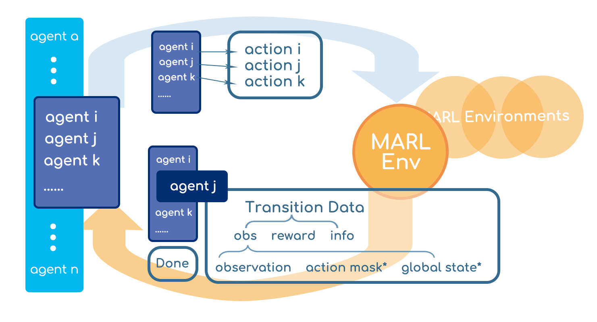
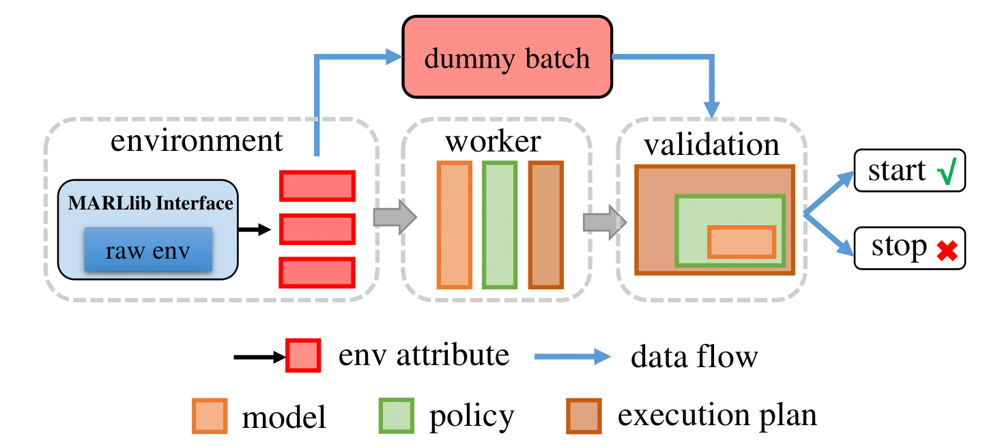
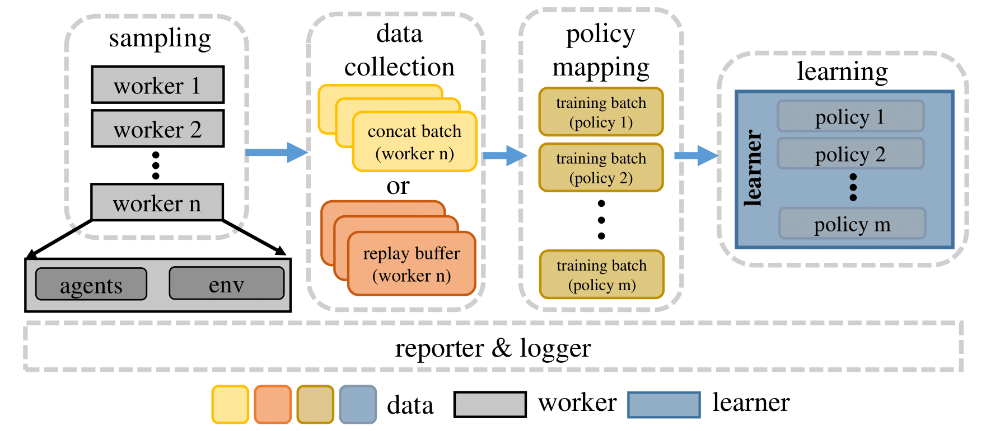
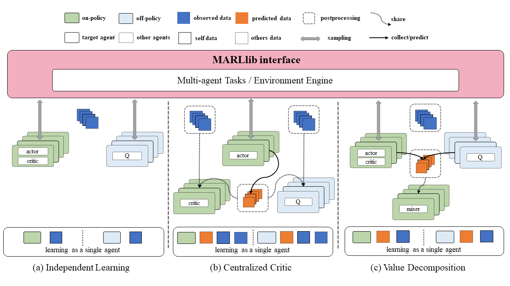
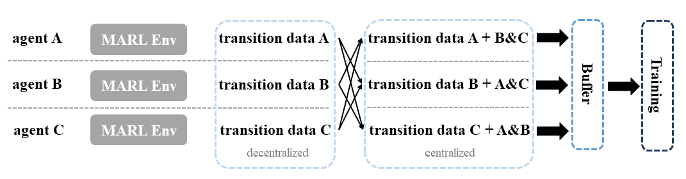
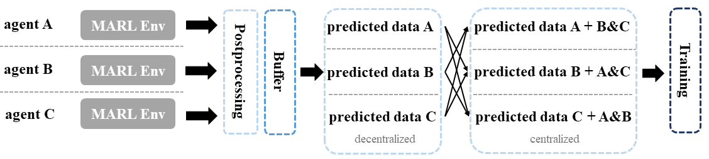
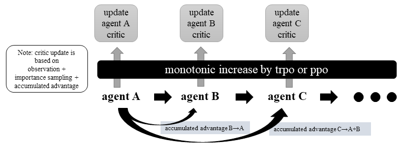

.. _algorithms:

*******************************
Framework
*******************************

MARLlib is a software library designed to facilitate the development and evaluation of multi-agent reinforcement learning (MARL) algorithms.
The library is built on top of Ray, a distributed computing framework, and RLlib, one of its toolkits.
Specifically, MARLlib extends RLlib by incorporating 18 MARL algorithms and 10 multi-agent environments, providing a comprehensive testing bed for MARL research.
One of the key features of MARLlib is its auto-adaptation capability, which allows for seamless execution of algorithms on various environments,including model architecture and interface.
Additionally, MARLlib offers flexible customization options through straightforward configuration file modifications.

.. contents::
    :local:
    :depth: 3

Architecture
====================

In this part, we introduce the MARLlib training pipelines from three perspectives:

- agent and environment interaction
- data sampling and training workflow
- core components that form the whole pipeline

Environment Interface
-----------------------

    Agent-Environment Interface in MARLlib

The environment interface in MARLlib enables the following abilities:

#. agent-agnostic: each agent has insulated data in the training stage
#. task-agnostic: diverse environments in one interface
#. asynchronous sampling: flexible agent-environment interaction mode

First, MARLlib treats MARL as the combination of single agent RL processes.

Second, MARLlib unifies all the ten environments into one abstract interface that helps the burden for algorithm design work. And the environment under this interface
can be any instance, enabling multi-tasks / task agnostic learning.

Third, unlike most of the existing MARL framework that only supports synchronous interaction between agents and environments, MARLlib supports an asynchronous interacting style.
This should be credited to RLlib's flexible data collecting mechanism as data of different agents can be collected and stored in both synchronous and asynchronous ways.

Workflow
-----------------------

Same as RLlib, MARLlib has two phases after launching the process.

Phase 1:   Pre-learning
^^^^^^^^^^^^^^^^^^^^^^^^^^^^^^

MARLlib commences the reinforcement learning process by instantiating the environment and the agent model. Subsequently, a mock batch is generated based on environment characteristics and fed into the sampling/training pipeline of the designated algorithm. Upon successful completion of the learning workflow with no encountered errors, MARLlib proceeds to the subsequent stage.

    Pre-learning Stage

Phase 2: Sampling & Training
^^^^^^^^^^^^^^^^^^^^^^^^^^^^^^

Upon completion of the pre-learning stage, MARLlib assigns real jobs to the workers and the learner, and schedules these processes under the execution plan to initiate the learning process.

During a standard learning iteration, each worker interacts with its environment instance(s) using agent model(s) to sample data, which is then passed to the replay buffer. The replay buffer is initialized according to the algorithm and decides how the data are stored. For instance, for the on-policy algorithm, the buffer is a concatenation operation, while for the off-policy algorithm, the buffer is a FIFO queue.

Following this, a pre-defined policy mapping function distributes the collected data to different agents. Once all the data for one training iteration are fully collected, the learner begins to optimize the policy/policies using these data, and broadcasts the new model to each worker for the next sampling round.

    Sampling & Training Stage

Algorithm Pipeline
----------------------------------------

Independent Learning
^^^^^^^^^^^^^^^^^^^^

In MARLlib, implementing independent learning (left) is straightforward due to the availability of many algorithms provided by RLlib. To initiate training, one can select an algorithm from RLlib and apply it to the multi-agent environment with no additional effort compared to RLlib. Although independent learning in MARL does not require any data exchange, its performance is typically inferior to that of the centralized training strategy in most tasks.

Centralized Critic
^^^^^^^^^^^^^^^^^^^^

Centralized critic learning is one of the two centralized training strategies in the CTDE framework supported by MARLlib. Under this approach, agents are required to share their information with each other after obtaining the policy output but before the critic value computation. This shared information includes individual observations, actions, and global state (if available).

The exchanged data is collected and stored as transition data during the sampling stage, where each transition data contains both self-collected data and exchanged data. These data are then utilized to optimize a centralized critic function along with a decentralized policy function. The implementation of information sharing is primarily done in the postprocessing function for on-policy algorithms. In the case of off-policy algorithms like MADDPG, additional data such as action value provided by other agents is collected before the data enters the training iteration batch.

Value Decomposition
^^^^^^^^^^^^^^^^^^^^

In MARLlib, Value Decomposition (VD) is another category of centralized training strategies, differing from centralized critics in terms of the information agents are required to share. Specifically, only the predicted Q value or critic value needs to be shared among the agents, and additional data may be necessary depending on the algorithm used. For example, QMIX requires a global state to compute the mixing Q value.

The data collection and storage mechanism for VD is similar to that of centralized critics, with the agents collecting and storing transition data during the sampling stage. The joint Q learning methods (VDN, QMIX) are based on the original PyMARL, with only FACMAC, VDA2C, and VDPPO following the standard RLlib training pipeline among the five VD algorithms.

Key Component
-------------------------

Postprocessing Before Data Collection
^^^^^^^^^^^^^^^^^^^^^^^^^^^^^^^^^^^^^^^^^^^^

MARL algorithms adopting the centralized training with decentralized execution (CTDE) paradigm necessitate the sharing of information among agents during the learning phase. In value decomposition algorithms such as QMIX, FACMAC, and VDA2C, the computation of the total Q or V value requires agents to provide their respective Q or V value estimation. Conversely, algorithms based on centralized criticism such as MADDPG, MAPPO, and HAPPO require agents to share their observation and action data to determine a centralized critic value. The postprocessing module is the ideal location for agents to exchange data with their peers. For centralized critics algorithms, agents may obtain additional information from other agents to calculate a centralized critic value. On the other hand, for value decomposition algorithms, agents must provide their predicted Q or V value to other agents. Additionally, the postprocessing module is also responsible for computing various learning targets using techniques such as GAE or N-step reward adjustment.

    Postprocessing Before Data Collection

Postprocessing Before Batch Learning
^^^^^^^^^^^^^^^^^^^^^^^^^^^^^^^^^^^^^^^^^^^^^^^^^

In the context of MARL algorithms, not all algorithms can leverage the postprocessing module. One such example is off-policy algorithms like MADDPG and FACMAC, which face the challenge of outdated data in the replay buffer that cannot be used for current training interactions. To address this challenge, an additional "before batch learning" function is implemented to accurately compute the Q or V value of the current model just before the sampled batch enters the training loop. This ensures that the data used for training is up-to-date and accurate, improving the training effectiveness.

    Postprocessing Before Batch Learning

Centralized Value function
^^^^^^^^^^^^^^^^^^^^^^^^^^^^

In the centralized critic agent model, the conventional value function based solely on an agent's self-observation is replaced with a centralized critic that can adapt to the algorithm's requirements. The centralized critic is responsible for processing information received from other agents and generating a centralized value as output.

Mixing Value function
^^^^^^^^^^^^^^^^^^^^^^^^^^^^

In the value decomposition agent model, the original value function is retained, but a new mixing value function is introduced to obtain the overall mixing value. The mixing function is flexible and can be customized as per the user's requirements. Currently, the VDN and QMIX mixing functions are available. To modify the mixing value, the user can make changes to the model configuration file located at **marl/model/configs/mixer**.

Heterogeneous Optimization
^^^^^^^^^^^^^^^^^^^^^^^^^^^^

In heterogeneous optimization, individual agent parameters are updated independently, and therefore, the policy function is not shared across different agents.
However, according to the algorithm proof, updating the policies of agents sequentially and setting the values of the loss-related summons can lead to an incremental summation with any positive update.

To ensure the incremental monotonicity of the algorithm, a trust region is utilized to obtain suitable parameter updates, as is the case in the HATRPO algorithm.
To accelerate the policy and critic update process while considering computational efficiency, the proximal policy optimization technique is employed in the HAPPO algorithm.

    Heterogeneous Agent Critic Optimization

Policy Mapping
^^^^^^^^^^^^^^^^^^^^^^^^^^^^

Policy mapping plays a crucial role in standardizing the interface of the Multi-Agent Reinforcement Learning (MARL) environment. In MARLlib, policy mapping is implemented as a dictionary with a hierarchical structure. The top-level key represents the scenario name, the second-level key contains group information, and four additional keys (**description**, **team_prefix**,
**all_agents_one_policy**, and **one_agent_one_policy**) are used to define various policy settings. The **team_prefix** key groups the agents based on their names, while the last two keys indicate whether a fully shared or no-sharing policy strategy is applicable for the given scenario. The policy mapping method is utilized to initialize and allocate policies to different agents, and each policy is trained using the data sampled only by the agents in its corresponding policy group.

For instance, consider a mixed mode scenario from MAgent, which can be represented using the following policy mapping:

.. code-block:: ini

    "adversarial_pursuit": {
        "description": "one team attack, one team survive",
        "team_prefix": ("predator_", "prey_"),
        "all_agents_one_policy": False,
        "one_agent_one_policy": False,
    },

Algorithms Checklist
================================

Independent Learning
---------------------

- :ref:`IQL`
- :ref:`IPG`
- :ref:`IA2C`
- :ref:`IDDPG`
- :ref:`ITRPO`
- :ref:`IPPO`

.. _cc:

Centralized Critic
---------------------

- :ref:`MAA2C`
- :ref:`COMA`
- :ref:`MADDPG`
- :ref:`MATRPO`
- :ref:`MAPPO`
- :ref:`HATRPO`
- :ref:`HAPPO`

.. _vd:

Value Decomposition
---------------------

- :ref:`VDN`
- :ref:`QMIX`
- :ref:`FACMAC`
- :ref:`VDA2C`
- :ref:`VDPPO`

Environment Checklist
================================

Please refer to :ref:`env`

