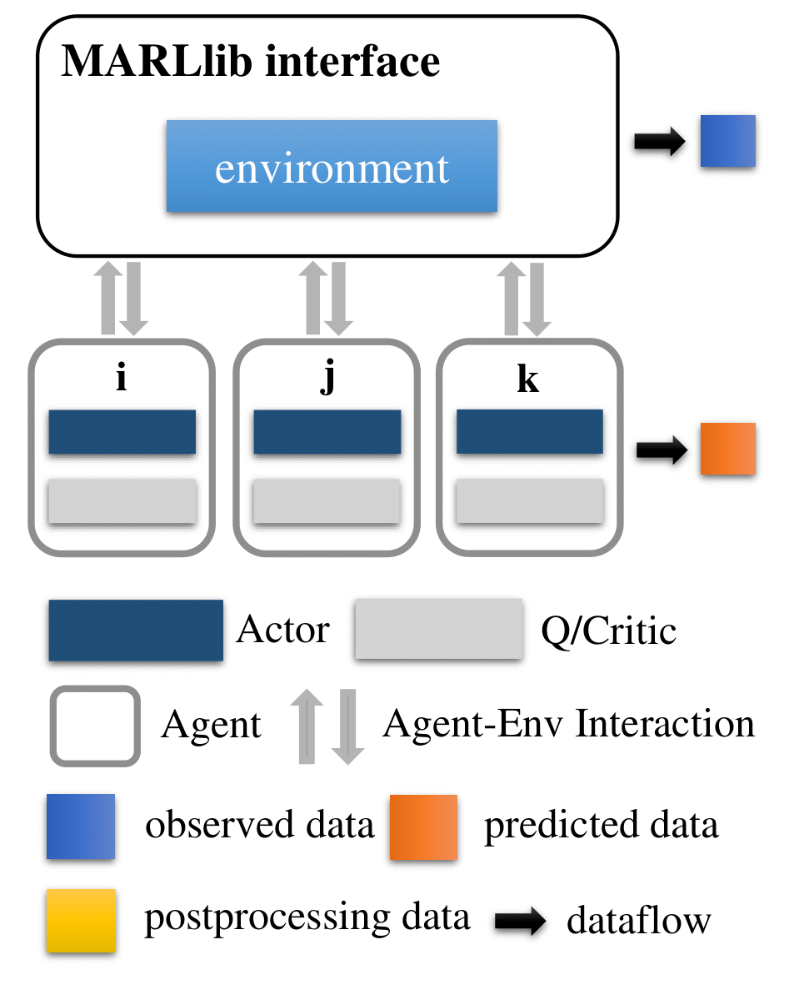
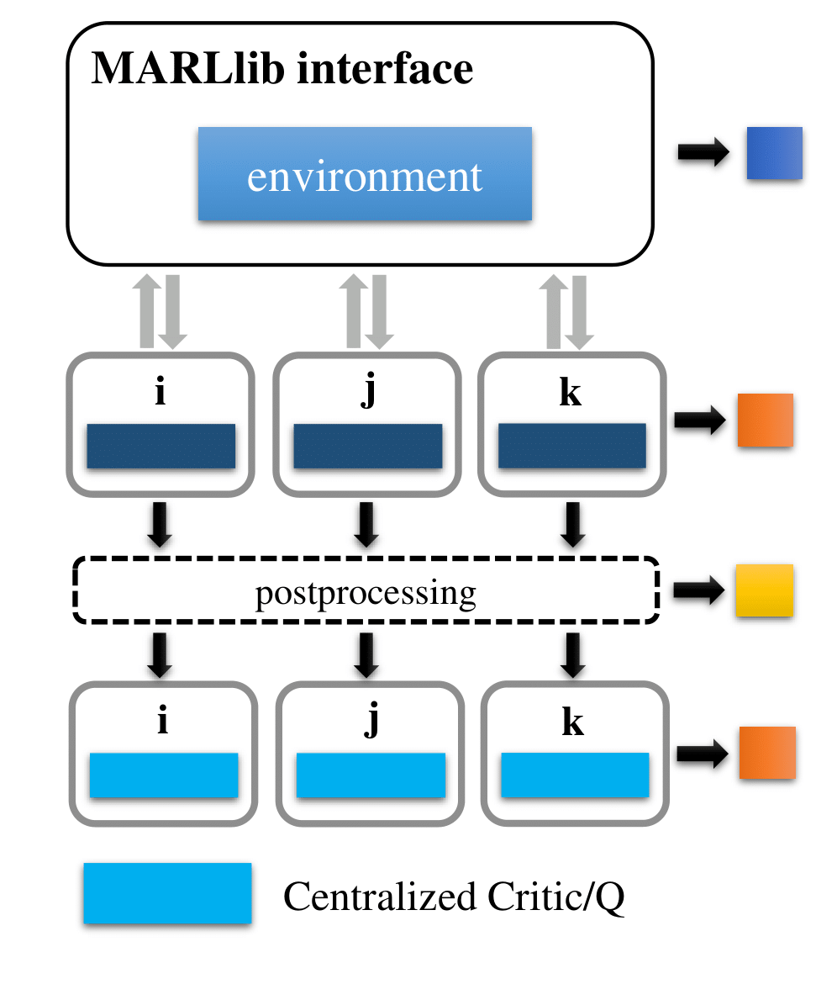
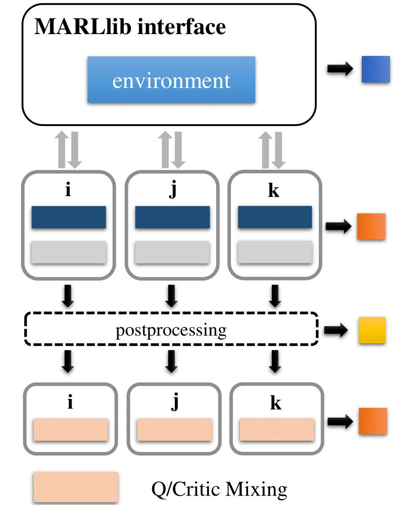

.. _algorithms:

*******************************
MARLlib Framework
*******************************

Based on Ray and one of its toolkit RLlib, MARLlib is built to be a highly modularized framework where standard
single agent algorithms in RLlib are extended to be multi-agent compatible.

Environment interface is also redesigned in MARLlib as multi-agent RL tasks are so diverse
where building a unified algorithm that can run everywhere is so challenging.

.. contents::
    :local:
    :depth: 3

MARLlib Architecture
====================

We introduce the training pipelines from three perspectives:

- how agent and environment interact in MARLlib
- what the whole data sampling and training workflow look like
- how the key components of MARLlib are combined to form the whole pipeline

In MARLlib, 18 MARL algorithms are implemented covering 10 different multi-agent environments.
This raises a challenge for both environment interface design and algorithms modularization to be compatiable for all the environments

Environment Interface
-----------------------

.. figure:: ../images/marl_env_right.png
    :align: center
    :width: 600

    Agent-Environment Interface in MARLlib

Environment interface in MARLlib enables following abilities:

- Ten diverse environments in one interface
- Multi-task as one task.
- Group by group interact available
- Unique data collection for each agent

MARLlib successfully unify all the 10 environments into one abstract interface that help the burden for algorithms side designing work. And the environment under this interface
can be any type of instance, which enables multi-tasks / task agnostic learning.

Different to most of the exsiting MARL framework that only supports synchronous interaction between agents and environments, MARLlib supports asynchronous interacting style.
This should be credited to RLlib's flexible data collecting mechanism as data of different agent can be collected and stored in both synchronous and asynchronous ways.

The last most important feature in MARLlib environment interface design is avoiding data sharing across agent. For instance, the global reward is duplicated to each agent.
This duplication is a must for MARLlib as we treats MARL as a combination of several singe agent RL process. You can also find similar duplication on algorithm side component design.

RLlib/MARLlib Workflow
-----------------------

Same as RLlib, MARLlib has two phases after launching the process.

Phase 1:   Pre-learning
^^^^^^^^^^^^^^^^^^^^^^^^^^^^^^

MARLlib initialize the environment and the agent model, producing a fake batch according to environment attributes and passing it to the sampling/training pipeline of the chosen algorithm.
If the fake batch going through the whole learning workflow with no error reported, MARLlib steps into the next stage.

.. figure:: ../images/rllib_data_flow_left.png
    :align: center
    :width: 600

    Pre-learning Stage

Phase 2: Sampling & Training
^^^^^^^^^^^^^^^^^^^^^^^^^^^^^^

After checking the whole pipeline in pre-learning stage, real jobs are assigned to the workers and the learner. These process are scheduled under the execution plan, where MARL officially starts.

In a standard learning iteration, each worker frist sampling the data by interacting with its own environment instance(s) using agent model(s). The workers pass The sampled data to the replay buffer.
Reply buffer is initialized according the algorithm, which will decide how the data are stored. For on-policy algorithm, the buffer is a concatenation operation.
For off-policy algorithm, the buffer is a FIFO queue.

Next, pre-defined policy mapping function will distribute these data to different agent(s).
Once the data for one training iteration is fully collected, the learner start optimize the policy/policies using these data
and broadcasts the new model to each worker for next sampling round.

.. figure:: ../images/rllib_data_flow_right.png
    :align: center

    Sampling & Training Stage

Algorithm  Pipeline Overview
----------------------------------------

Independent Learning
^^^^^^^^^^^^^^^^^^^^

Independent learning is easy to implement in MARLlib as RLlib provide a great number of algorithms.
Choose one from them and applied to the multi-agent environment to start training is easy and require no extra work compared to RLlib.
While no data exchange is needed in independent learning of MARL, the performance is worse then centralized training strategy in most tasks.

Centralized Critic
^^^^^^^^^^^^^^^^^^^^

Centralized critic learning is one of the two centralized training strategies under CTDE framework.
Agents are required to share their information after getting the policy output and before the critic value computing.
Typical information they have to share with other agents including individual observation, actions, and global state (if available).

The exchanged data is collected and stored as transition data during the sampling stage. Each transition data contains both self collected data and exchanged data.
All the data is then used to optimized a centralized critic function with a decentralized policy function.
How data is shared is mostly implemented in postprocessing function for on-policy algorithms. For off-policy algorithms like MADDPG,
additional data like action value provided by other agents is collected before the batch of data entering the training iteration.

Value Decomposition
^^^^^^^^^^^^^^^^^^^^

Value Decomposition is another branch of centralized training strategies. Different to centralized critic, the only information for agent
to share is predicted Q value or critic value. Additional data is required according to the algorithm. For instance, QMIX need a global state to
compute the mixing Q value.

The data collecting and storage logic is same as centralized critic. To be mentioned, the joint Q learning methods (VDN, QMIX) are heavily copied from original
PyMARL. Only the FACMAC, VDA2C, and VDPPO follow the standard RLlib training pipeline among all five value decomposition algorithms

Key Component
-------------------------

Postprocessing Before Data Collection
^^^^^^^^^^^^^^^^^^^^^^^^^^^^^^^^^^^^^^^^^^^^

MARL algorithms with centralized training with decentralized execution (CTDE) require agents to share their information with others in the learning stage.
Algorithms in value decomposition like QMIX, FACMAC, and VDA2C require other agents to provide their Q value or V value estimation to compute Q total or V total. Algorithms in centralized critic like MADDPG, MAPPO, and HAPPO require other agents to provide their observation and actions to help determine a centralized critic value.
A postprocessing module is then a perfect place for agents to share the data with other agents.
For algorithms belonging to centralized critic, the agent can get extra information from other agents to compute a centralized critic value.
For algorithms belonging to value decomposition, the agent needs to provide other agents with their Q or V value predicted.
Besides, the postprocessing module is also the place for computing different learning targets using GAE or N-step reward adjustment.

.. figure:: ../images/pp.png
    :align: center

    Postprocessing Before Data Collection

Postprocessing Before Batch Learning
^^^^^^^^^^^^^^^^^^^^^^^^^^^^^^^^^^^^^^^^^^^^^^^^^

Postprocessing is not suitable for every algorithm, exceptions are like off-policy algorithm including MADDPG and FACMAC.
The problem is, the data stored in replay buffer are from the old model, e.g. Q value, which can not be used for current training interation.
To deal with this, the additional before batch learning function is adopted to calculate the accurate Q or V value
using the current model just before the sampled batch entering the training loop.

.. figure:: ../images/pp_batch.png
    :align: center

    Postprocessing Before Batch Learning

Centralized Value function
^^^^^^^^^^^^^^^^^^^^^^^^^^^^

Centralized critic agent model abandons original value function conditioned only on self-observation. Instead, a centralized critic which dynamically fit the
algorithm needs are provided to deal with data provided from other agents and output a centralized value.

Mixing Value function
^^^^^^^^^^^^^^^^^^^^^^^^^^^^

Value decomposition agent model preserve the original value function, but add a new mixing value function to get the mixing value function.
The mixing function is customizable. Currently, VDN and QMIX mixing function is provided. To change the mixing value simple modify
the model configuration file in **marl/model/configs/mixer**.

Heterogeneous Optimization
^^^^^^^^^^^^^^^^^^^^^^^^^^^^

In heterogeneous optimization, the parameters of each agent will be updated separately.
Therefore, policy function is not shared across different agents.
According to the proof of the algorithm , if agents were to set the values of the loss-related summons by sequentially updating their policies,
any positive update would lead to an increment in summation.

In order to ensure the monotonic increment. We use trust region to get the suitable parameters update (HATRPO).
Considering the computing consumption, we use the proximal policy optimization to speed up the policy and critic update (HAPPO).

.. figure:: ../images/hetero.png
    :align: center

    Heterogeneous Agent Critic Optimization

Policy Mapping
^^^^^^^^^^^^^^^^^^^^^^^^^^^^

Policy mapping plays an important role in unifying MARL environments interface. In MARLlib, the policy mapping is designed to be a dictionary, 
with top-level key as the scenario name, second-level key as the group information, with four extra keys including **description**, **team_prefix**,
**all_agents_one_policy**, and **one_agent_one_policy**. **team_prefix** is used to group the agents according to their name.
The last two keys indicate whether a fully shared or no-sharing policy strategy is a valid option for this scenario.
We use policy mapping to initialize the policies and allocate them to different agents.
Each policy is optimized only using the data sampled by the agent that belongs to this policy group.

Available Algorithms Checklist
-------------------------------

- Independent Learning
    - :ref:`IQL`
    - :ref:`IPG`
    - :ref:`IA2C`
    - :ref:`IDDPG`
    - :ref:`ITRPO`
    - :ref:`IPPO`
- Centralized Critic
    - :ref:`COMA`
    - :ref:`MAA2C`
    - :ref:`MADDPG`
    - :ref:`MATRPO`
    - :ref:`MAPPO`
    - :ref:`HATRPO`
    - :ref:`HAPPO`
- Value Decomposition
    - :ref:`VDN`
    - :ref:`QMIX`
    - :ref:`FACMAC`
    - :ref:`VDA2C`
    - :ref:`VDPPO`

Available Environment Checklist
-------------------------------

Please refer to :ref:`env`

