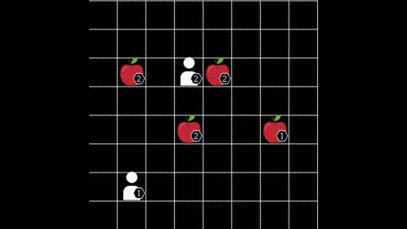
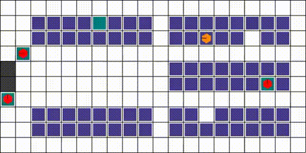
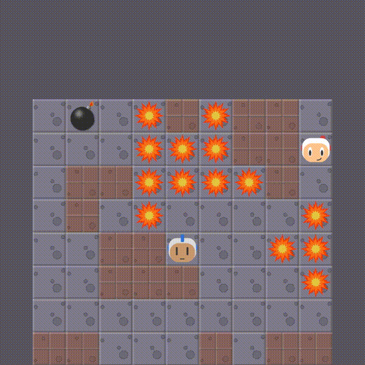
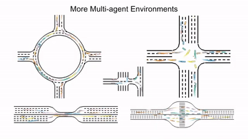
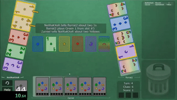

.. _env:

*********************************************
Environments
*********************************************

Environment list of MARLlib, including installation and description.

.. contents::
    :local:
    :depth: 1

**Note**: make sure you have read and completed the :ref:`basic-installation` part.

.. _SMAC:

SMAC
==============

.. figure:: ../images/smac.gif
    :width: 550
    :align: center

StarCraft Multi-Agent Challenge (SMAC) is a multi-agent environment for collaborative multi-agent reinforcement learning (MARL) research based on Blizzard's StarCraft II RTS game.
It focuses on decentralized micromanagement scenarios, where an individual RL agent controls each game unit.

Official Link: https://github.com/oxwhirl/smac

.. list-table::
   :widths: 25 25
   :header-rows: 0

   * - ``Original Learning Mode``
     - Cooperative
   * - ``MARLlib Learning Mode``
     - Cooperative + Collaborative
   * - ``Observability``
     - Partial
   * - ``Action Space``
     - Discrete
   * - ``Observation Space Dim``
     - 1D
   * - ``Action Mask``
     - Yes
   * - ``Global State``
     - Yes
   * - ``Global State Space Dim``
     - 1D
   * - ``Reward``
     - Dense / Sparse
   * - ``Agent-Env Interact Mode``
     - Simultaneous

Installation
-----------------

.. code-block:: shell

    bash install_sc2.sh # https://github.com/oxwhirl/pymarl/blob/master/install_sc2.sh
    pip3 install numpy scipy pyyaml matplotlib
    pip3 install imageio
    pip3 install tensorboard-logger
    pip3 install pygame
    pip3 install jsonpickle==0.9.6
    pip3 install setuptools
    pip3 install sacred

    git clone https://github.com/oxwhirl/smac.git
    cd smac
    pip install -e .

**Note**: the location of the StarcraftII game directory should be pre-defined,
or you can just follow the error log (when the process can not found the game's location)
and put it in the right place.

API usage
-----------------

.. code-block:: python

    from marllib import marl

    env = marl.make_env(environment_name="smac", map_name="3m", difficulty="7", reward_scale_rate=20)

.. _MAMuJoCo:

MAMuJoCo
==============

.. figure:: ../images/mamujoco.gif
    :width: 400
    :align: center

Multi-Agent Mujoco (MAMuJoCo) is an environment for continuous cooperative multi-agent robotic control.
Based on the popular single-agent robotic MuJoCo control suite provides a wide variety of novel scenarios in which multiple agents within a single robot have to solve a task cooperatively.

Official Link: https://github.com/schroederdewitt/multiagent_mujoco

.. list-table::
   :widths: 25 25
   :header-rows: 0

   * - ``Original Learning Mode``
     - Cooperative
   * - ``MARLlib Learning Mode``
     - Cooperative + Collaborative
   * - ``Observability``
     - Partial
   * - ``Action Space``
     - Continuous
   * - ``Observation Space Dim``
     - 1D
   * - ``Action Mask``
     - No
   * - ``Global State``
     - Yes
   * - ``Global State Space Dim``
     - 1D
   * - ``Reward``
     - Dense
   * - ``Agent-Env Interact Mode``
     - Simultaneous

Installation
-----------------

.. code-block:: shell

    mkdir /home/YourUserName/.mujoco
    cd /home/YourUserName/.mujoco
    wget https://roboti.us/download/mujoco200_linux.zip
    unzip mujoco200_linux.zip
    export LD_LIBRARY_PATH=/home/YourUserName/.mujoco/mujoco200/bin;
    pip install mujoco-py==2.0.2.8

    git clone https://github.com/schroederdewitt/multiagent_mujoco
    cd multiagent_mujoco
    mv multiagent_mujoco /home/YourPathTo/MARLlib/multiagent_mujoco

    # optional
    sudo apt-get install libosmesa6-dev # If you meet GCC error with exit status 1
    pip install patchelf-wrapper

**Note**: To access the MuJoCo API, you may get a mjkey (free now) and put it under /home/YourUserName/.mujoco.

API usage
-----------------

.. code-block:: python

    from marllib import marl

    env = marl.make_env(environment_name="mamujoco", map_name="2AgentAnt")

.. _Football:

Google Research Football
================================

.. figure:: ../images/grf.gif
    :width: 550
    :align: center

Google Research Football (GRF) is a reinforcement learning environment where agents are trained to play football in an advanced,
physics-based 3D simulator. It also provides support for multiplayer and multi-agent experiments.

Official Link: https://github.com/google-research/football

.. list-table::
   :widths: 25 25
   :header-rows: 0

   * - ``Original Learning Mode``
     - Collaborative + Competitive
   * - ``MARLlib Learning Mode``
     - Cooperative + Collaborative
   * - ``Observability``
     - Full
   * - ``Action Space``
     - Discrete
   * - ``Observation Space Dim``
     - 2D
   * - ``Action Mask``
     - No
   * - ``Global State``
     - No
   * - ``Global State Space Dim``
     - /
   * - ``Reward``
     - Sparse
   * - ``Agent-Env Interact Mode``
     - Simultaneous

Installation
-----------------

Google Research Football is somehow a bit tricky for installation. We wish you good luck.

.. code-block:: shell

    sudo apt-get install git cmake build-essential libgl1-mesa-dev libsdl2-dev libsdl2-image-dev libsdl2-ttf-dev libsdl2-gfx-dev libboost-all-dev libdirectfb-dev libst-dev mesa-utils xvfb x11vnc python3-pip
    python3 -m pip install --upgrade pip setuptools psutil wheel

We provide solutions (may work) for potential bugs

* `Compiler error on /usr/lib/x86_64-linux-gnu/libGL.so <https://github.com/RobotLocomotion/drake/issues/2087>`_
* `apt-get, unmet dependencies, ... "but it is not going to be installed" <https://askubuntu.com/questions/564282/apt-get-unmet-dependencies-but-it-is-not-going-to-be-installed>`_
* `Errors related to Could NOT find Boost <https://github.com/google-research/football/issues/317>`_

API usage
-----------------

.. code-block:: python

    from marllib import marl

    env = marl.make_env(environment_name="football", map_name="academy_pass_and_shoot_with_keeper")

.. _MPE:

MPE
==============

.. figure:: ../images/mpe.gif
    :width: 550
    :align: center

Multi-particle Environments (MPE) are a set of communication-oriented environments where particle agents can (sometimes) move,
communicate, see each other, push each other around, and interact with fixed landmarks.

Official Link: https://github.com/openai/multiagent-particle-envs

Our version: https://github.com/Farama-Foundation/PettingZoo/tree/master/pettingzoo/mpe

.. list-table::
   :widths: 25 25
   :header-rows: 0

   * - ``Original Learning Mode``
     - Collaborative + Competitive
   * - ``MARLlib Learning Mode``
     - Cooperative + Collaborative + Competitive + Mixed
   * - ``Observability``
     - Full
   * - ``Action Space``
     - Discrete + Continuous
   * - ``Observation Space Dim``
     - 1D
   * - ``Action Mask``
     - No
   * - ``Global State``
     - No
   * - ``Global State Space Dim``
     - /
   * - ``Reward``
     - Dense
   * - ``Agent-Env Interact Mode``
     - Simultaneous / Asynchronous

Installation
-----------------

We use the pettingzoo version of MPE

.. code-block:: shell

    pip install pettingzoo[mpe]

API usage
-----------------

.. code-block:: python

    from marllib import marl

    # discrete control
    env = marl.make_env(environment_name="mpe", map_name="simple_spread", force_coop=True, continuous_actions=False)

    # continuous control
    env = marl.make_env(environment_name="mpe", map_name="simple_spread", force_coop=True, continuous_actions=True)

    # turn off teamwork setting
    env = marl.make_env(environment_name="mpe", map_name="simple_spread")

.. _LBF:

LBF
==============

Level-based Foraging (LBF) is a mixed cooperative-competitive game that focuses on coordinating the agents involved.
Agents navigate a grid world and collect food by cooperating with other agents if needed.

Official Link: https://github.com/semitable/lb-foraging

.. list-table::
   :widths: 25 25
   :header-rows: 0

   * - ``Original Learning Mode``
     - Cooperative + Collaborative
   * - ``MARLlib Learning Mode``
     - Cooperative + Collaborative
   * - ``Observability``
     - Partial
   * - ``Action Space``
     - Discrete
   * - ``Observation Space Dim``
     - 1D
   * - ``Action Mask``
     - No
   * - ``Global State``
     - No
   * - ``Global State Space Dim``
     - /
   * - ``Reward``
     - Dense
   * - ``Agent-Env Interact Mode``
     - Simultaneous

Installation
-----------------

.. code-block:: shell

    pip install lbforaging==1.0.15

API usage
-----------------

.. code-block:: python

    from marllib import marl

    # use default setting marllib/envs/base_env/config/lbf.yaml
    env = marl.make_env(environment_name="lbf", map_name="default_map")

    # customize yours
    env = marl.make_env(environment_name="lbf", map_name="customized_map", force_coop=True, players=4, field_size_x=8)

.. _RWARE:

RWARE
==============

Robot Warehouse (RWARE) simulates a warehouse with robots moving and delivering requested goods.
Real-world applications inspire the simulator, in which robots pick up shelves and deliver them to a workstation.

Official Link: https://github.com/semitable/robotic-warehouse

.. list-table::
   :widths: 25 25
   :header-rows: 0

   * - ``Original Learning Mode``
     - Cooperative
   * - ``MARLlib Learning Mode``
     - Cooperative + Collaborative
   * - ``Observability``
     - Partial
   * - ``Action Space``
     - Discrete
   * - ``Observation Space Dim``
     - 1D
   * - ``Action Mask``
     - No
   * - ``Global State``
     - No
   * - ``Global State Space Dim``
     - /
   * - ``Reward``
     - Sparse
   * - ``Agent-Env Interact Mode``
     - Simultaneous

Installation
-----------------

.. code-block:: shell

    pip install rware==1.0.1

API usage
-----------------

.. code-block:: python

    from marllib import marl

    # use default setting marllib/envs/base_env/config/rware.yaml
    env = marl.make_env(environment_name="rware", map_name="default_map")

    # customize yours
    env = marl.make_env(environment_name="rware", map_name="customized_map", players=4, map_size="tiny")

.. _MAgent:

MAgent
==============

.. figure:: ../images/magent.gif
    :width: 700
    :align: center

MAgent is a set of environments where large numbers of pixel agents in a grid world interact in battles or other competitive scenarios.

Official Link: https://www.pettingzoo.ml/magent

Our version: https://github.com/Farama-Foundation/PettingZoo/tree/master/pettingzoo/mpe

.. list-table::
   :widths: 25 25
   :header-rows: 0

   * - ``Original Learning Mode``
     - Collaborative + Competitive
   * - ``MARLlib Learning Mode``
     - Collaborative + Competitive
   * - ``Observability``
     - Partial
   * - ``Action Space``
     - Discrete
   * - ``Observation Space Dim``
     - 2D
   * - ``Action Mask``
     - No
   * - ``Global State``
     - MiniMap
   * - ``Global State Space Dim``
     - 2D
   * - ``Reward``
     - Dense
   * - ``Agent-Env Interact Mode``
     - Simultaneous / Asynchronous

Installation
-----------------

.. code-block:: shell

    pip install pettingzoo[magent]

API usage
-----------------

.. code-block:: python

    from marllib import marl

    env = marl.make_env(environment_name="magent", map_name="adversarial_pursuit")

    # turn off minimap; need to change global_state_flag to False
    env = marl.make_env(environment_name="magent", map_name="adversarial_pursuit", minimap_mode=False)

.. _Pommerman:

Pommerman
==============

Pommerman is stylistically similar to Bomberman, the famous game from Nintendo.
Pommerman's FFA is a simple but challenging setup for engaging adversarial research where coalitions are possible,
and Team asks agents to be able to work with others to accomplish a shared but competitive goal.

Official Link: https://github.com/MultiAgentLearning/playground

.. list-table::
   :widths: 25 25
   :header-rows: 0

   * - ``Original Learning Mode``
     - Collaborative + Competitive
   * - ``MARLlib Learning Mode``
     - Cooperative + Collaborative + Competitive + Mixed
   * - ``Observability``
     - Full
   * - ``Action Space``
     - Discrete
   * - ``Observation Space Dim``
     - 2D
   * - ``Action Mask``
     - No
   * - ``Global State``
     - No
   * - ``Global State Space Dim``
     - /
   * - ``Reward``
     - Sparse
   * - ``Agent-Env Interact Mode``
     - Simultaneous

Installation
-----------------

.. code-block:: shell

    git clone https://github.com/MultiAgentLearning/playground
    cd playground
    pip install .
    cd /home/YourPathTo/MARLlib/patch
    python add_patch.py --pommerman
    pip install gym==0.21.0

API usage
-----------------

.. code-block:: python

    from marllib import marl

    # competitive mode
    env = marl.make_env(environment_name="pommerman", map_name="PommeFFACompetition-v0")

    # cooperative mode
    env = marl.make_env(environment_name="pommerman", map_name="PommeTeamCompetition-v0", force_coop=True)

.. _MetaDrive:

MetaDrive
==============

MetaDrive is a driving simulator that supports generating infinite scenes with various road maps and
traffic settings to research generalizable RL. It provides accurate physics simulation and multiple sensory inputs,
including Lidar, RGB images, top-down semantic maps, and first-person view images.

Official Link: https://github.com/decisionforce/metadrive

.. list-table::
   :widths: 25 25
   :header-rows: 0

   * - ``Original Learning Mode``
     - Collaborative
   * - ``MARLlib Learning Mode``
     - Collaborative
   * - ``Observability``
     - Partial
   * - ``Action Space``
     - Continuous
   * - ``Observation Space Dim``
     - 1D
   * - ``Action Mask``
     - No
   * - ``Global State``
     - No
   * - ``Global State Space Dim``
     - /
   * - ``Reward``
     - Dense
   * - ``Agent-Env Interact Mode``
     - Simultaneous

Installation
-----------------

.. code-block:: shell

    pip install metadrive-simulator==0.2.3

API usage
-----------------

.. code-block:: python

    from marllib import marl

    env = marl.make_env(environment_name="metadrive", map_name="Bottleneck")

.. _Hanabi:

Hanabi
==============

Hanabi is a cooperative card game created by French game designer Antoine Bauza.
Players are aware of other players' cards but not their own and attempt to play a series of cards in a
specific order to set off a simulated fireworks show.

Official Link: https://github.com/deepmind/hanabi-learning-environment

.. list-table::
   :widths: 25 25
   :header-rows: 0

   * - ``Original Learning Mode``
     - Collaborative
   * - ``MARLlib Learning Mode``
     - Collaborative
   * - ``Observability``
     - Partial
   * - ``Action Space``
     - Discrete
   * - ``Observation Space Dim``
     - 1D
   * - ``Action Mask``
     - Yes
   * - ``Global State``
     - Yes
   * - ``Global State Space Dim``
     - 1D
   * - ``Reward``
     - Dense
   * - ``Agent-Env Interact Mode``
     - Asynchronous

Installation
-----------------

From `MAPPO official site <https://github.com/marlbenchmark/on-policy>`_

The environment code for Hanabi is developed from the open-source environment code but has been slightly modified to fit the algorithms used here.
To install, execute the following:

.. code-block:: shell

    pip install cffi
    cd /home/YourPathTo/MARLlib/patch/hanabi
    mkdir build
    cd build
    cmake ..
    make -j

API usage
-----------------

.. code-block:: python

    from marllib import marl

    env = marl.make_env(environment_name="hanabi", map_name="Hanabi-Small", num_agents=3)

.. _MATE:

MATE
==============

.. figure:: ../images/mate.gif
    :width: 550
    :align: center

Multi-Agent Tracking Environment (MATE) is an asymmetric two-team zero-sum stochastic game with partial observations, and each team has multiple agents (multiplayer). Intra-team communications are allowed, but inter-team communications are prohibited. It is cooperative among teammates, but it is competitive among teams (opponents).

Official Link: https://github.com/XuehaiPan/mate

.. list-table::
   :widths: 25 25
   :header-rows: 0

   * - ``Original Learning Mode``
     - Cooperative + Mixed
   * - ``MARLlib Learning Mode``
     - Cooperative + Mixed
   * - ``Observability``
     - Partial
   * - ``Action Space``
     - Discrete + Continuous
   * - ``Observation Space Dim``
     - 1D
   * - ``Action Mask``
     - No
   * - ``Global State``
     - No
   * - ``Global State Space Dim``
     - /
   * - ``Reward``
     - Dense
   * - ``Agent-Env Interact Mode``
     - Simultaneous

Installation
-----------------

.. code-block:: shell

    pip3 install git+https://github.com/XuehaiPan/mate.git#egg=mate

API usage
-----------------

.. code-block:: python

    from marllib import marl

    env = marl.make_env(environment_name="mate", map_name="MATE-4v2-9-v0", coop_team="camera")

.. _GoBigger:

GoBigger
==============
.. only:: html

    .. figure:: ../images/gobigger.gif
       :width: 550
       :align: center

GoBigger is a game engine that offers an efficient and easy-to-use platform for agar-like game development. It provides a variety of interfaces specifically designed for game AI development. The game mechanics of GoBigger are similar to those of Agar, a popular massive multiplayer online action game developed by Matheus Valadares of Brazil. The objective of GoBigger is for players to navigate one or more circular balls across a map, consuming Food Balls and smaller balls to increase their size while avoiding larger balls that can consume them. Each player starts with a single ball, but can divide it into two when it reaches a certain size, giving them control over multiple balls.
Official Link: https://github.com/opendilab/GoBigger

.. list-table::
   :widths: 25 25
   :header-rows: 0

   * - ``Original Learning Mode``
     - Cooperative + Mixed
   * - ``MARLlib Learning Mode``
     - Cooperative + Mixed
   * - ``Observability``
     - Partial + Full
   * - ``Action Space``
     - Continuous
   * - ``Observation Space Dim``
     - 1D
   * - ``Action Mask``
     - No
   * - ``Global State``
     - No
   * - ``Global State Space Dim``
     - /
   * - ``Reward``
     - Dense
   * - ``Agent-Env Interact Mode``
     - Simultaneous

Installation
-----------------

.. code-block:: shell

    conda install -c opendilab gobigger

API usage
-----------------

.. code-block:: python

    from marllib import marl

    env = marl.make_env(environment_name="gobigger", map_name="st_t1p2")

.. _Overcooked-AI:

Overcooked-AI
==============
.. only:: html

    .. figure:: ../images/overcooked.gif
       :width: 500
       :align: center

Overcooked-AI is a benchmark environment for fully cooperative human-AI task performance, based on the wildly popular video game Overcooked.
Official Link: https://github.com/HumanCompatibleAI/overcooked_ai

.. list-table::
   :widths: 25 25
   :header-rows: 0

   * - ``Original Learning Mode``
     - Cooperative
   * - ``MARLlib Learning Mode``
     - Cooperative
   * - ``Observability``
     - Full
   * - ``Action Space``
     - Discrete
   * - ``Observation Space Dim``
     - 1D
   * - ``Action Mask``
     - No
   * - ``Global State``
     - No
   * - ``Global State Space Dim``
     - /
   * - ``Reward``
     - Dense
   * - ``Agent-Env Interact Mode``
     - Simultaneous

Installation
-----------------

.. code-block:: shell

    git clone https://github.com/Replicable-MARL/overcooked_ai.git
    cd overcooked_ai
    pip install -e .

API usage
-----------------

.. code-block:: python

    from marllib import marl

    env = marl.make_env(environment_name="overcooked", map_name="asymmetric_advantages")

.. _Active_Voltage_Control_on_Power_Distribution_Networks:

Power Distribution Networks
==============================
.. only:: html

    .. figure:: ../images/env_voltage.png
       :width: 640
       :align: center

MAPDN is an environment of distributed/decentralised active voltage control on power distribution networks and a batch of state-of-the-art multi-agent actor-critic algorithms that can be used for training.
Official Link: https://github.com/Future-Power-Networks/MAPDN

.. list-table::
   :widths: 25 25
   :header-rows: 0

   * - ``Original Learning Mode``
     - Cooperative
   * - ``MARLlib Learning Mode``
     - Cooperative
   * - ``Observability``
     - Partial
   * - ``Action Space``
     - Continuous
   * - ``Observation Space Dim``
     - 1D
   * - ``Action Mask``
     - No
   * - ``Global State``
     - Yes
   * - ``Global State Space Dim``
     - 1D
   * - ``Reward``
     - Dense
   * - ``Agent-Env Interact Mode``
     - Simultaneous

Installation
-----------------

Please follow this `data link <https://github.com/Future-Power-Networks/MAPDN#downloading-the-dataset>`_ to download data and unzip them to ``$Your_Project_Path/marllib/patch/dpn`` or anywhere you like (need to adjust the corresponding file location to load the data).

.. code-block:: shell

    pip install numba==0.56.4
    pip install llvmlite==0.39.1
    pip install pandapower==2.7.0
    pip install pandas==1.1.3

API usage
-----------------

.. code-block:: python

    from marllib import marl

    env = marl.make_env(environment_name="voltage", map_name="case33_3min_final")

.. _Light_Aircraft_Game:

Air Combat
==============================
.. only:: html

    .. figure:: ../images/aircombat.gif
       :width: 700
       :align: center

CloseAirCombat is a competitive environment for red and blue aircrafts games, which includes single control setting, 1v1 setting and 2v2 setting. The flight dynamics based on JSBSIM, and missile dynamics based on our implementation of proportional guidance.
Official Link: https://github.com/liuqh16/CloseAirCombat

In MARLlib we supports three scenario including extended multi-agent vs Bot games just like tasks such as SMAC.
We will test and support more scenarios in the future.
Our fork: https://github.com/Theohhhu/CloseAirCombat_baseline

.. list-table::
   :widths: 25 25
   :header-rows: 0

   * - ``Original Learning Mode``
     - Competitive + Cooperative
   * - ``MARLlib Learning Mode``
     - Cooperative + Mixed
   * - ``Observability``
     - Partial
   * - ``Action Space``
     - MultiDiscrete
   * - ``Observation Space Dim``
     - 1D
   * - ``Action Mask``
     - No
   * - ``Global State``
     - No
   * - ``Global State Space Dim``
     - 1D
   * - ``Reward``
     - Dense
   * - ``Agent-Env Interact Mode``
     - Simultaneous

Installation
-----------------

.. code-block:: shell

    pip install torch pymap3d jsbsim==1.1.6 geographiclib gym==0.20.0 wandb icecream setproctitle
    cd Path/To/MARLlib
    # we use commit 8c13fd6 on JBSim, version is not restricted but may trigger potential bugs
    git submodule add --force https://github.com/JSBSim-Team/jsbsim.git marllib/patch/aircombat/JBSim/data

API usage
-----------------

.. code-block:: python

    from marllib import marl

    # competitive mode
    env = marl.make_env(environment_name="aircombat", map_name="MultipleCombat_2v2/NoWeapon/Selfplay")

    # cooperative mode
    env = marl.make_env(environment_name="aircombat", map_name="MultipleCombat_2v2/NoWeapon/vsBaseline")

.. _Hide_and_Seek:

Hide and Seek
==============================
.. only:: html

    .. figure:: ../images/hns.gif
       :width: 700
       :align: center

OpenAI Hide and Seek is a multi-agent reinforcement learning environment where artificial intelligence agents play a game inspired by hide and seek. Hiders and seekers navigate a virtual 3D environment, with hiders attempting to find clever hiding spots and stay hidden, while seekers aim to locate and tag the hiders within a time limit. With unique abilities and strategies, the agents learn and adapt through reinforcement learning algorithms, making it an engaging and competitive platform to explore advanced techniques in multi-agent AI and showcase the potential of complex behaviors in interactive environments.
Official Link: https://github.com/openai/multi-agent-emergence-environments

.. list-table::
   :widths: 25 25
   :header-rows: 0

   * - ``Original Learning Mode``
     - Competitive + Cooperative
   * - ``MARLlib Learning Mode``
     - Cooperative + Mixed
   * - ``Observability``
     - Partial
   * - ``Action Space``
     - MultiDiscrete
   * - ``Observation Space Dim``
     - 1D
   * - ``Action Mask``
     - No
   * - ``Global State``
     - No
   * - ``Global State Space Dim``
     - 1D
   * - ``Reward``
     - Dense
   * - ``Agent-Env Interact Mode``
     - Simultaneous

Installation
-----------------

To execute the following command, it is necessary to install MuJoCo.
The installation process is identical to the one explained for MAMuJoCo in the previous section.

.. code-block:: shell

    cd marllib/patch/envs/hns/mujoco-worldgen/
    pip install -e .
    pip install xmltodict
    # if encounter enum error, excute uninstall
    pip uninstall enum34

API usage
-----------------

.. code-block:: python

    from marllib import marl

    # sub task
    env = marl.make_env(environment_name="hns", map_name="BoxLocking")

    # full game
    env = marl.make_env(environment_name="hns", map_name="hidenseek")
