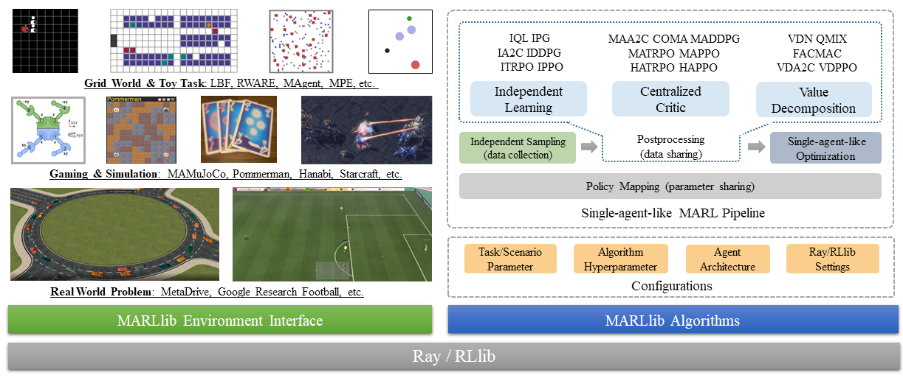

.. _intro:

Introduction
============

**Multi-Agent Reinforcement Learning Library (MARLlib)** is **a comprehensive Multi-Agent Reinforcement Learning algorithm library** based on `Ray <https://github.com/ray-project/ray>`_ and one of its toolkits `RLlib <https://github.com/ray-project/ray/tree/master/rllib>`_. It provides MARL research community with a unified platform for building, training, and evaluating MARL algorithms.

    Overview of the MARLlib architecture.

MARLlib offers several key features that make it stand out:

- MARLlib unifies diverse algorithm pipelines with agent-level distributed dataflow, allowing researchers to develop, test, and evaluate MARL algorithms across different tasks and environments.
- MARLlib supports all task modes, including cooperative, collaborative, competitive, and mixed. This makes it easier for researchers to train and evaluate MARL algorithms across a wide range of tasks.
- MARLlib provides a new interface that follows the structure of Gym, making it easier for researchers to work with multi-agent environments.
- MARLlib provides flexible and customizable parameter-sharing strategies, allowing researchers to optimize their algorithms for different tasks and environments.

Using MARLlib, you can take advantage of various benefits, such as:

- **Zero knowledge of MARL**: MARLlib provides 18 pre-built algorithms with an intuitive API, allowing researchers to start experimenting with MARL without prior knowledge of the field.
- **Support for all task modes**: MARLlib supports almost all multi-agent environments, making it easier for researchers to experiment with different task modes.
- **Customizable model architecture**: Researchers can choose their preferred model architecture from the model zoo, or build their own.
- **Customizable policy sharing**: MARLlib provides grouping options for policy sharing, or researchers can create their own.
- **Access to over a thousand released experiments**: Researchers can access over a thousand released experiments to see how other researchers have used MARLlib.

Before starting, please ensure you've installed the dependencies by following the :ref:`basic-installation`.
The environment-specific description is maintained in :ref:`env`.
:ref:`quick-start` gives some basic examples.

