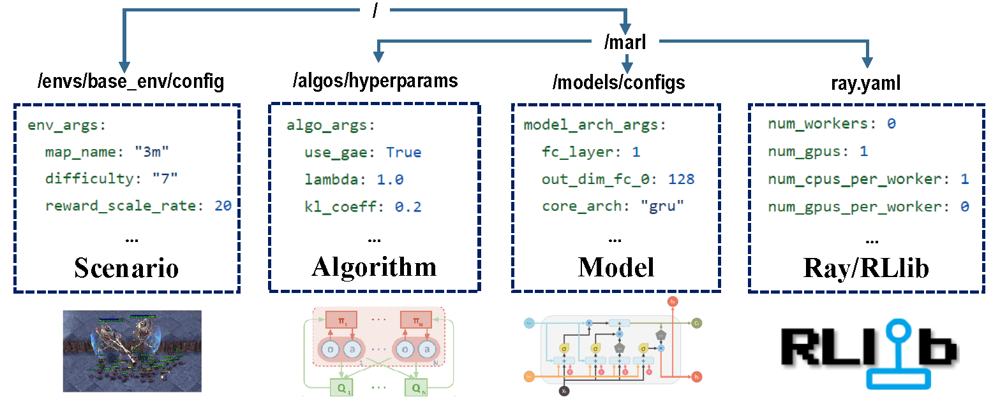

.. _quick-start:

Quick Start
===========

.. contents::
    :local:
    :depth: 2

If you have not installed MARLlib yet, please refer to :ref:`basic-installation` before running.

Configuration Overview
---------------------------

    Prepare all the configuration files to start your MARL journey

To start your MARL journey with MARLlib, you need to prepare all the configuration files to customize the whole learning pipeline.
There are four configuration files that you need to ensure correctness for your training demand:

- scenario: specify your environment/task settings
- algorithm: finetune your algorithm hyperparameters
- model: customize the model architecture
- ray/rllib: changing the basic training settings

Scenario Configuration
^^^^^^^^^^^^^^^^^^^^^^^^^^^^^^^^^^^^^^^^^^^^^^^^^

MARLlib provides ten environments for you to conduct your experiment.
You can follow the instruction in the :ref:`env` section to install them and change the corresponding configuration to customize the chosen task.

Algorithm Hyper-parameter
^^^^^^^^^^^^^^^^^^^^^^^^^^^^^^^^^^^^^^^^^^^^^^^^

After setting up the environment, you need to visit the MARL algorithms' hyper-parameter directory. Each algorithm has different hyper-parameters that you can finetune.
Most of the algorithms are sensitive to the environment settings. Therefore, you need to give a set of hyper-parameters that fit the current MARL task.

We provide a `commonly used hyper-parameters directory <https://github.com/Replicable-MARL/MARLlib/tree/sy_dev/marllib/marl/algos/hyperparams/common>`_,
a `test-only hyper-parameters directory <https://github.com/Replicable-MARL/MARLlib/tree/sy_dev/marllib/marl/algos/hyperparams/test>`_, and
a finetuned hyper-parameters sets for the three most used MARL environments, including `SMAC <https://github.com/Replicable-MARL/MARLlib/tree/sy_dev/marllib/marl/algos/hyperparams/finetuned/smac>`_
, `MPE <https://github.com/Replicable-MARL/MARLlib/tree/sy_dev/marllib/marl/algos/hyperparams/finetuned/mpe>`_, and `MAMuJoCo <https://github.com/Replicable-MARL/MARLlib/tree/sy_dev/marllib/marl/algos/hyperparams/finetuned/mamujoco>`_

Model Architecture
^^^^^^^^^^^^^^^^^^^^^^^^^^^^^^^^^^^^^^^^^^^^^^^^^

Observation space varies with different environments. MARLlib automatically constructs the agent model to fit the diverse input shape, including: observation, global state, action mask, and additional information (e.g., minimap)

However, you can still customize your model in `model's config <https://github.com/Replicable-MARL/MARLlib/tree/sy_dev/marllib/marl/models/configs>`_.
The supported architecture change includes:

- Observation/State Encoder: `CNN <https://github.com/Replicable-MARL/MARLlib/blob/sy_dev/marllib/marl/models/configs/cnn_encoder.yaml>`_, `FC <https://github.com/Replicable-MARL/MARLlib/blob/sy_dev/marllib/marl/models/configs/fc_encoder.yaml>`_
- `Multi-layers Perceptron <https://github.com/Replicable-MARL/MARLlib/blob/sy_dev/marllib/marl/models/configs/mlp.yaml>`_: MLP
- `Recurrent Neural Network <https://github.com/Replicable-MARL/MARLlib/blob/sy_dev/marllib/marl/models/configs/rnn.yaml>`_: GRU, LSTM
- `Q/Critic Value Mixer <https://github.com/Replicable-MARL/MARLlib/blob/sy_dev/marllib/marl/models/configs/mixer.yaml>`_: VDN, QMIX

Ray/RLlib Running Options
^^^^^^^^^^^^^^^^^^^^^^^^^^^^^

Ray/RLlib provides a flexible multi-processing scheduling mechanism for MARLlib.
You can modify the `file of ray configuration <https://github.com/Replicable-MARL/MARLlib/blob/sy_dev/marllib/marl/ray.yaml>`_ to adjust sampling speed (worker number, CPU number), training speed (GPU acceleration),
running mode (locally or distributed), parameter sharing strategy (all, group, individual), and stop condition (iteration, reward, timestep).

How to Customize
------------------------------
To modify the configuration settings in MARLlib, it is important to first understand the underlying configuration system.

Level of the configuration
^^^^^^^^^^^^^^^^^^^^^^^^^^^^^^^
There are three levels of configuration, listed here in order of priority from low to high:

- File-based configuration, which includes all the default ``*.yaml`` files.
- API-based customized configuration, which allows users to specify their own preferences, such as ``{"core_arch": "mlp", "encode_layer": "128-256"}``.
- Command line arguments, such as ``python xxx.py --ray_args.local_mode --env_args.difficulty=6 --algo_args.num_sgd_iter=6``.

If a parameter is set at multiple levels, the higher level configuration will take precedence over the lower level configuration.

Compatibility across different levels
^^^^^^^^^^^^^^^^^^^^^^^^^^^^^^^^^^^^^^^^^^^^^

It is important to ensure that hyperparameter choices are compatible across different levels.
For example, the Multiple Particle Environments (MPE) support both discrete and continuous actions.
To enable continuous action space settings, one can simply change the `continuous_actions` parameter in the `mpe.yaml <https://github.com/Replicable-MARL/MARLlib/blob/sy_dev/marllib/envs/base_env/config/mpe.yaml>`_ to **True**.
It is important to pay attention to the corresponding setting when using the API-based approach or command line arguments, such as marl.make_env(xxxx, continuous_actions=True), where the argument name must match the one in ``mpe.yaml`` exactly.

Training
----------------------------------

.. code-block:: python

    from marllib import marl
    # prepare env
    env = marl.make_env(environment_name="mpe", map_name="simple_spread")
    # initialize algorithm with appointed hyper-parameters
    mappo = marl.algos.mappo(hyperparam_source="mpe")
    # build agent model based on env + algorithms + user preference
    model = marl.build_model(env, mappo, {"core_arch": "mlp", "encode_layer": "128-256"})
    # start training
    mappo.fit(env, model, stop={"timesteps_total": 1000000}, checkpoint_freq=100, share_policy="group")

prepare the ``environment``
^^^^^^^^^^^^^^^^^^^^^^^^^^^^^^^

.. list-table::
   :header-rows: 1

   * - task mode
     - api example
   * - cooperative
     - ``marl.make_env(environment_name="mpe", map_name="simple_spread", force_coop=True)``
   * - collaborative
     - ``marl.make_env(environment_name="mpe", map_name="simple_spread")``
   * - competitive
     - ``marl.make_env(environment_name="mpe", map_name="simple_adversary")``
   * - mixed
     - ``marl.make_env(environment_name="mpe", map_name="simple_crypto")``

Most of the popular environments in MARL research are supported by MARLlib:

.. list-table::
   :header-rows: 1

   * - Env Name
     - Learning Mode
     - Observability
     - Action Space
     - Observations
   * - :ref:`LBF`
     - cooperative + collaborative
     - Both
     - Discrete
     - 1D
   * - :ref:`RWARE`
     - cooperative
     - Partial
     - Discrete
     - 1D
   * - :ref:`MPE`
     - cooperative + collaborative + mixed
     - Both
     - Both
     - 1D
   * - :ref:`SMAC`
     - cooperative
     - Partial
     - Discrete
     - 1D
   * - :ref:`MetaDrive`
     - collaborative
     - Partial
     - Continuous
     - 1D
   * - :ref:`MAgent`
     - collaborative + mixed
     - Partial
     - Discrete
     - 2D
   * - :ref:`Pommerman`
     - collaborative + competitive + mixed
     - Both
     - Discrete
     - 2D
   * - :ref:`MAMuJoCo`
     - cooperative
     - Partial
     - Continuous
     - 1D
   * - :ref:`Football`
     - collaborative + mixed
     - Full
     - Discrete
     - 2D
   * - :ref:`Hanabi`
     - cooperative
     - Partial
     - Discrete
     - 1D

Each environment has a readme file, standing as the instruction for this task, including env settings, installation,
and important notes.

initialize the  ``algorithm``
^^^^^^^^^^^^^^^^^^^^^^^^^^^^^^^^^

.. list-table::
   :header-rows: 1

   * - running target
     - api example
   * - train & finetune
     - ``marl.algos.mappo(hyperparam_source=$ENV)``
   * - develop & debug
     - ``marl.algos.mappo(hyperparam_source="test")``
   * - 3rd party env
     - ``marl.algos.mappo(hyperparam_source="common")``

Here is a chart describing the characteristics of each algorithm:

.. list-table::
   :header-rows: 1

   * - algorithm
     - support task mode
     - discrete action
     - continuous action
     - policy type
   * - :ref:`IQL`
     - all four
     - :heavy_check_mark:
     -
     - off-policy
   * - :ref:`IPG`
     - all four
     - :heavy_check_mark:
     - :heavy_check_mark:
     - on-policy
   * - :ref:`IA2C`
     - all four
     - :heavy_check_mark:
     - :heavy_check_mark:
     - on-policy
   * - :ref:`IDDPG`
     - all four
     -
     - :heavy_check_mark:
     - off-policy
   * - :ref:`ITRPO`
     - all four
     - :heavy_check_mark:
     - :heavy_check_mark:
     - on-policy
   * - :ref:`IPPO`
     - all four
     - :heavy_check_mark:
     - :heavy_check_mark:
     - on-policy
   * - :ref:`COMA`
     - all four
     - :heavy_check_mark:
     -
     - on-policy
   * - :ref:`MADDPG`
     - all four
     -
     - :heavy_check_mark:
     - off-policy
   * - :ref:`MAA2C`
     - all four
     - :heavy_check_mark:
     - :heavy_check_mark:
     - on-policy
   * - :ref:`MATRPO`
     - all four
     - :heavy_check_mark:
     - :heavy_check_mark:
     - on-policy
   * - :ref:`MAPPO`
     - all four
     - :heavy_check_mark:
     - :heavy_check_mark:
     - on-policy
   * - :ref:`HATRPO`
     - cooperative
     - :heavy_check_mark:
     - :heavy_check_mark:
     - on-policy
   * - :ref:`HAPPO`
     - cooperative
     - :heavy_check_mark:
     - :heavy_check_mark:
     - on-policy
   * - :ref:`VDN`
     - cooperative
     - :heavy_check_mark:
     -
     - off-policy
   * - :ref:`QMIX`
     - cooperative
     - :heavy_check_mark:
     -
     - off-policy
   * - :ref:`FACMAC`
     - cooperative
     -
     - :heavy_check_mark:
     - off-policy
   * - :ref:`VDA2C`
     - cooperative
     - :heavy_check_mark:
     - :heavy_check_mark:
     - on-policy
   * - :ref:`VDPPO`
     - cooperative
     - :heavy_check_mark:
     - :heavy_check_mark:
     - on-policy

***all four**\ : cooperative collaborative competitive mixed

construct the agent  ``model``
^^^^^^^^^^^^^^^^^^^^^^^^^^^^^^^^^^

.. list-table::
   :header-rows: 1

   * - model arch
     - api example
   * - MLP
     - ``marl.build_model(env, algo, {"core_arch": "mlp")``
   * - GRU
     - ``marl.build_model(env, algo, {"core_arch": "gru"})``
   * - LSTM
     - ``marl.build_model(env, algo, {"core_arch": "lstm"})``
   * - encoder arch
     - ``marl.build_model(env, algo, {"core_arch": "gru", "encode_layer": "128-256"})``

kick off the training ``algo.fit``
^^^^^^^^^^^^^^^^^^^^^^^^^^^^^^^^^^^^^^

.. list-table::
   :header-rows: 1

   * - setting
     - api example
   * - train
     - ``algo.fit(env, model)``
   * - debug
     - ``algo.fit(env, model, local_mode=True)``
   * - stop condition
     - ``algo.fit(env, model, stop={'episode_reward_mean': 2000, 'timesteps_total': 10000000})``
   * - policy sharing
     - ``algo.fit(env, model, share_policy='all') # or 'group' / 'individual'``
   * - save model
     - ``algo.fit(env, model, checkpoint_freq=100, checkpoint_end=True)``
   * - GPU accelerate
     - ``algo.fit(env, model, local_mode=False, num_gpus=1)``
   * - CPU accelerate
     - ``algo.fit(env, model, local_mode=False, num_workers=5)``

policy inference ``algo.render``

.. list-table::
   :header-rows: 1

   * - setting
     - api example
   * - render
     - ``algo.render(env, model, local_mode=True, restore_path='path_to_model')``

By default, all the models will be saved at ``/home/username/ray_results/experiment_name/checkpoint_xxxx``

Logging & Saving
----------------------------------

MARLlib uses the default logger provided by Ray in **ray.tune.CLIReporter**.
You can change the saved log location `here <https://github.com/Replicable-MARL/MARLlib/blob/sy_dev/marllib/marl/algos/utils/log_dir_util.py>`_.

