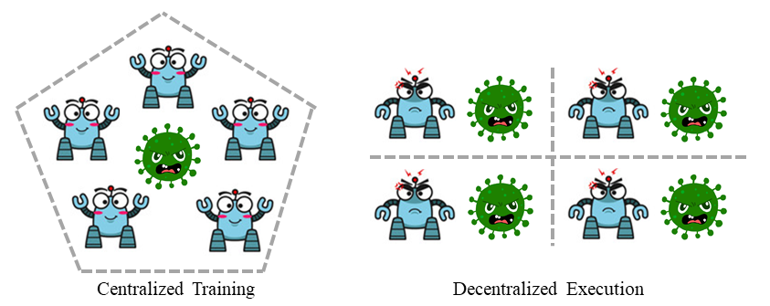

.. _part2:

***************************************
Part 2. Navigate From RL To MARL
***************************************

.. contents::
    :local:
    :depth: 3

Reinforcement learning (RL), particularly deep RL, has achieved remarkable success in solving decision-making problems and has become crucial in various fields. One of these fields is multi-agent reinforcement learning (MARL), which is concerned with both the individual learning of an agent in terms of developing an effective strategy and the collective behavior of a group of agents. In MARL, agents need to coordinate with each other when sharing the same group target or adapt to changes when facing adversarial agents.

MARL: On the shoulder of RL
----------------------------------------

Multi-agent reinforcement learning (MARL) is an extension of reinforcement learning (RL) that focuses on analyzing group behavior while keeping the core component unchanged, i.e., how an agent optimizes its strategy to obtain higher rewards. Most existing MARL algorithms are built on well-known RL algorithms such as Q learning and Proximal Policy Optimization (PPO), making RL a strong tool for MARL. However, applying plain RL algorithms with no external signal from other agents is suboptimal. To understand the necessity of transitioning from RL to MARL for multi-agent tasks, it is essential to cover some basic concepts.

.. _POMDP:

Partially Observable Markov Decision Process (POMDP)
--------------------------------------------------

In a Partially Observable Markov Decision Process (POMDP), the system states are unobservable and probabilistically mapped to observations. The agent's access to the system state is limited, and taking the same action can result in different observations. The observation is, however, still dependent on the system state. Hence, the agent must learn or hold a belief about its observation and learn a policy that accounts for all possible states.

POMDP is a more general approach for modeling sequential decision-making problems, especially in multi-agent settings. For instance, in a complex cooperative task, a group of agents may not have access to the entire system information, making it impractical for a single agent to solve the task. Instead, a more practical approach is to provide each agent with local observations to make decisions based on the current situation.

The main challenge lies in helping the agent build its belief system such that its decision-making aligns with its teammates and the system state towards achieving the final goal. To tackle this challenge, one of the most commonly used techniques is Centralized Training & Decentralized Execution (CTDE), which we will discuss next.

.. _CTDE:

Centralized Training & Decentralized Execution (CTDE)
-----------------------------------------------------

The CTDE framework, which stands for Centralized Training & Decentralized Execution, is a widely used approach in multi-agent reinforcement learning (MARL). In this setting, agents are trained together in a centralized manner where they can access all available information, including the global state, other agents' status, and rewards. However, during the execution stage, agents are forced to make decisions based on their local observations, without access to centralized information or communication.

CTDE strikes a balance between coordination learning and deployment cost, making it a popular framework in MARL. Since multi-agent tasks involve numerous agents, learning a policy that aligns with the group target requires incorporating extra information from other sources. Thus, centralized training is the preferred choice. However, after training, the delivery of centralized information is too costly during deployment, leading to delays in decision-making. Furthermore, centralized execution is insecure, as centralized information can be intercepted and manipulated during transmission.

Following the CTDE framework, there are two main branches of MARL algorithms:

- :ref:`CC`
- :ref:`VD`

Centralized critic-based algorithms are applicable to all types of multi-agent tasks, including cooperative, collaborative, competitive, and mixed. These algorithms use a centralized critic to approximate the state-action value function, which enables agents to learn a policy that considers the actions of other agents and the global state.

On the other hand, value decomposition-based algorithms can only be applied to cooperative and collaborative scenarios. These algorithms use a value decomposition technique to decompose the value function into individual value functions, one for each agent. The agents then learn their own policies based on their individual value functions. Since value decomposition-based algorithms do not use a centralized critic, they cannot be applied to competitive scenarios where the agents' objectives conflict.

Diversity: Task Mode, Interacting Style, and Additional Infomation
----------------------------------------------------------------

Multi-agent tasks exhibit a high degree of diversity compared to single-agent tasks. In single-agent settings, diversity is generally limited to the action space, reward function, and observation dimension. In contrast, multi-agent tasks feature a range of diversifying elements, including

#. **Task mode**: how agents work together.
#. **Interacting style**: in which order the agent interacts with the environment.
#. **Additional information**: depends on whether the environment provides it.

These complexities present unique challenges when comparing MARL algorithms. An algorithm that performs well in one multi-agent task may not perform as effectively in another, making it difficult to develop a unified benchmark for MARL.

The Future of MARL
----------------------------------------

It can be inferred that MARL provides a bridge between RL and real-world scenarios by enabling a group of agents to learn how to coordinate with each other, providing extra information to guide the evolution of strategies, and equipping agents with the ability to handle diverse tasks with a more general policy. The primary motivations behind MARL are to achieve these goals, as well as to progress towards the development of artificial general intelligence.
MARL can now outperform humans in games like chess and `MOBA <https://en.wikipedia.org/wiki/Multiplayer_online_battle_arena>`_,
solve real-world tasks like vision+language-based navigation,
help to design a better traffic system, etc.

MARL has been gaining increasing attention in both academic research and industrial applications. With the development of more sophisticated algorithms and hardware, MARL is becoming more practical and effective in solving complex real-world problems. The potential applications of MARL are numerous and span across many different fields, including transportation, logistics, robotics, finance, and more. As the technology continues to advance, we can expect to see even more exciting developments and innovations in the field of MARL in the coming years.

