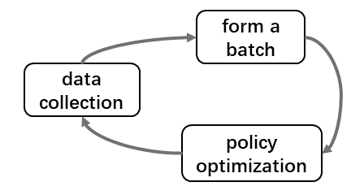
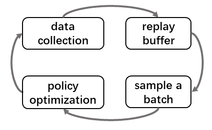

.. _part1:

***************************************
Part 1. Single Agent (Deep) RL
***************************************

There have been many great RL tutorials and open-sourced repos where you can find both the principle of different RL algorithms and
the implementation details. In this part, we will quickly navigate from RL to DRL.

.. contents::
    :local:
    :depth: 2

Reinforcement Learning (RL)
===================================

Reinforcement Learning focuses on goal-directed learning from interaction.
The learning entity must discover which strategy produces the greatest reward by "trial and error".

Deep Reinforcement Learning (DRL)
==================================

Deep Reinforcement Learning (DRL) combines Reinforcement Learning and Deep Learning.
It can solve a wide range of complex decision-making tasks previously out of reach for a machine to solve real-world problems with human-like intelligence.

Deep Learning (DL)
---------------------

Deep learning can learn from a training set and then apply that learning to a new data set.
Deep learning is well known for its function-fitting ability, which can infinitely approximate the optimal mapping function for a high-dimensional problem.

DL + RL
---------------------------

Deep neural networks enable RL with state representation and function approximation for value function, policy, etc.
Deep reinforcement learning incorporates deep learning into the solution, allowing agents to make decisions from unstructured input data without manual engineering of the state space.
You can find an instance of combining Q learning with Deep learning in :ref:`DQN`.

Learning Cycle
-----------------

**On-policy** (left) and **off-policy** (right) learning cycle:

- **data collection**: agent sends an action to the environment, environment returns some results, including observation, state, reward, etc.
- **form a batch**: policy optimization needs a batch of data from **data collection** to conduct stochastic gradient descent (SGD).
- **replay buffer**: data from **data collection** is sent to the replay buffer for future optimization use.
- **sample a batch**: sample a batch from **replay buffer** follow some rules.
- **policy optimization**: use the data batch to optimize the policy.

RL/DRL Algorithms
----------------------------

A comprehensive collection of RL/DRL algorithms from very old to very new can be found:

- `Awesome Deep RL <https://github.com/tigerneil/awesome-deep-rl>`_

Resources
=================

A great `RL resource guide <https://github.com/aikorea/awesome-rl>`_ includes all kinds of RL-related surveys, books, open-sourced repos, etc.

