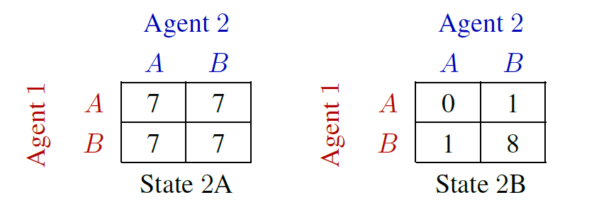
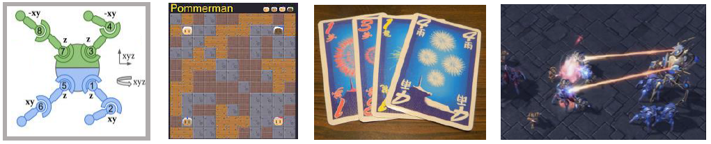
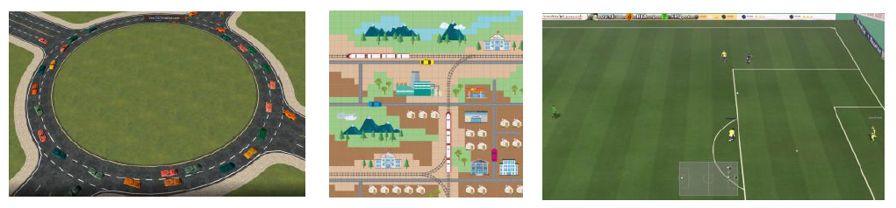
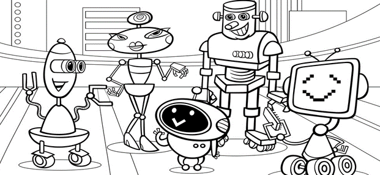

.. _part3:

********************************************************************
Part 3. A Collective Survey of MARL
********************************************************************

.. contents::
    :local:
    :depth: 3

Tasks: Arenas of MARL
=====================

In the field of machine learning, it is widely accepted that the evaluation of a new idea necessitates the use of an appropriate dataset. The most effective approach is to employ a representative or widely accepted dataset, adhere to its established evaluation pipeline, and compare the performance of the new idea with other existing algorithms.

In the context of Multi-Agent Reinforcement Learning (MARL), a dataset corresponds to a collection of scenarios that comprise a single multi-agent task. Multi-agent tasks are customizable on a variety of aspects, such as the number of agents, map size, reward function, and unit status. This section provides a brief overview of the categories of multi-agent tasks, ranging from the simplest matrix game to real-world applications.

Matrix Problem and Grid World
--------------------------------------------------------------

    Two-step game

The first option for evaluating a new idea in MARL involves using a matrix and grid world task.
 One such example is the **Two-step Game**.
In this task, two agents act in turn to gain the highest team reward.
The task is very straightforward:

#. two agents in the task
#. the observation is a short vector with a length four
#. two actions (A&B) to choose from

Despite the simple task setting, however, the game is still very challenging as one agent needs to coordinate with another agent
to achieve the highest reward: the joint action with the highest reward is not a good option from the view of the first agent if it is not willing to cooperate with another agent.
**Two-step Game** evaluates whether an agent has learned to cooperate by sacrificing its reward for a higher team reward.

As the value(reward) of the matrix can be customized, the number of matrix combinations (scenarios) that can be solved is a good measurement of the robustness of an algorithm in solving **cooperative-like** multi-agent tasks.

The grid world-based tasks are relatively more complicate than the matrix problem.
A well-known grid world example in RL is `frozen lake <https://towardsdatascience.com/q-learning-for-beginners-2837b777741>`_.
For MARL, there are many grid-world-based tasks, including:

- :ref:`LBF`
- :ref:`RWARE`
- :ref:`MAgent`

Different tasks target different topics like mixed cooperative-competitive task mode, sparse reward in MARL, and many agents in one system.

Gaming and Physical Simulation
--------------------------------------------------------------

    Gaming & Simulation: MAMuJoCo, Pommerman, Hanabi, Starcraft, etc.

Recent advances in MARL research have shifted the focus towards video gaming and physical simulation, as a means to bridge the gap between simple matrix games and the high cost of sampling and training on real-world scenarios. This approach allows for algorithms to showcase their performance on more complex tasks with a more manageable cost.
One of the most popular multi-agent tasks in MARL is StarCraft Multi-Agent Challenge(:ref:`SMAC`), which is for discrete control and cooperative task mode.
For continuous control, the most used task is the multi-agent version of MuJoCo: (:ref:`MAMuJoCo`).
To analyze the agent behavior of adversary agents, a typical task is :ref:`Pommerman`.
Scenarios within one task can contain different task modes, like :ref:`MPE`, which simplifies the evaluation procedure of the algorithm's generalization ability within one task domain.

Towards Real-world Application
--------------------------------------------------------------

    Real World Problem: MetaDrive, Flatland, Google Research Football, etc.

Tasks that are real-world-problem oriented, including traffic system design(:ref:`MetaDrive`), football(:ref:`Football`), and auto driving, also benchmark
recent years' MARL algorithms. These tasks can
inspire the next generation of AI solutions.
Although the tasks belonging to this categorization are of great significance to the real application, unluckily, fewer algorithms choose to be built on
these tasks due to high complexity and standard evaluation procedure.

Methodology of MARL: Task First or Algorithm First
====================================================================

The current state of research on multi-agent reinforcement learning (MARL) is facing challenges regarding the diversity of multi-agent tasks and the categorization of MARL algorithms. These characteristics make it difficult to conduct a fair comparison of different algorithms and raise a question for researchers: should algorithms be developed for a specific task (task first) or for general tasks (algorithm first). This difficulty stems from the nature of multi-agent tasks, as well as the various learning styles and knowledge-sharing strategies.

Since the development of algorithms is closely related to the features of the task, there is a trade-off between the algorithm's ability to generalize on a broad topic and its expertise in a particular multi-agent task.

In the subsequent section, we will provide a brief introduction to how the environment is categorized based on the agents' relationship. We will then classify the algorithms based on their learning style and the connection between the learning style and the agents' relationship.

Finally, we will discuss the extension of MARL algorithms to become more general and applicable to real-world scenarios using knowledge-sharing techniques.

Agent Relationship
--------------------------------------------------------------

In multi-agent reinforcement learning (MARL), the learning of agents is regulated by the relationship among them. Two critical factors affecting the development of MARL algorithms are the working mode and agent similarity.

The first factor is the working mode, also referred to as the task mode, which describes how agents work and learn in a multi-agent task. For instance, a task can be Cooperative-like, where agents share the same goal. Alternatively, a task can be Competitive-like, where agents have different or adversary objectives.

The second factor is agent similarity. In a task with homogeneous agents, they prefer knowledge sharing with each other and learning as a team. Conversely, in a task with heterogeneous agents, they prefer to learn their policies separately.

Task Mode: Cooperative-like or Competitive-like
^^^^^^^^^^^^^^^^^^^^^^^^^^^^^^^^^^^^^^^^^^^^^^^^^^^^

The task modes in multi-agent reinforcement learning can be broadly classified into two types: Cooperative-like, where agents tend to work as a team towards a shared goal, and Competitive-like, where agents have adversarial targets and exhibit aggression towards other agents.

Mode 1: Cooperative-like
"""""""""""""""""""""""""""""

The Cooperative-like task mode is prevalent in scenarios where agents are rewarded only when the team achieves a shared goal. This mode is considered a strict form of cooperation, where each agent cannot access its individual reward. In Cooperative tasks, agents must have a robust credit assignment mechanism to decompose the global reward and update their policies accordingly.

Environments contain **cooperative** scenarios:

- :ref:`SMAC`
- :ref:`MAMuJoCo`
- :ref:`Football`
- :ref:`MPE`
- :ref:`LBF`
- :ref:`RWARE`
- :ref:`Pommerman`

Another mode is **collaborative**, where agents can access individual rewards. Under this mode, the agents tend to work together, but the target varies between different agents.
Sometimes individual rewards may cause some potential interest conflict.
Collaborative task mode has less restriction and richer reward information for wilder algorithms development:
:ref:`il` is a good solution for collaborative tasks, as each agent has been allocated an individual reward for doing a standard RL.
:ref:`cc` is a more robust algorithm family for collaborative tasks as the improved critic help agent coordinate using global information.
:ref:`vd`-based methods are still applicable for collaborative tasks as we can integrate all the individual rewards received into one (only the agents act simultaneously).
**Cooperative** mode can also be transformed to **collaborative** as we can copy the global reward to each agent and treat them as an individual reward.

Environments contain **collaborative** scenarios:

- :ref:`SMAC`
- :ref:`MAMuJoCo`
- :ref:`Football`
- :ref:`MPE`
- :ref:`LBF`
- :ref:`RWARE`
- :ref:`Pommerman`
- :ref:`MAgent`
- :ref:`MetaDrive`
- :ref:`Hanabi`

Mode 2: Competitive-like
""""""""""""""""""""""""""""""

When agents have different targets in a task, especially when the targets are adversarial, the task can become much more complicated. An example of such a task is a zero-sum game, where the total reward is fixed, and any reward gained by one agent results in an equal loss for another agent.
A specific example can be found in :ref:`MPE` that in scenarios like **simple_push**, agent ONE is trying to gain more reward by
getting closer to its target location while agent TWO gains reward by pushing agent ONE away from the target location.

Moreover, the competitive-like mode can also be not so **pure competitive**. It can incorporate some cooperative agents' relationships.
This type of work mode is referred to as **mixed** mode. A representative task of mixed mode is :ref:`MAgent`, where agents are divided into several groups. Agents in the same group need to attack the enemy group cooperatively.

Environments contain **competitive** or **mixed** scenarios:

- :ref:`MPE`
- :ref:`Pommerman`
- :ref:`MAgent`

Agents Type: Heterogeneous or Homogeneous
^^^^^^^^^^^^^^^^^^^^^^^^^^^^^^^^^^^^^^^^^^^^

Two methods exist to solve the multi-agent problem, **heterogeneous** and **homogeneous**. Homogeneous agent affiliated with the environment holds the same policy. The policy gives out different actions based on the agent's observation.
Heterogeneous methods require each agent to maintain its individual policy, which can accept different environment observation dimensions or output actions with diverse semantic meanings.

Learning Style
--------------------------------------------------------------

Categorizing MARL algorithms by their learning style provides an overview of the topics that researchers are currently interested in. The following are the three main classes:

- Independent Learning: This class applies single-agent RL directly to multi-agent settings without additional coordination mechanisms.
- Centralized Training Decentralized Execution: This class adds extra modules to the training pipeline to help agents learn coordinated behavior while keeping independently executed policies.
- Fully Centralized: In this class, agents are treated as a single agent with multiple actions to execute simultaneously, and the learning algorithm is designed accordingly.

Independent Learning
^^^^^^^^^^^^^^^^^^^^^^^^^^^^

The core idea of Independent Learning is to extract an independent policy for one agent from the multi-agent system and train it using RL, ignoring other agents and system states. Based on this idea, if every agent learns its policy independently, we can obtain a set of policies that jointly solve the task.

Every RL algorithm can be extended to be MARL compatible, including:

- :ref:`IQL`
- :ref:`IA2C`
- :ref:`IDDPG`
- :ref:`IPPO`
- :ref:`ITRPO`

However, independent learning always falls into the local-optimal, and performance degrades rapidly when the multi-agent tasks require
a coordinated behavior among agents. This is primarily due to the low utilization of other agents' information and the system's global state.

Centralized Training Decentralized Execution (CTDE)
^^^^^^^^^^^^^^^^^^^^^^^^^^^^^^^^^^^^^^^^^^^^^^^^^^^^^^^^

To enable agents to learn a coordinated behavior while keeping computation budget and optimization complexity low, various learning settings have been proposed in MARL research. Among these, the Centralized Training Decentralized Execution (CTDE) framework has garnered the most attention in recent years. We have introduced the CTDE framework earlier: :ref:`CTDE`.

Within the CTDE framework, there are two main branches of algorithms: Centralized Critic (CC) and Value Decomposition (VD).

CC-based algorithms can handle general multi-agent tasks but have some restrictions on their architecture. On the other hand, VD-based algorithms are well-suited for solving cooperative-like tasks with a robust credit assignment mechanism, but they have limited applicability.

Type 1. Centralized Critic
"""""""""""""""""""""""""""

CC is first used in MARL since the :ref:`MADDPG`.
As the name indicated, a critic is a must in a CC-based algorithm, which excludes most Q-learning-based algorithms as they have no
critic module. Only actor-critic algorithms like :ref:`MAA2C` or actor-Q architecture like :ref:`MADDPG` fulfill this requirement.

For the training pipeline of CC, the critic is targeting finding a good mapping between the value function and the combination of system state and self-state.
This way, the critic is updated regarding the system state and the local states.
The policy is optimized using policy gradient according to GAE produced by the critic.
The policy only takes the local states as input to conduct a decentralized execution.

The core idea of CC is to provide different information for critics and policy to update them differently.
The critic is centralized as it utilizes all the system information to accurately estimate the whole multi-agent system.
The policy is decentralized, but as the policy gradient comes from the centralized critic,
it can learn a coordinated strategy.

A list of commonly seen CC algorithms:

- :ref:`MAA2C`
- :ref:`COMA`
- :ref:`MADDPG`
- :ref:`MATRPO`
- :ref:`MAPPO`
- :ref:`HATRPO`
- :ref:`HAPPO`

Type 2. Value Decomposition
""""""""""""""""""""""""""""""

VD is introduced to MARL since the :ref:`VDN`.
The name **value decomposition** is based on the fact that the value function of each agent is updated by factorizing the global value function.
Take the most used baseline algorithms of VD :ref:`VDN` and :ref:`QMIX` for instance: VDN sums all the individual value functions to get the global function.
QMIX mixes the individual value function and sets non-negative constraints on the mixing weight.
The mixed global value function can then be optimized to follow standard RL. Finally, if learnable, backpropagated gradient updates all the individual value functions and the mixer.

Although VDN and QMIX are all off-policy algorithms, the value decomposition can be easily transferred to on-policy algorithms like :ref:`VDA2C` and :ref:`VDPPO`.
Instead of decomposing the Q value function, on-policy VD algorithms decompose the critic value function. And using the decomposed individual critic function to update the
policy function by policy gradient.

The pipeline of the VD algorithm is strictly CTDE. Global information like state and other agent status is only accessible in the mixing stage in order to maintain a decentralized policy or
individual Q function.

A list of commonly seen VD algorithms:

- :ref:`VDN`
- :ref:`QMIX`
- :ref:`FACMAC`
- :ref:`VDA2C`
- :ref:`VDPPO`

Fully Centralized
^^^^^^^^^^^^^^^^^^^^^^^^^^^^

A fully centralized method is a viable option when the number of agents and the action space are relatively small. The approach of the fully centralized algorithm to multi-agent tasks is straightforward: all agents and their action spaces are combined into one, and a standard RL pipeline is used to update the policy or Q-value function. For instance, a five-agent discrete control problem can be transformed into a single-agent multi-discrete control problem. Therefore, only a cooperative-like task mode is suitable for this approach, as it would be counterproductive to combine agents that are adversaries to each other.

Although few works focus on fully centralized MARL, it can still serve as a baseline for algorithms of CTDE and others.

Knowledge Sharing
--------------------------------------------------------------

In MARL, agents can share knowledge with others to learn faster or reuse knowledge from previous tasks to adapt quickly to new ones. This is based on the idea that different strategies may share a similar function, which exists across three levels in MARL: agent, scenario, and task.

At the agent level, knowledge sharing is targeted at increasing sample efficiency and improving learning speed. Sharing at the scenario level focuses on developing a multi-task MARL framework to handle multiple scenarios simultaneously within the same task domain. Task-level sharing is the most difficult, and it requires an algorithm to learn and generalize knowledge from one task domain and apply it to a new domain.

Agent Level
^^^^^^^^^^^^^^^^^^^^^^^^^^^^

Agent-level knowledge sharing primarily focuses on two components: the replay buffer and model parameters. Typically, these two parts are linked, implying that if two agents share model parameters, they also share the replay buffer. However, there are some exceptions where only part of the model is shared. For example, in an actor-critic architecture, if only the critic is shared, the critic is updated with full data, while the policy is updated with the sampled data.

Sharing knowledge across agents can enhance the algorithm's performance by increasing sample efficiency, making it an essential technique in MARL. However, sharing knowledge is not always beneficial. In some cases, diverse individual policy sets are required, and sharing knowledge can significantly reduce this diversity. For example, adversary agents may not share knowledge to maintain competitiveness.

Scenario Level
^^^^^^^^^^^^^^^^^^^^^^^^^^^^

Scenario-level multi-task MARL is a learning approach that focuses on developing a general policy that can be applied to multiple scenarios within the same task. Compared to task-level multi-task MARL, scenario-level multi-task MARL is more feasible as the learned strategies across different scenarios are more similar than different. For example, skills like hit and run are commonly used across different scenarios in SMAC, despite variations in unit type, agent number, and map terrain.

Recent research has demonstrated that scenario-level knowledge sharing can be achieved through a transformer-based architecture and a meta-learning approach. This holds promise for real-world applications where the working environment is subject to constant changes, requiring agents to quickly adapt to new scenarios.

Task Level
^^^^^^^^^^^^^^^^^^^^^^^^^^^^

Task-level multi-task MARL aims to learn a self-contained and adaptable strategy without limitations on task mode, enabling agents to effectively reuse knowledge from previous tasks and learn new ones. Achieving task-level knowledge sharing requires agents to identify and apply common principles across different tasks. For example, when presented with a new cooperative task, agents can leverage their understanding of teamwork to quickly find effective solutions. This ability to understand and apply common sense and teamwork concepts is a critical component of human intelligence. Thus, achieving task-level knowledge sharing represents a significant milestone towards the development of artificial general intelligence.

