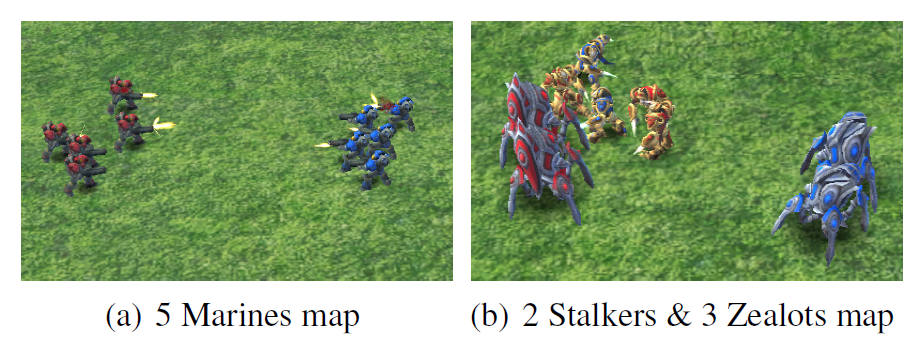
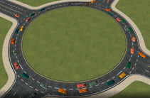

.. _part3:

********************************************************************
Part 3. A Collective Survey of MARL
********************************************************************

.. contents::
    :local:
    :depth: 3

Tasks: Arenas of MARL
=====================

Finding a dataset to evaluate the new idea has become a consensus in machine learning.
The best way is to get a representative or commonly acknowledged dataset in your research area,
follow its standard evaluation pipeline, and finally compare the performance of your idea with other existing algorithms.

In MARL, the dataset is now a set of scenarios contained in one multi-agent task.
Most multi-agent tasks are customizable on many aspects like agent number, map size, reward function, unit status, etc.
In this section, we briefly introduce the category of multi-agent tasks, from the most straightforward matrix game
to the real-world application.

Matrix Problem and Grid World
--------------------------------------------------------------

.. figure:: ../images/twostep.jpg
    :align: center

    Two-step game

Quickly verifying the new idea, using a matrix and grid world-based problem is the best choice.
It can help analyze the algorithms with less complexity. A famous example of this type of task is the **Two-step Game**.
In this task, two agents act to gain the highest reward in a cooperative style.
The task can not be more straightforward as:

#. only two agents in the task.
#. the observation is a short vector.
#. only two actions are available for agents to choose from.

However, the game is still a challenge as the agent act in the first turn needs to coordinate with the agent act in the second turn
to achieve the highest reward: the joint action of two agents with the highest reward is seemingly a wrong choice from the view of the first agent.
In other words, the **Two-step Game** is targeted at evaluating whether the agent can sacrifice an individual reward for a higher team reward.

As the value(reward) of the matrix can be customized, how many different matrix combinations (scenario) can the algorithms solve
to avoid getting stuck in the sub-optimal is a good measurement of how well the algorithm solves **cooperative-game-theory**-like multi-agent tasks.

You can find more matrix games in **game-theory** based MARL.

The grid world is relatively more complicated than the matrix problem. Nevertheless, the element is more enriched.
RL's well-known grid world task example is `frozen lake <https://towardsdatascience.com/q-learning-for-beginners-2837b777741>`_.
For MARL, there are many grid-world-based tasks. In addition, MARLlib incorporates three tasks namely :ref:`LBF`, :ref:`RWARE`, and :ref:`MAgent`, which focus on different MARL topics.

Gaming and Physical Simulation
--------------------------------------------------------------

    Starcraft II Battle Game

A significant offset between naive matrix games and the expensive cost of sampling and training on real-world scenarios brings most attention to gaming and physical simulation in RL, and so does MARL.
In MARL, most algorithms try to prove their advance on these testing beds: towards solving more complicated tasks with a modest cost.
The most popular multi-agent task in MARL is StarCraft Multi-Agent Challenge(:ref:`SMAC`), which is for discrete control and cooperative task mode.
If you are interested in continuous control, try the multi-agent version of MuJoCo(:ref:`MaMujoco`).
To take the challenge of adversary task modes, refer to :ref:`Pommerman`.
Some tasks contain more than one task mode like :ref:`MPE`. Please read the document carefully before using them.

Towards Real-world Application
--------------------------------------------------------------

    Autonomous Traffic Coordination

Tasks that are real-world-problem oriented, like traffic system design(:ref:`MetaDrive`), football(:ref:`Football`), and auto driving, are also benchmarking
recent years' MARL algorithms. These tasks are more practical that can
inspire the next generation of AI solutions for real-world problems.
Although the task belonging to this multi-agent categorization is of great significance to real life, unluckily, fewer algorithms choose to be built on
these tasks.
It is not easy work to implement existing algorithms in a new environment, not to mention the more complicated settings based on real scenarios.

Algorithms: Method for MARL Alchemy
=======================================

Another significant characteristic of MARL is the diversity of its algorithms.
This is partly due to the diversity of multi-agent tasks that we discussed in the above section,
as well as the various learning styles and knowledge-sharing strategies.

Agent Relationship
--------------------------------------------------------------

The relationship among agents regulates agent learning.
Two aspects of this relationship affect the MARL algorithm development the most.

First is the **working mode** of agents. For example, a task can be Cooperative-like, where agents share the same target.
A task can be Competitive-like, where agents have different or adversary targets.
We also refer **working mode** as **task mode**, as an overall description of how agents work and learn in a multi-agent task.

The second is the type of agents. A task can contain homogeneous agents. These agents prefer knowledge sharing with others and learning as a team.
A task can also contain heterogeneous agents, where these agents prefer learning separately, and the intersection of the learned knowledge is relatively small.

Task Mode: Cooperative-like or Competitive-like
^^^^^^^^^^^^^^^^^^^^^^^^^^^^^^^^^^^^^^^^^^^^^^^^^^^^

There are two commonly seen task mode: cooperative-like, where agents tends to work as a team; and competitive-like, where agents have adversarial target
and can be aggressive to other agents.

Mode 1: Cooperative-like
"""""""""""""""""""""""""""""

There are two sub-modes under cooperative-like mode.

The first mode is **cooperative**, where all agents cannot access their individual rewards.
These tasks require algorithms to have a strong credit assignment mechanism to decompose the global reward to each agent.
:ref:`vd`-based methods are proposed to deal with this problem.

Environments with **cooperative** mode in MARLlib:

- :ref:`SMAC`
- :ref:`MaMujoco`
- :ref:`Football`
- :ref:`MPE`
- :ref:`LBF`
- :ref:`RWARE`
- :ref:`Pommerman`

The second mode is **collaborative**, where agents can access their individual rewards. Therefore, the credit assignment mechanism is no longer needed.
With less restriction and richer reward information, algorithms for **collaborative** task mode are more diverse.
:ref:`il` is naturally a good solution now as each agent has been allocated an individual reward for doing a standard RL.
:ref:`cc` is a more robust algorithm family for **collaborative** tasks as the improved critic help agent coordinate using global information.
:ref:`vd`-based methods are still applicable for **collaborative** tasks as we can integrate all the individual rewards received into one (only the agents act simultaneously).
**Cooperative** mode can also be transformed to **collaborative** as we can copy the global reward agent number times and treat them as an individual reward.

Environments with **cooperative** mode in MARLlib:

- :ref:`SMAC`
- :ref:`MaMujoco`
- :ref:`Football`
- :ref:`MPE`
- :ref:`LBF`
- :ref:`RWARE`
- :ref:`Pommerman`
- :ref:`MAgent`
- :ref:`MetaDrive`
- :ref:`Hanabi`

Mode 2: Competitive-like
""""""""""""""""""""""""""""""

Once agents have different targets in one task, especially when the targets are adversaries,
the task can become much more complicated. A famous example is **zero-sum** game, where the total reward is fixed.
One agent being rewarded will result in another agent being punished.
A specific example can be found in :ref:`MPE` that in scenarios like **simple_push**, agent one is trying to gain more reward by
getting closer to its target location while agent two gains reward by pushing agent one away from the target location.

Moreover, the competitive-like mode can also be not so **pure competitive**. It can incorporate some cooperative agents' relationships.
This type of work mode is referred as **mixed** mode. A representative task of mixed mode is :ref:`MAgent`, where agents are divided into several groups. Agents in the same group need to attack the enemy group cooperatively.

Environments with **Competitive** or **Mixed** mode in MARLlib:

- :ref:`MPE`
- :ref:`Pommerman`
- :ref:`MAgent`

Agents Type: Heterogeneous or Homogeneous
^^^^^^^^^^^^^^^^^^^^^^^^^^^^^^^^^^^^^^^^^^^^

There are two methods to solve the multi-agent problem, **heterogeneous** and **homogeneous** method. In homogeneous each agent affiliate with the environment holds the same policy. The policy will give out different actions based on the agent's observation.
However, the heterogeneous methods give each agent with different or individual policy, which may accept different environment observation dimension or could give different actions, though, based on same observation for different agents.

Learning Style
--------------------------------------------------------------

Categorizing the MARL algorithm by its learning style provides an overview of which topic researchers are most interested in.
The first class is **Independent Learning**, which directly applies single-agent RL to multi-agent settings.
The second class is **Centralized Training Decentralized Execution**, where extra modules are added to the training pipeline
to help agents learn a coordinated behavior while keeping an independently executed policy.
The third class is **Fully Centralized**, where agents are treated as a single agent with multiple actions to execute simultaneously.

Independent Learning
^^^^^^^^^^^^^^^^^^^^^^^^^^^^

We then get an independent policy to separate one agent from the multi-agent system and train this agent using RL ignoring other agents and system states. This is the core idea of independent learning. Based on this, if every agent learns its policy independently,
we can have a group of policies that jointly solve the task.

Every RL algorithm can be extended to be MARL compatible, including:

- :ref:`IQL`
- :ref:`IA2C`
- :ref:`IDDPG`
- :ref:`IPPO`
- :ref:`ITRPO`

However, independent learning always falls into local-optimal, and performance degrades rapidly when the multi-agent tasks require
a coordinated behavior among agents. This is primarily due to the low utilization of the information from other agents and the global state of the system.

Centralized Training Decentralized Execution (CTDE)
^^^^^^^^^^^^^^^^^^^^^^^^^^^^^^^^^^^^^^^^^^^^^^^^^^^^^^^^

Helping agents learn a coordinated behavior while keeping a low computation budget and optimization complexity, the Centralized Training Decentralized Execution (CDTE) framework has been proposed and has attracted the most attention in recent years of MARL research.
Under CTDE framework, there are two main branches: **Centralized Critic (CC)** and **Value Decomposition (VD)**.
CC-based algorithm covers broader modes of multi-agent tasks while having some restrictions on its architecture.
The VD-based algorithm is good at solving cooperative tasks with its strong credit assignment mechanism, while the task mode it can cover is limited.

Type 1. Centralized Critic
"""""""""""""""""""""""""""

CC is firstly used in MARL since the :ref:`MADDPG`.
As the name indicated, a critic is a must in a CC-based algorithm, which excludes most Q learning-based algorithms as they have no
critic module. Only actor-critic algorithms like :ref:`MAA2C` or actor-Q architecture like :ref:`MADDPG` fulfill this requirement.

For the training pipeline of CC, the critic is targeting finding a good mapping between the value function and the combination of system state and self-state.
This way, the critic is updated regarding the whole system and the agent itself.
The policy is then updated using policy gradient according to GAE produced by the critic.
To conduct a decentralized execution, the policy only takes self-got information as input.

The core idea of CC is to provide different information for critics and policy to update them differently.
The critic is centralized as it utilizes all the system information to find the accurate estimation of the whole multi-agent system.
The policy is decentralized, but as the policy gradient comes from the centralized critic,
the policy can learn a coordinated strategy.

A list of commonly seen centralized critic algorithms:

- :ref:`MAA2C`
- :ref:`COMA`
- :ref:`MADDPG`
- :ref:`MATRPO`
- :ref:`MAPPO`
- :ref:`HATRPO`
- :ref:`HAPPO`

Type 2. Value Decomposition
""""""""""""""""""""""""""""""

VD is introduced to MARL since the :ref:`VDN`.
The name **value decomposition** is based on the fact that the value function of each agent is updated by factorizing the global value function.
Take the most used baseline algorithms of VD :ref:`VDN` and :ref:`QMIX` for instance: VDN sums all the individual value functions to get the global function.
QMIX mixes the individual value function and sets non-negative constraints on the mixing weight.
The mixed global value function can then be optimized to follow standard RL. Back propagated gradient updates all the individual value functions and the mixer if learnable.

Although VDN and QMIX are all off-policy algorithms, the value decomposition can be easily transferred to on-policy algorithms like :ref:`VDA2C` and :ref:`VDPPO`.
Instead of decomposing the Q value function, on-policy VD algorithms decompose the critic value function. And using the decomposed individual critic function to update the
policy function by policy gradient.

The pipeline of the VD algorithm is strictly CTDE. Global information like state and other agent status is only accessible in the mixing stage in order to maintain a decentralized policy or
individual Q function.

A list of commonly seen value decomposition algorithms:

- :ref:`VDN`
- :ref:`QMIX`
- :ref:`FACMAC`
- :ref:`VDA2C`
- :ref:`VDPPO`

Fully Centralized
^^^^^^^^^^^^^^^^^^^^^^^^^^^^

A fully centralized method is an option while the agent number and the action space are relatively small.
The approach of the fully centralized algorithm to the multi-agent tasks is straightforward: combine all the agents and their action spaces into one and follow a standard RL
pipeline to update the policy or Q value function.
For instance, a five-agents discrete control problem can be transformed into a single-agent multi-discrete control problem.
Therefore, only a cooperative-like task mode is suitable for this approach. It would be nonsense to combine agents that are adversaries to each other.

Few works focus on fully centralized MARL. However, it can still serve as a baseline for algorithms of CTDE and others.

Knowledge Sharing
--------------------------------------------------------------

Agents can share the knowledge with others to learn faster or reuse the knowledge from the old task to adapt quickly to new tasks.
We can quickly get this inspiration based on the fact that different strategies may share a similar function.
Moreover, this similarity exists across three levels in MARL: agent, scenario, and task.
Agent-level knowledge sharing is targeted to increase sample efficiency and improve learning speed.
Scenario level sharing focuses on developing a multi-task MARL to handle multiple scenarios simultaneously but still in the same task domain.
Task level sharing is the most difficult, and it requires an algorithm to learn and conclude general knowledge from one task domain and apply them to
a new domain.

Agent Level
^^^^^^^^^^^^^^^^^^^^^^^^^^^^

Agent-level knowledge sharing mainly focuses on two parts: replay buffer and model parameters.
In most cases, these two parts are bound, meaning if two agents share the model parameters, they share the replay buffer(sampled data in on-policy case).
There are still some exceptions, like only part of the model is shared. For instance,  in actor-critic architecture, if only the critic is shared, then the critic is
updated with the full data while the policy is updated with the data sampled.

Knowledge across other agents can significantly benefit the algorithm performance as it improves the sample efficiency and thus can be an essential trick in MARL.

However, sharing knowledge is not always good. For example, we may need a diverse individual policy set in some circumstances, but the sharing operation vastly reduces this diversity.
An extreme instance will be adversary agents who never share knowledge to keep competitiveness.

Scenario Level
^^^^^^^^^^^^^^^^^^^^^^^^^^^^

Scenario-level multi-task MARL focuses on learning a general policy that can
cover more than one scenario in one task. Therefore, scenario level multi-task MARL is of great feasibility than task level multi-task MARL
as the learned strategies of different scenarios is more similar than different.
For instance, although scenarios in SMAC vary on unit type, agent number, and map terrain, skills like hit and run always exist in most of the learned
strategy from them.

Recent work has proved that scenario-level knowledge sharing is doable with transformer-based architecture plus a meta-learning method.
This is a potential solution for real-world applications where the working environment constantly changes and requires agents to adapt to new scenarios soon.

Task Level
^^^^^^^^^^^^^^^^^^^^^^^^^^^^

Task level multi-task MARL is the final step of learning a self-contained and constantly evolving strategy, with no restrictions on task mode and easily
adopting to new tasks and reusing the knowledge from other tasks.

Task-level knowledge sharing requires agents to conclude common sense from different tasks.
For instance, when a new cooperative-like task comes, agents behave more agreeable with others and can quickly find a way to cooperate as a team.
As common sense and team-working concepts are what make human being intelligent, achieving task-level knowledge sharing equals training an agent
to learn and act like humans is the holy grail of artificial general intelligence.

Future Direction
===================

TODO

